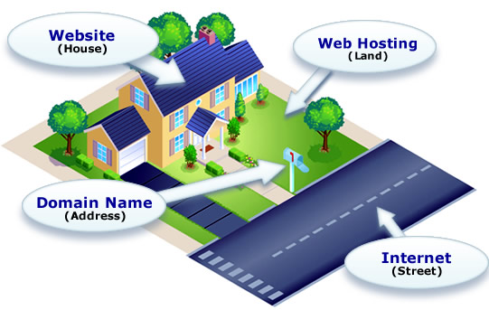
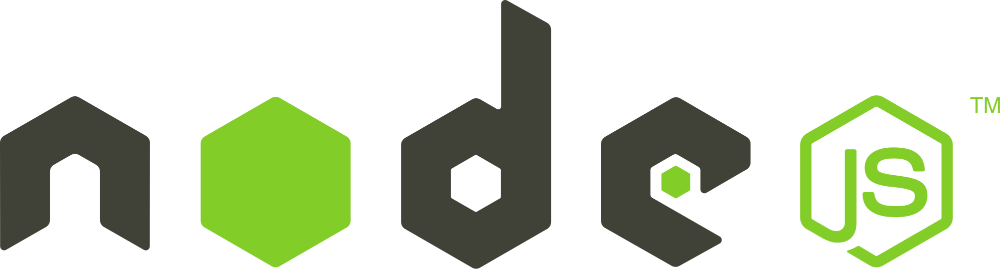
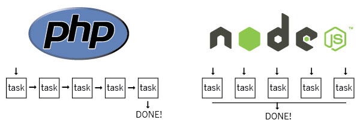
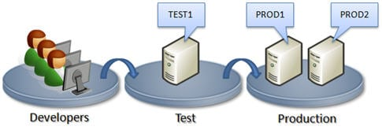
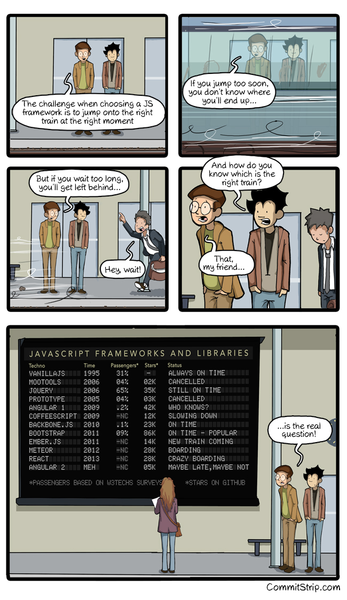

# Curso Incompany para PROCESIA
### HTML5 APIs, ECMA6, Patrones de diseño, AJAX avanzado, APIs externas, JS para Frontend, Automatización...


[FICTIZIA » Cursos a medida para empresas](https://www.fictizia.com/formacion-empresas)

## Clase 1

### Normas y demás
- Puntualidad
- Liquidos y comida
- Ubicación

### Metodología
- Descansos
- Gestión del curso en GitHub
 - Comunicación fuera de clase
 - Repositorio común
 - Toda la teoría, prácticas y recursos
- Prácticas y "deberes"
- Repasos, para afianzar lógica

### Sobre el profesor


**Bio:**
"#Maker, #IoT, #OpenSource | #JavaScript, #Node, #Python | Co-organizador de [@os_weekends](http://osweekends.com/) | Profe en [@fictiziaescuela](http://www.fictizia.com/profesores/) | Mentor en [@TetuanValley](https://twitter.com/tetuanvalley) | Autor de [#JavaScriptInspirate](https://leanpub.com/javascript-inspirate) | Freelance | xIBMer | xGoogler"

**Redes Sociales:**
- [Twitter](https://twitter.com/kom_256)
- [Github](https://github.com/UlisesGascon)
- [Linkedin](https://www.linkedin.com/in/ulisesgascon/)


### Hablemos de la web
- [Evolution of the web](http://www.evolutionoftheweb.com/?hl=es)
- [Internet de los 90](http://theworldsworstwebsiteever.com/)
- [Internet Archive Wayback Machine - La máquina del tiempo](http://archive.org/web/)
  - [Google](http://web.archive.org/web/*/http://google.com)
    - [Prototipo - 1998](http://web.archive.org/web/19981111184551/http://google.com/)
    - [Beta - 1998](http://web.archive.org/web/19981202230410/http://www.google.com/)
    - [2000](http://web.archive.org/web/20001027222150/http://www.google.com/)
    - [2005](http://web.archive.org/web/20051114081503/http://www.google.com)
    - [2010](http://web.archive.org/web/20101130235215/http://www.google.com/)
    - [2015](http://web.archive.org/web/20151215000203/http://www.google.com/)
    - [Hoy](https://www.google.es)
  - [Amazon](http://web.archive.org/web/*/http://amazon.com)
    - [1998](http://web.archive.org/web/19981212012532/http://amazon.com/)
    - [2000](http://web.archive.org/web/20000229081105/http://www.amazon.com/exec/obidos/subst/home/home.html)
    - [2005](http://web.archive.org/web/20051126094753/http://www.amazon.com/exec/obidos/subst/home/home.html)
    - [2010](http://web.archive.org/web/20101126032341/http://www.amazon.com/)
    - [2015](http://web.archive.org/web/20151127000839/http://www.amazon.com/)
    - [Hoy](http://www.amazon.com/)
  - [Youtube](http://web.archive.org/web/*/http://youtube.com)
    - [2005](http://web.archive.org/web/20050428014715/http://www.youtube.com/)
    - [2010](http://web.archive.org/web/20100914234459/http://www.youtube.com/)
    - [2015](http://web.archive.org/web/20151115000036/https://www.youtube.com/)
    - [Hoy](https://www.youtube.com/)
  - [Facebook](http://web.archive.org/web/*/http://www.facebook.com)
    - [2005 (AboutFace)](http://web.archive.org/web/20050213040632/http://facebook.com/)
    - [2005](http://web.archive.org/web/20051020000116/http://www.facebook.com)
    - [2010](http://web.archive.org/web/20100110004754/http://www.facebook.com/)
    - [2015](http://web.archive.org/web/20150731235552/https://facebook.com/)
    - [Hoy](https://www.facebook.com)

### [El largo camino del desarrollador web](https://coggle.it/diagram/52e97f8c5a143de239005d1b/56212c4e4c505e0045c0d3bda59b77e5977c2c9bd40f3fd0b451bdcf8da4aa52)
- Front-End
- Back-End
- Full-Stack
- Dev Ops
- etc...

### Arquitectura de Internet 
**Navegación**


**Hosting**



**CMS (Back-End)**

 

**CDN (Content Delivery Network)**


**Tracking**


**[W3C - World Wide Web Consortium](https://www.w3.org/)**


- [historia y logros](https://www.w3.org/2005/01/timelines/timeline-2500x998.png)


## Front-end

### HTML


  > HTML, sigla en inglés de HyperText Markup Language (lenguaje de marcas de hipertexto), hace referencia al lenguaje de marcado para la elaboración de páginas web. Es un estándar que sirve de referencia del software que conecta con la elaboración de páginas web en sus diferentes versiones, define una estructura básica y un código (denominado código HTML) para la definición de contenido de una página web, como texto, imágenes, videos, juegos, entre otros. Es un estándar a cargo del World Wide Web Consortium (W3C) o Consorcio WWW, organización dedicada a la estandarización de casi todas las tecnologías ligadas a la web, sobre todo en lo referente a su escritura e interpretación. Se considera el lenguaje web más importante siendo su invención crucial en la aparición, desarrollo y expansión de la World Wide Web (WWW). Es el estándar que se ha impuesto en la visualización de páginas web y es el que todos los navegadores actuales han adoptado.1

  > El lenguaje HTML basa su filosofía de desarrollo en la diferenciación. Para añadir un elemento externo a la página (imagen, vídeo, script, entre otros.), este no se incrusta directamente en el código de la página, sino que se hace una referencia a la ubicación de dicho elemento mediante texto. De este modo, la página web contiene solamente texto mientras que recae en el navegador web (interpretador del código) la tarea de unir todos los elementos y visualizar la página final. Al ser un estándar, HTML busca ser un lenguaje que permita que cualquier página web escrita en una determinada versión, pueda ser interpretada de la misma forma (estándar) por cualquier navegador web actualizado.[HTML Wikiwand](https://es.wikipedia.org/wiki/HTML)
- Versiones:
  	- HTML 1.0	(1991)
  	- HTML 2.0 (1995)
  	- HTML 3.2 (1997)
  	- HTML 4 (1997)
  	- HTML 4.01 (1999)
  	- HTML 5 (2014)

### CSS


  > Hoja de estilo en cascada o CSS (siglas en inglés de cascading style sheets) es un lenguaje usado para definir y crear la presentación de un documento estructurado escrito en HTML o XML2 (y por extensión en XHTML). El World Wide Web Consortium (W3C) es el encargado de formular la especificación de las hojas de estilo que servirán de estándar para los agentes de usuario o navegadores.
  > La idea que se encuentra detrás del desarrollo de CSS es separar la estructura de un documento de su presentación.[CSS Wikiwand](https://es.wikipedia.org/wiki/Hoja_de_estilos_en_cascada)
- Versiones:
    - Versión 1 (CSS1) en 1996
    - Versión 2 (CSS2) en 1998
    - Versión 2.1 (CSS2) en 2004
    - Versión 3 (CSS3) en 2011
- Ejemplos:
  - [El poder de CSS - CSSZenGarden](http://www.csszengarden.com/)
  - [Ejemplos CodePen](http://codepen.io/pens/3/) 
  


### JavaScript


> JavaScript (abreviado comúnmente JS) es un lenguaje de programación interpretado, dialecto del estándar ECMAScript. Se define como orientado a objetos, basado en prototipos, imperativo, débilmente tipado y dinámico.

> Se utiliza principalmente en su forma del lado del cliente (client-side), implementado como parte de un navegador web permitiendo mejoras en la interfaz de usuario y páginas web dinámicas aunque existe una forma de JavaScript del lado del servidor (Server-side JavaScript o SSJS). Su uso en aplicaciones externas a la web, por ejemplo en documentos PDF, aplicaciones de escritorio (mayoritariamente widgets) es también significativo. [JavaScript Wikiwand](https://www.wikiwand.com/es/JavaScript)


**Características**
- Multiparadigma
- Imperativo y estructurado
- Dinámico
	- Tipado dinámico
	- Objetual
	- Evaluación en tiempo de ejecución
- Funcional
	- Funciones de primera clase
- Prototípico	
	- Prototipos
	- Funciones constructoras
- Entorno de ejecución
- Funciones varídicas	
- Funciones como métodos
- Arrays y la definición literal de objetos
- Expresiones regulares

**[ECMA-262](https://www.wikiwand.com/es/ECMAScript)**
- Versiones:
	- Versión 1 (Junio de 1997)
	- Versión 2 (Junio de 1998)
	- Versión 3 (Diciembre de 1999)
	- Versión 3 (Abandonado)
	- Versión 5 (Diciembre de 2009)
	- Versión 5.1 (Diciembre de 2011)
	- Versión 6 (Junio de 2015)
	- Versión 7 (En desarrollo)

- **Compatibilidad:**
	- [ECMA6](https://kangax.github.io/compat-table/es6/)
	- [ECMA5](http://kangax.github.io/compat-table/es5/)
	- [Non-standard](http://kangax.github.io/compat-table/non-standard/)
	- [HTML5 & CSS3](http://fmbip.com/litmus/)
	- [Polyfill](https://www.wikiwand.com/en/Polyfill)

- **Compiladores**
	- [Coffeescript](http://coffeescript.org/)
	- [Typescript](http://www.typescriptlang.org/)
	- [Livescript](http://livescript.net/)

- **Librerías**
	- [underscore](http://underscorejs.org/)
	- [Jquery](https://jquery.com/)
	- [Microjs](http://microjs.com/#)
	- [Threejs](http://threejs.org/)
	- [D3.js](http://d3js.org/)
	- [Modernizr](https://modernizr.com/)
	- [Lodash](https://lodash.com/)
	- [mustache.js](https://github.com/janl/mustache.js)
	- [handlebars.js](http://handlebarsjs.com/)
	- [Firebase](http://firebase.com/)
	- [p5js](http://p5js.org/)

- **Frameworks (MV*)**
	- [Angular.js](https://angularjs.org/)
	- [Ember.js](http://emberjs.com/)
	- [Backbone.js](http://backbonejs.org/)
	- [KnockOut.js](http://knockoutjs.com/)
	- [React](http://facebook.github.io/react/)
	- [Meteor](https://www.meteor.com/)


## Back-end

### Node.js



> Node.js es un entorno en tiempo de ejecución multiplataforma, de código abierto, para la capa del servidor (pero no limitándose a ello) basado en el lenguaje de programación ECMAScript, asíncrono, con I/O de datos en una arquitectura orientada a eventos y basado en el motor V8 de Google. Fue creado con el enfoque de ser útil en la creación de programas de red altamente escalables, como por ejemplo, servidores web. Fue creado por Ryan Dahl en 2009 y su evolución está apadrinada por la empresa Joyent, que además tiene contratado a Dahl en plantilla - [Wikipedia](https://www.wikiwand.com/es/Node.js)


**Otra manera es posible**




**Puntos Fuertes**
- Asincronía (no bloqueo)
- Backend completo
- NPM (comunidad)
- Single thread (paralelismo)
- Librerías propias
- Utilidades
- Código abierto
- Basado en el V8 (escrito en C++) de Google
- Multiplataforma
- Orientado a Eventos
- **No se limita solo a servidores HTTP**

**Librerías interesantes**
- [Grunt](http://gruntjs.com/)
- [Gulp](http://gulpjs.com/)
- [Express](http://expressjs.com/es/)
- [Mongoose](http://mongoosejs.com/)
- [Socket.io](http://socket.io/)
- [Apache Cordova](http://cordova.apache.org/)
- [Async](https://www.npmjs.com/package/async)
- [Chalk](https://www.npmjs.com/package/chalk)
- [J5](http://johnny-five.io/)
- [GraphicsMagick](http://aheckmann.github.io/gm/)
- [Marked](https://github.com/chjj/marked)
- [Node-restify](https://github.com/restify/node-restify)
- [Webpack](https://github.com/webpack/webpack)
- [Morgan](https://github.com/expressjs/morgan)
- [Nodemailer](https://github.com/nodemailer/nodemailer)
- [Passportjs](http://passportjs.org/)
- [Cheerio](https://github.com/cheeriojs/cheerio)
- [X-ray](https://github.com/lapwinglabs/x-ray)
- [Bower](https://bower.io/)
- [PM2](http://pm2.keymetrics.io/)
- [Electron](http://electron.atom.io/)
- [Yeoman](http://yeoman.io/)
- [Babel](https://babeljs.io/)
- [Helmet](https://www.npmjs.com/package/helmet)
- [Faker](https://www.npmjs.com/package/faker)
- [Protractor](https://www.npmjs.com/package/protractor)
- [Nightwatch.js](http://nightwatchjs.org/)
- [Cypress.io](https://www.cypress.io/)


### Más Back-end
  
- **PHP**
  - [Laravel](https://laravel.com/) 
- **Python**
  - [Django](https://www.djangoproject.com/)
- **Ruby**
  - [Ruby on Rails](http://www.rubyonrails.org.es/)
- **Java**
  - [Spring](http://projects.spring.io/spring-framework/)
- etc...  

### NoBackend

- [Firebase](https://www.firebase.com/)
- [Parse](http://parseplatform.org/)
- [Iniciativa Nobackend](http://nobackend.org/)

### Stack
- LAMP:
  - Linux
  - Apache
  - MySQL
  - PHP
- MEAN:
  - MongoDB
  - Express
  - Angular
  - Node

### Bases de datos

- [Racionales](https://es.wikipedia.org/wiki/Base_de_datos_relacional)
  - [MySQL](https://es.wikipedia.org/wiki/MySQL)
  - [PostgreSQL](https://es.wikipedia.org/wiki/PostgreSQL)
  - [Oracle](https://es.wikipedia.org/wiki/Oracle)
  - [DB2](https://es.wikipedia.org/wiki/DB2)

- [NoSQL]()
  - Documentales([MongoDB](https://es.wikipedia.org/wiki/MongoDB))
  - Grafo([Neo4j](Neo4j))
  - Clave/valor ([Firebase](https://www.firebase.com/))
  - Orientadas a objetos ([ObjectDB](https://es.wikipedia.org/wiki/ObjectDB))
  - etc...

### Entorno de desarollo moderno

- **[JSON](https://es.wikipedia.org/wiki/JSON)**
- **[AJAX](https://es.wikipedia.org/wiki/AJAX)**
- **[APIs Rest](https://es.wikipedia.org/wiki/Representational_State_Transfer)**
- **[WEBSOCKET](https://es.wikipedia.org/wiki/WebSocket)**
- **[Platform as a service (PaaS)](https://en.wikipedia.org/wiki/Platform_as_a_service)**
- **[Programación funcional](https://es.wikipedia.org/wiki/Programaci%C3%B3n_funcional)**
- **[Test-driven development (TDD)](https://es.wikipedia.org/wiki/Desarrollo_guiado_por_pruebas)**
- **[Manifiesto por el Desarrollo Ágil de Software](http://agilemanifesto.org/iso/es/)**
- **[El estado del desarrollo Front-End en 2016 por Ashley Nolan](https://ashleynolan.co.uk/blog/frontend-tooling-survey-2016-results)**

### Desarrolladores de hoy

**JSDramas**
- [How one developer just broke Node, Babel and thousands of projects in 11 lines of JavaScript](http://www.theregister.co.uk/2016/03/23/npm_left_pad_chaos/)
- [A discussion about the breaking of the Internet](https://medium.com/@mproberts/a-discussion-about-the-breaking-of-the-internet-3d4d2a83aa4d#.r9oqkkuhb)
- [I’ve Just Liberated My Modules](https://medium.com/@azerbike/i-ve-just-liberated-my-modules-9045c06be67c#.mjp6u93c1)
- [Left-pad en GitHub](https://github.com/camwest/left-pad)
- [Is left-pad Indicative of a Fragile JavaScript Ecosystem?](http://developer.telerik.com/featured/left-pad-indicative-fragile-javascript-ecosystem/)
- [Overcoming JavaScript Fatigue](http://developer.telerik.com/topics/web-development/overcoming-javascript-fatigue/)
- [One developer just broke Node, Babel and thousands of projects in 11 lines of JavaScript](https://laravel-news.com/2016/03/one-developer-just-broke-node-babel-thousands-projects-11-lines-javascript/)
- [How 17 Lines of Code Took Down Silicon Valley’s Hottest Startups](http://www.huffingtonpost.com/ken-mazaika/how-17-lines-of-code-took_b_9532846.html)
- [Npm package author revokes his packages, breaking tons of builds](https://evertpot.com/npm-revoke-breaks-the-build/)
- [¿Y si el software Open Source desapareciera?](http://www.xataka.com/servicios/y-si-el-software-open-source-desapareciera)
- [El programador que borró 11 líneas de código y se cargó Internet](http://www.omicrono.com/2016/04/desaparicion-en-node-js-de-left-pad/)


**Cambios, cambios... y más cambios**



- [State of the Art JavaScript in 2016](https://medium.com/javascript-and-opinions/state-of-the-art-javascript-in-2016-ab67fc68eb0b#.8byumpq6f)
- [If Loving Computers is Wrong, I Don't Want to Be Right](http://blog.codinghorror.com/if-loving-computers-is-wrong-i-dont-want-to-be-right/)
- [Keeping Up and "Just In Time" Learning](http://blog.codinghorror.com/keeping-up-and-just-in-time-learning/)

**The Magpie Developer**
- [The Magpie Developer](http://blog.codinghorror.com/the-magpie-developer/)

**The Sad State of Web Development**
- [El estado del desarrollo Front-End en 2015 por Ashley Nolan](http://ashleynolan.co.uk/blog/frontend-tooling-survey-2015-results)
- [The Sad State of Web Development](https://medium.com/@wob/the-sad-state-of-web-development-1603a861d29f#.62up3vtl1)
- [A response to The Sad State of Web Development — Its not about Javascript really](https://www.reddit.com/r/programming/comments/40rwrk/a_response_to_the_sad_state_of_web_development/)

**Fatiga y tendencias**

- [A Study Plan To Cure JavaScript Fatigue](https://medium.freecodecamp.com/a-study-plan-to-cure-javascript-fatigue-8ad3a54f2eb1)
- [Top JavaScript Frameworks & Topics to Learn in 2017](https://medium.com/javascript-scene/top-javascript-frameworks-topics-to-learn-in-2017-700a397b711)
- [How it feels to learn JavaScript in 2016](https://hackernoon.com/how-it-feels-to-learn-javascript-in-2016-d3a717dd577f)
- [State of the Art JavaScript in 2016](https://medium.com/javascript-and-opinions/state-of-the-art-javascript-in-2016-ab67fc68eb0b)
- [JavaScript Fatigue Fatigue](https://medium.freecodecamp.com/javascript-fatigue-fatigue-66ffb619f6ce)
- [Want to learn JavaScript ?](https://medium.com/@_cmdv_/i-want-to-learn-javascript-in-2015-e96cd85ad225)
- [The Two Pillars of JavaScript](https://medium.com/javascript-scene/the-two-pillars-of-javascript-ee6f3281e7f3)
- [12 Books Every JavaScript Developer Should Read](https://medium.com/javascript-scene/12-books-every-javascript-developer-should-read-9da76157fb3)
- [Javascript Fatigue](https://medium.com/@ericclemmons/javascript-fatigue-48d4011b6fc4)
- [Modern JavaScript for Ancient Web Developers](https://trackchanges.postlight.com/modern-javascript-for-ancient-web-developers-58e7cae050f9)
- [Functional Programming for JavaScript People](https://medium.com/@chetcorcos/functional-programming-for-javascript-people-1915d8775504)
- [A Beginner’s JavaScript Study Plan](https://medium.freecodecamp.com/a-beginners-javascript-study-plan-27f1d698ea5e)

### Herramientas

- [Chrome Dev Tools](https://developer.chrome.com/devtools)
- [Can I use](http://caniuse.com/)
- [EsLint](http://eslint.org/demo/)
- [JSHint](http://jshint.com/)
- Editores
  - [Sublime Text](https://www.sublimetext.com/)
  - [Atom](https://atom.io/)
  - [Brakets](http://brackets.io/)
  - [Notepad++](https://notepad-plus-plus.org/)
  - [C9.io](https://c9.io/ulisesgascon)
  - [Visual Studio Code](https://www.visualstudio.com/es/?rr=https%3A%2F%2Fwww.google.es%2F)
  - [WebStorm](https://www.jetbrains.com/webstorm/)

### Documentación
  - [MDN - HTML](https://developer.mozilla.org/es/docs/Web/HTML)
  - [MDN - CSS](https://developer.mozilla.org/es/docs/Web/CSS)
  - [MDN - JS](https://developer.mozilla.org/es/docs/Web/JavaScript)
  - [devdocs - JS](http://devdocs.io/javascript/)
  - [devdocs - CSS](http://devdocs.io/css/)
  - [Nodejs Docs](https://nodejs.org/es/docs/)
  - [devdocs - Nodejs](http://devdocs.io/node/)
  - [Standard ECMA-262](http://ecma-international.org/publications/standards/Ecma-262.htm)
  - [Modern JavaScript Cheatsheet](https://github.com/mbeaudru/modern-js-cheatsheet)

### C9.io


**Características estrella**
- Code together in real time
- Share your IDE, your workspace, a preview, or your running app
- Replay all edits and see your code at any point in time

**Otras características**
- Preview in any browser
- Built-In Terminal
- Language Tools
- Debugger
- Split View
- Themes
- Run Panel
- Key Bindings Editor
- VIM/Emacs/Sublime Mode
- Built-In Image Editor

**Más**
- [Precios y planes](https://c9.io/pricing/webide)
- [Soporte](https://c9.io/support)
- [c9 en GitHub](https://github.com/c9)

## Comunidad

### Libros

- [JavaScript, ¡Inspírate!](https://leanpub.com/javascript-inspirate)
- [Eloquent JavaScript de Marijn Haverbeke](https://eloquentjavascript.net/)
- [JavaScript: The Good Parts de Douglas Crockford](http://shop.oreilly.com/product/9780596517748.do)
- [JavaScript Patterns de Stoyan Stefanov](http://shop.oreilly.com/product/9780596806767.do)
- [JavaScript Ninja de John Resig y Bear Bibeault (español)](https://www.amazon.es/JavaScript-Ninja-Anaya-Multimedia-Manning/dp/8441533970)
- [JavaScript. La Guía Definitiva de David Flanagan](https://www.casadellibro.com/libro-javascript-la-guia-definitiva-anaya-multimedia/9788441522022/1142519)
- [Código Limpio: Manual de estilo para el desarrollo ágil de software de Robert C. Martin (español)](https://www.amazon.es/C%C3%B3digo-Limpio-desarrollo-software-Programaci%C3%B3n/dp/8441532109)
- [Sams Teach Yourself Node.js in 24 Hours de George Ornbo](https://www.pearson.com/us/higher-education/program/Ornbo-Sams-Teach-Yourself-Node-js-in-24-Hours/PGM24237.html)
- [Node.js de George Ornbo (Español)](https://www.anayamultimedia.es/libro.php?id=3275163)
- [Learning JavaScript Design Pattern](http://addyosmani.com/resources/essentialjsdesignpatterns/book/) de Addy Osmani
- [You Don't Know Js (6 Book Series) de Kyle Simpson](https://www.amazon.com/You-Dont-Know-Js-Book/dp/B01AY9P0P6)

### Charlas recomendadas

**Otros/Inspiracionales**

- ["Code Stars" - Short Film](https://www.youtube.com/watch?v=dU1xS07N-FA)
- [The Code: Story of Linux documentary](https://www.youtube.com/watch?v=XMm0HsmOTFI)
- [Free software, free society: Richard Stallman at TEDxGeneva 2014](https://www.youtube.com/watch?v=Ag1AKIl_2GM)
- [Project Code Rush - The Beginnings of Netscape / Mozilla Documentary](https://www.youtube.com/watch?v=4Q7FTjhvZ7Y)
- [The Internet's Own Boy: The Story of Aaron Swartz](https://www.youtube.com/watch?v=3Q6Fzbgs_Lg)
- [Massimo Banzi: How Arduino is open-sourcing imagination | TED](https://www.ted.com/talks/massimo_banzi_how_arduino_is_open_sourcing_imagination)
- [Linus Torvals: The mind behind Linux | TED](https://www.ted.com/talks/linus_torvalds_the_mind_behind_linux)
- [William Kamkwamba: How I built a windmill | TED](https://www.ted.com/talks/william_kamkwamba_on_building_a_windmill)
- [Pia Mancini: How to upgrade democracy for the Internet era | TED](https://www.ted.com/talks/pia_mancini_how_to_upgrade_democracy_for_the_internet_era)
- [Christopher "Moot" Poole: The case for anonymity online | TED](https://www.ted.com/talks/christopher_m00t_poole_the_case_for_anonymity_online)
- [Pranav Mistry: The thrilling potential of SixthSense technology | TED](https://www.ted.com/talks/pranav_mistry_the_thrilling_potential_of_sixthsense_technology)
- [Steve Jobs: How to live before you die | TED](https://www.ted.com/talks/steve_jobs_how_to_live_before_you_die)
- [Thomas Suarez: A 12-year-old app developer | TED](https://www.ted.com/talks/thomas_suarez_a_12_year_old_app_developer)
- [Johnny Lee: Free or cheap Wii Remote hacks | TED](https://www.ted.com/talks/johnny_lee_demos_wii_remote_hacks)
- [Temple Grandin: The world needs all kinds of minds | TED](https://www.ted.com/talks/temple_grandin_the_world_needs_all_kinds_of_minds)
- [Neil Harbisson: I listen to color | TED](https://www.ted.com/talks/neil_harbisson_i_listen_to_color)
- [Mitch Resnick: Let's teach kids to code | TED](https://www.ted.com/talks/mitch_resnick_let_s_teach_kids_to_code)
- [Tim Berners-Lee: The year open data went worldwide | TED](https://www.ted.com/talks/tim_berners_lee_the_year_open_data_went_worldwide)
- [Jimmy Wales: The birth of Wikipedia | TED](https://www.ted.com/talks/jimmy_wales_on_the_birth_of_wikipedia)
- [Jennifer Pahlka: Coding a better government | TED](https://www.ted.com/talks/jennifer_pahlka_coding_a_better_government)
- [Charles Leadbeater: The era of open innovation | TED](https://www.ted.com/talks/charles_leadbeater_on_innovation)
- [Keren Elazari: hackers the internet's immune system | TED](https://www.ted.com/talks/keren_elazari_hackers_the_internet_s_immune_system)
- [Mikko Hyponnen: Fighting viruses, defending the net | TED](https://www.ted.com/talks/mikko_hypponen_fighting_viruses_defending_the_net)
- [Misha Glenny: Hire the hackers! | TED](https://www.ted.com/talks/misha_glenny_hire_the_hackers)
- [Ralph Langner: Cracking Stuxnet, a 21st-century cyber weapon | TED](https://www.ted.com/talks/ralph_langner_cracking_stuxnet_a_21st_century_cyberweapon)
- [Avi Rubin: All your devices can be hacked | TED](https://www.ted.com/talks/avi_rubin_all_your_devices_can_be_hacked)
- [Catherine Bracy: Why good hackers make good citizens | TED](https://www.ted.com/talks/catherine_bracy_why_good_hackers_make_good_citizens)
- [Todd Humphreys: How to fool a GPS | TED](https://www.ted.com/talks/todd_humphreys_how_to_fool_a_gps)
- [Guy-Philippe Goldstein: How cyberattacks threaten real-world peace | TED](https://www.ted.com/talks/guy_philippe_goldstein_how_cyberattacks_threaten_real_world_peace)
- [Marcin Jakubowski: Open-sourced blueprints for civilization | TED](https://www.ted.com/talks/marcin_jakubowski)
- [Michael Anti: Behind the Great Firewall of China | TED](https://www.ted.com/talks/michael_anti_behind_the_great_firewall_of_china)
- [James Lyne: Everyday cybercrime — and what you can do about it | TED](https://www.ted.com/talks/james_lyne_everyday_cybercrime_and_what_you_can_do_about_it)
- [Lorrie Faith Cranor: What’s wrong with your pa$$w0rd? | TED](https://www.ted.com/talks/lorrie_faith_cranor_what_s_wrong_with_your_pa_w0rd)
- [Jay Silver: Hack a banana, make a keyboard! | TED](https://www.ted.com/talks/jay_silver_hack_a_banana_make_a_keyboard)
- [Christopher Soghoian: How to avoid surveillance ... with the phone in your pocket | TED](https://www.ted.com/talks/christopher_soghoian_a_brief_history_of_phone_wiretapping_and_how_to_avoid_it)
- [Jaron Lanier: How we need to remake the internet | TED](https://www.ted.com/talks/jaron_lanier_how_we_need_to_remake_the_internet)
- [Roger McNamee: 6 ways to save the internet | TED](https://www.ted.com/talks/roger_mcnamee_six_ways_to_save_the_internet)
- [Nicholas Negroponte: Taking OLPC to Colombia | TED](https://www.ted.com/talks/nicholas_negroponte_takes_olpc_to_colombia)
- [How the mysterious dark net is going mainstream | Jamie Bartlett | TED](https://www.youtube.com/watch?v=pzN4WGPC4kc)

**CSS**
- [CSSconf EU 2017 | Guil Hernandez: Get Ready for the Future of CSS!](https://www.youtube.com/watch?v=UMwunYQGvhs)
- [Writing Efficient CSS - JSOxford](https://www.youtube.com/watch?v=yZUm5uK2zPI)
- [CSS Grid Changes Everything (About Web Layouts) - talk by Morten Rand-Hendriksen](https://www.youtube.com/watch?v=Qgyg-SRr-UQ)
- [Chen Hui Jing: How I Learn To CSS - CSSConf.Asia 2016](https://www.youtube.com/watch?v=gJA5sdyCWNQ)
- [CSSconf EU 2014 | Addy Osmani: CSS Performance Tooling](https://www.youtube.com/watch?v=FEs2jgZBaQA)
- [CSSconf EU 2015 | Lea Verou: The Missing Slice](https://www.youtube.com/watch?v=eVnUDTtOLE0)
- [CSSconf EU 2014 | Mathias Bynens: 3.14 Things I Didn't Know About CSS](https://www.youtube.com/watch?v=WjP7TEKB7Uo)


**JS**
- [Douglas Crockford: The JavaScript Programming Language](https://www.youtube.com/watch?v=v2ifWcnQs6M)
- [What the... JavaScript?](https://www.youtube.com/watch?v=2pL28CcEijU&t)
- [Making Badass Developers - Kathy Sierra (Serious Pony) keynote](https://www.youtube.com/watch?v=FKTxC9pl-WM)
- [The myth of the “Real JavaScript Developer” – Brenna O'Brien / Front-Trends 2016](https://www.youtube.com/watch?v=Xt5qpbiqw2g)
- [Computer, build me an app - Rich Harris - JSConf EU 2018](https://www.youtube.com/watch?v=qqt6YxAZoOc)

**Listados**
- [hellerve/programming-talks](https://github.com/hellerve/programming-talks)

### Developers Importantes a los que seguir...

- [Ashley Williams (@ag_dubs)](https://twitter.com/ag_dubs)
- [Lea Verou (@LeaVerou)](https://twitter.com/LeaVerou)
- [John Resig (@jeresig)](https://twitter.com/jeresig)
- [Paul Irish (@paul_irish)](https://twitter.com/paul_irish)
- [Karolina Szczur (@fox)](https://twitter.com/fox)
- [Addy Osmani (@addyosmani)](https://twitter.com/addyosmani)
- [David Walsh (@davidwalshblog)](https://twitter.com/davidwalshblog)
- [Mathias Bynens (@mathias)](https://twitter.com/mathias)
- [Felix Geisendorfer (@felixge)](https://twitter.com/felixge)
- [Natalie MacLees (@nataliemac)](https://twitter.com/nataliemac)
- [Sindre Sorhus (@sindresorhus)](https://twitter.com/sindresorhus)
- [Ben Nadel (@BenNadel)](https://twitter.com/BenNadel)
- [Rebecca Murphey (@rmurphey)](https://twitter.com/rmurphey)
- [Chris Heilmann (@codepo8)](https://twitter.com/codepo8)
- [Sarah Mei (@sarahmei)](https://twitter.com/sarahmei)
- [Brendan Eich(@BrendanEich)](https://twitter.com/BrendanEich)
- [Axel Rauschmayer (@rauschma)](https://twitter.com/rauschma)
- [Kyle Simpson (@getify)](https://twitter.com/getify)
- [Rachel Andrew (@rachelandrew)](https://twitter.com/rachelandrew)
- [JavaScript Daily (@JavaScriptDaily)](https://twitter.com/JavaScriptDaily)
- [Dan Abramov (@dan_abramov)](@https://twitter.com/dan_abramov)
- [Evan You (@youyuxi)](https://twitter.com/youyuxi)
- [Sarah Drasner (@sarah_edo)](https://twitter.com/sarah_edo)
- [Jen Simmons (@jensimmons)](https://twitter.com/jensimmons)
- [CSS Tricks (@Real_CSS_Tricks)](https://twitter.com/Real_CSS_Tricks)
- [Free Code Camp (@FreeCodeCamp)](https://twitter.com/FreeCodeCamp)

**Listados**
- [42 JavaScript experts to follow on Twitter](https://techbeacon.com/javascript-leaders-you-should-follow-twitter)
- [9 Influential JavaScript Developers You Should Follow](https://javascriptreport.com/9-influential-javascript-developers-you-should-follow/)
- [33 Developers you MUST Subscribe to as a JavaScript Junkie](https://code.tutsplus.com/articles/33-developers-you-must-subscribe-to-as-a-javascript-junkie--net-18151)
- [20 Developers to Follow on Twitter](https://codeburst.io/best-web-developers-to-follow-on-twitter-9318a3f6525a)
- [25 JS Developers You Must Follow On Twitter](http://blog.crossrider.com/post/28828010399/25-js-developers-you-must-follow-on-twitter)

### Blogs, posts, etc...

- [Reddit - JavaScript](https://www.reddit.com/r/javascript/)
- [Ponyfoo](https://ponyfoo.com/)
- [Ben Nadel](https://www.bennadel.com/)
- [David Wash](https://davidwalsh.name/)
- [Dailyjs](http://dailyjs.com/)
- [Sitepoint](https://www.sitepoint.com/javascript/)
- [Javascript.com](https://www.javascript.com/)
- [Brendan Eich](https://brendaneich.com/)
- [JavaScript Playground](http://javascriptplayground.com/)
- [Superhero.js](http://superherojs.com/)
- [JavaScript Jabber](https://devchat.tv/js-jabber)
- [Smashing Magazine](https://www.smashingmagazine.com/tag/javascript/)
- [Web Fundamentals, antes HTML5 Rocks!](https://developers.google.com/web/)

**Medium**
- [Medium | Javascript](https://medium.com/topic/javascript)
- [Medium | Programming](https://medium.com/tag/programming)
- [Medium | Technology](https://medium.com/tag/technology)
- [Medium | Learning to code](https://medium.com/tag/learning-to-code)
- [Medium | Nodejs](https://medium.com/tag/nodejs)
- [Medium | Expressjs](https://medium.com/tag/expressjs)
- [Medium | NPM](https://medium.com/tag/npm)
- [Medium | API](https://medium.com/tag/api)
- [Medium | CSS](https://medium.com/tag/css)
- [Medium | Frontend development](https://medium.com/tag/front-end-development)
- [Medium | Software development](https://medium.com/tag/software-development)
- [Medium | Web development](https://medium.com/tag/web-development)
- [Medium | Code](https://medium.com/tag/code)
- [Medium | Coding](https://medium.com/tag/coding)
- [Medium | Cybersecurity](https://medium.com/tag/cybersecurity)
- [Medium | Hacking](https://medium.com/tag/hacking)
- [Medium | Security](https://medium.com/tag/security)

### Youtubers, charlas, etc...

- [Google Developers](https://www.youtube.com/user/GoogleDevelopers/featured)
- [The Coding Train](https://www.youtube.com/user/shiffman)
- [Fun Fun Function](https://www.youtube.com/channel/UCO1cgjhGzsSYb1rsB4bFe4Q)
- [The Net Ninja](https://www.youtube.com/channel/UCW5YeuERMmlnqo4oq8vwUpg)
- [JSConf](https://www.youtube.com/user/jsconfeu)
- [Coding Tech](https://www.youtube.com/channel/UCtxCXg-UvSnTKPOzLH4wJaQ)
- [FreeCodeCamp](https://www.youtube.com/channel/UC8butISFwT-Wl7EV0hUK0BQ)
- [bnb/awesome-developer-streams](https://github.com/bnb/awesome-developer-streams#suz-hinton)

### Meetups y eventos

- [Open Source Weekends](http://osweekends.com/)
- [PyLadies Madrid](https://www.meetup.com/es-ES/PyLadiesMadrid/)
- [Makespace Madrid](http://makespacemadrid.org/)
- [Codenares](https://www.meetup.com/es-ES/codenares/)
- [HackMadrid %27](https://www.meetup.com/es-ES/HackMadrid-27/)
- [Madrid Haskell Users Group](https://www.meetup.com/es-ES/Haskell-MAD/)
- [RLadies Madrid](https://www.meetup.com/es-ES/rladies-madrid/)
- [Madrid Tech Alliance](https://twitter.com/madridtechall?lang=es)
- [Rust Madrid](https://twitter.com/rustmadrid?lang=es)
- [GDG Madrid](https://www.meetup.com/es-ES/GDGMadrid/)
- [BetaBeers eventos](https://betabeers.com/event/)
- [Betabeers](https://betabeers.com/)
- [MadridJS](http://www.meetup.com/es/madridjs/)
- [Nodejs](http://www.meetup.com/es/Node-js-Madrid/)
- [WordPress Madrid](http://www.meetup.com/es/WordPress-Madrid/)
- [Hackathon Todos Incluidos](http://www.meetup.com/es/Hackathon-Todos-Incluidos/)
- [Girls in Tech Spain](http://spain.girlsintech.org/)
- [Madriagil](http://www.meetup.com/es/madriagil/)
- [Hackathon Lovers](http://www.meetup.com/es/Hackathon-Lovers/)
- [HTML5 Spain](http://www.meetup.com/es/HTML5-Spain/)
- [API Addicts](http://www.meetup.com/es/ApiAddicts/)
- [ReactMad](http://www.meetup.com/es/ReactMad/)
- [Edupreneurs Madrid](http://www.meetup.com/es/edupreneursMAD/)
- [TypeScript Madrid](http://www.meetup.com/es/Typescript-Madrid/)
- [IoT Madrid](http://www.meetup.com/es/iotmadrid/)


### JavaScript en Acción

- **[The scraping machine](https://github.com/UlisesGascon/the-scraping-machine)**
  - Alto nivel de abstracción para el usuario final
  - Soporte como aplicación de terminal con [Vorpal](https://www.npmjs.com/package/vorpal)
  - Generación dinámica de scripts en varios lenguajes (JS, Python, etc...)
  - Gestión de procesos hijos de forma nativa
  - Instalación global como módulo de NPM

- **[Simple hangouts bot](https://github.com/UlisesGascon/simple-hangouts-bot)**
  - Aislamiento del core para mejorar la portabilidad usando patrones
  - XMPP Protocolo
  - Soporte de operaciones en terminal 
  - Soporte para la instalación como dependencia de NPM
  - Extensión de por API interna
  - Incorporación de servicios externos como Alchemy (Inteligencia Artificial como servicio)
  - Gestión de la asincronía
  - Array de objetos
  - Gestión de notificación y ayuda al usuario
  - Detección de eventos de Error y cierre del sistema

- **[GingerCode](https://github.com/GingerCode)**
  - Orientado a nuevos programadores
  - Pseudocódigo funcional
  - Alto nivel de abstracción
  - Isomórfico

- **[GoblinDB](GoblinDBRocks.github.io)**
  - Base de datos reactiva
  - Almacenamiento Asíncrono
  - Patrones de diseño (Namespace, Façade, etc...)
  - Ambush Functions, funciones Lambda a demanda
  - Soporte a Eventos

- **[OSWaldito](https://github.com/OSWeekends/OSWaldito)**
  - Orientado a IOT
  - Comunciación I2C
  - Movimiento controlado por WebSockets
  - Renderización en cliente de VR usando three.js
  - Stream de vídeo bajo demanda frame a frame
  - Uso del sintetizador de voz nativo de Chrome
  - Gestión de redes sociales

- **[Slack Canal Directo](https://github.com/OSWeekends/Slack-Canal-Directo)**
  - Orientado a la gestión de redes sociales
  - Escucha activamente conversaciones en Google Hangouts
  - Envía mensajes en Google Hangouts
  - Envía mensajes en Slack
  - Envía mensajes al azar clasificados por prioridad en Slack
  - Envía mensajes de Error y estado al administrador en Goolgle Hangouts
  - Puede ser desplegado en multiples entornos (Raspbian, Linux, OSX, Windows, C9...)
  - Permite desplegar multiples avatares y personalidades desde la configuración para comunicarse en Slack

- **[Know Your SNPs](https://github.com/OSWeekends/know-your-SNPs)**
  - Proyecto BioTecnológico
  - Analiza ADN
  - Permite buscar dentro del ADN ciertos patrones
  - No almacena datos
  - Futura migración a aplicación de escritorio
  - Formulario para realizar nuevas queries (desarrollo) sin tener que programar

- **[protoUnicorn](https://github.com/OSWeekends/protoUnicorn)**
  - Librería de utilidades para JavaScript
  - Utiliza los mejores métodos de librerias extendidas como Lodash o Underscore
  - Añade estos métodos a nuestro JavaScript mediante prototype

- **[Spotymix](https://github.com/OSWeekends/spoty-mix)**
  - Permite crear nuevas playlist
  - Fusiona canciones de diversas playlist
  - Permite juntar tus mejores canciones con las mejores canciones de otro amigo
  - Social Login integrado

- **[JSDayES golosinas IOT](https://github.com/UlisesGascon/JSDayES-golosinas-IOT)**
  - Orientado a IOT
  - Comunicación Serial
  - Gestión de dispositivos externos
  - No necesita HTTP

- **[Raspi - System Info to Firebase](https://github.com/UlisesGascon/raspberrypi-system-info-data-to-firebase)**
  - Partiendo de otro repositorio/proyecto. 
  - Monitorización del sistema
  - Uso de comandos de terminal
  - Gestión de procesos inestables
  - Integración con soluciones No-backend
  - Tiempo Real
  - No necesita HTTP
 
- **[IT Pulse](https://github.com/UlisesGascon/twitter-sentiments)**
  - Partiendo de otro repositorio/proyecto.
  - APIs de terceros
  - Stream directo de datos
  - Servidor Http
  - Tiempo Real y sincronía con WebSockets
  - Eventos
  - Evaluación semántica de la información
  - Sin Bases de datos

- **[MovieFire](https://github.com/UlisesGascon/Simple-API-REST-with-Firebase-and-IMBD)**
  - Integración con soluciones No-Backend
  - FrontEnd con Jade
  - BackEnd Flexible y dinámico
  - APIRest Cliente -> Servidor
  - BackEnd con Express
  - CORS y Ajax

- **[AireMadrid](https://github.com/UlisesGascon/Aire-Madrid)**
  - Arquitectura alternativa en versiones anteriores
  - Conversión y parseo a Json
  - Procesamiento de datos en bruto
  - APIRest
  - Operaciones cíclicas gestionadas por Pillarsjs
  - FrontEnd con Jade
  - BackEnd con Express
  - Documentación con JSDocs

- **[AireMAD](http://airemad.com/#/)**
  - Evolución de Aire Madrid
  - Scraping
  - Fuentes de datos Alternativas
  - Backend con Pillarsjs
  - Frontend con Angularjs
  - Permanencia de datos con GoblinDB
 
- **[Calidad del Aire con Firebase](https://github.com/UlisesGascon/Calidad-del-Aire-con-Firebase)**
  - Manejo de comunicación serial
  - Eventos y asincronía
  - IoT


- **[Curratelo](https://github.com/UlisesGascon/curratelo)**
  - APIs de terceros
  - Stream directo de datos
  - Servidor Http
  - Tiempo Real y sincronía con WebSockets
  - Automatización con Slack y Hangouts


### Tools for Web Developers


**Recursos**
- [Blog de Chromium](https://blog.chromium.org/)
- [Google Developers](https://developers.google.com/)
- [@ChromiumDev en Twitter](https://twitter.com/chromiumdev)
- [Shows for Web Developers](https://developers.google.com/web/shows/?hl=es)
- [Google Chrome Team en Github](https://github.com/googlechrome)
- [Web Fundamentals: GUIDES](https://developers.google.com/web/fundamentals/?hl=es)
- [Web Fundamentals: Code Labs](https://developers.google.com/web/fundamentals/codelabs/?hl=es)
- [Novedades](https://developers.google.com/web/updates/)

**Herramientas principales**
- Canary
- PageSpeed
- Lighthouse
- Puppeteer
- Workbox
- Chrome Developer Tools

### Canary


- [Web oficial](https://www.google.com/intl/en/chrome/canary/)

### PageSpeed


**Doc**
- [PageSpeed](https://developers.google.com/speed/)
- [Guía PageSpeed Insights](https://developers.google.com/speed/docs/insights/about)
- [Referencia API](https://developers.google.com/speed/docs/insights/v4/reference/)
- [F.A.Q](https://developers.google.com/speed/docs/insights/faq)

### Lighthouse


**Doc**
- [Lighthouse en Github](https://github.com/GoogleChrome/lighthouse)
- [Extensión de Chrome](https://chrome.google.com/webstore/detail/lighthouse/blipmdconlkpinefehnmjammfjpmpbjk)

### puppeteer


**Doc**
- [Web Oficial](https://pptr.dev/)
- [Web Oficial | Video presentación](https://youtu.be/lhZOFUY1weo)
- [Web Oficial | Quick start](https://developers.google.com/web/tools/puppeteer/get-started)
- [Headless Chrome: an answer to server-side rendering JS sites](https://developers.google.com/web/tools/puppeteer/articles/ssr)
- [Github](https://github.com/GoogleChrome/puppeteer)
- [Ejemplos](https://github.com/GoogleChrome/puppeteer/tree/master/examples)

### Workbox


**Doc**
- [Video presentación](https://youtu.be/DtuJ55tmjps)
- [Guias](https://developers.google.com/web/tools/workbox/guides/get-started)
- [Módulos](https://developers.google.com/web/tools/workbox/modules/)
- [Ref. Doc.](https://developers.google.com/web/tools/workbox/reference-docs/latest/)

### ChromeDevTools


**Recursos**
- [Slack](https://chromiumdev.slack.com/?redir=%2Fmessages%2Fdevtools)
- [google-chrome-devtools en Stakoverflow](https://stackoverflow.com/questions/tagged/google-chrome-devtools)
- [@ChromeDevTools en Twitter](https://twitter.com/ChromeDevTools)

**Abrir Chrome DevTools**
- En el Menú de Chrome, selecciona `More Tools` > `Developer Tools`.
- Haz clic con el botón secundario en un elemento de la página y selecciona Inspect.
- Usa las [combinaciones de teclas](https://developers.google.com/web/tools/chrome-devtools/inspect-styles/shortcuts) Ctrl+Mayúscula+I (Windows) o Cmd+Opción+I (Mac).


### ChromeDevTools: Paneles

**Device Mode**
> Device Mode Usa Device Mode para desarrollar experiencias web con una completa capacidad de respuestas y que prioricen los dispositivos móviles.

- [Device Mode](https://developers.google.com/web/tools/chrome-devtools/device-mode/)
- [Prueba ventanas de visualización adaptables y específicas para cada dispositivo](https://developers.google.com/web/tools/chrome-devtools/device-mode/emulate-mobile-viewports)
- [Emula sensores: ubicación geográfica y acelerómetro](https://developers.google.com/web/tools/chrome-devtools/device-mode/device-input-and-sensors)

**Elements**
> Panel Elements Usa el panel Elements para iterar la distribución y el diseño de tu sitio mediante la libre manipulación de DOM y CSS.

- [Inspecciona y modifica ligeramente tus páginas](https://developers.google.com/web/tools/chrome-devtools/inspect-styles/)
- [Edita estilos](https://developers.google.com/web/tools/chrome-devtools/inspect-styles/edit-styles)
- [Edita el DOM](https://developers.google.com/web/tools/chrome-devtools/inspect-styles/edit-dom)

**Console**
> Panel Console Usa el panel Console para registrar información de diagnóstico durante el desarrollo o úsalo como un shell para interactuar con el código JavaScript en la página.

- [Cómo usar la consola](https://developers.google.com/web/tools/chrome-devtools/console/)
- [Interactúa desde la línea de comandos](https://developers.google.com/web/tools/chrome-devtools/console/command-line-reference)

**Sources**
> Panel Sources Depura tu código JavaScript con puntos de interrupción en el panel Sources o conecta los archivos locales mediante espacios de trabajo para usar el editor en tiempo real de DevTools.

- [Depura con puntos de interrupción](https://developers.google.com/web/tools/chrome-devtools/javascript/add-breakpoints)
- [Depura código ofuscado](https://developers.google.com/web/tools/chrome-devtools/javascript/add-breakpoints)
- [Configura la persistencia con los espacios de trabajo de DevTools](https://developers.google.com/web/tools/setup/setup-workflow)

**Network**
> Panel Network Usa el panel Network para obtener información sobre recursos solicitados y descargados, y optimizar el rendimiento de carga de tu página.

- [Conceptos básicos del panel Network](https://developers.google.com/web/tools/chrome-devtools/network-performance/resource-loading)
- [Comprensión de Resource Timing](https://developers.google.com/web/tools/chrome-devtools/network-performance/understanding-resource-timing)
- [Limitación de la red](https://developers.google.com/web/tools/chrome-devtools/network-performance/network-conditions)


**Timeline**
> Panel Timeline Usa el panel Timeline para mejorar el rendimiento del tiempo de ejecución de la página mediante la grabación y la exploración de los diferentes eventos que ocurren durante el ciclo de vida de un sitio.

- [Cómo ver el rendimiento](https://developers.google.com/web/tools/chrome-devtools/evaluate-performance/timeline-tool)
- [Analiza el rendimiento del tiempo de ejecución](https://developers.google.com/web/tools/chrome-devtools/rendering-tools/)
- [Diagnostica diseños sincrónicos forzados](https://developers.google.com/web/tools/chrome-devtools/rendering-tools/forced-synchronous-layouts)


**Profiles**
> Panel Profiles Usa el panel Profiles si necesitas más información que la que proporciona el panel Timeline; por ejemplo, para rastrear pérdidas de memoria.

- [Generador de perfiles de CPU en JavaScript](https://developers.google.com/web/tools/chrome-devtools/rendering-tools/js-execution)
- [Generador de perfiles de montón](https://developers.google.com/web/tools/chrome-devtools/memory-problems/)


**Application**
> Panel Application Usa el panel Resources para inspeccionar todos los recursos que se cargan; entre otros, bases de datos IndexedDB o Web SQL, almacenamiento local y de sesión, cookies, caché de la app, imágenes, fuentes y hojas de estilos.

- [Administra datos](https://developers.google.com/web/tools/chrome-devtools/manage-data/local-storage)


**Security**
> Usa el panel Security para depurar problemas de contenido mixto, problemas de tu certificado y más.

- [Seguridad](https://developers.google.com/web/tools/chrome-devtools/security)


### Extensiones para developers

**Básicas**
- [Lighthouse](https://chrome.google.com/webstore/detail/lighthouse/blipmdconlkpinefehnmjammfjpmpbjk): Test automático para rendimiento y demás, pensado para PWAs
- [aXe](https://chrome.google.com/webstore/detail/axe/lhdoppojpmngadmnindnejefpokejbdd): ¿Piensas que eres Accesibile?
- [Wappalyzer](https://chrome.google.com/webstore/detail/wappalyzer/gppongmhjkpfnbhagpmjfkannfbllamg?hl=en%20): ¿Cómo se crea esta web?
- [Full Page Screen Capture](https://chrome.google.com/webstore/detail/full-page-screen-capture/fdpohaocaechififmbbbbbknoalclacl): Captura de pantalla
- [JSONView](https://chrome.google.com/webstore/detail/jsonview/chklaanhfefbnpoihckbnefhakgolnmc?hl=en%20): Visualiza un JSON bien
- [ColorZilla](https://chrome.google.com/webstore/detail/colorzilla/bhlhnicpbhignbdhedgjhgdocnmhomnp): La vida es color... ¡imprescindible!
- [checkbot](https://www.checkbot.io/): ¿Como va tu SEO, seguridad y velocidad...?

**Extras**
- [Site Palette](https://chrome.google.com/webstore/detail/site-palette/pekhihjiehdafocefoimckjpbkegknoh): Paleta de colores para tu web 
- [WhatFont](https://chrome.google.com/webstore/detail/whatfont/jabopobgcpjmedljpbcaablpmlmfcogm?hl=en): Identifica la fuente a golpe de ratón
- [Web Developer Checklist](https://chrome.google.com/webstore/detail/web-developer-checklist/iahamcpedabephpcgkeikbclmaljebjp): Típica lista con todo lo que debemos de hacer antes de subir a producción
- [BuiltWith Technology Profiler](https://chrome.google.com/webstore/detail/builtwith-technology-prof/dapjbgnjinbpoindlpdmhochffioedbn): ¿Cómo se crea esta web?
- [Awesome Screenshot](https://chrome.google.com/webstore/detail/awesome-screenshot-screen/nlipoenfbbikpbjkfpfillcgkoblgpmj?hl=en): Capturas y videos de la pantalla.
- [Pestaña de Flickr](https://chrome.google.com/webstore/detail/flickr-tab/bhnpmdabjgpimmnbmhefncbghknfegog): Una imagen nueva cada vez
- [Allow-Control-Allow-Origin: *](https://chrome.google.com/webstore/detail/allow-control-allow-origi/nlfbmbojpeacfghkpbjhddihlkkiljbi/reviews): Añade CORS a tus peticiones ajaxs
- [User-Agent Switcher](https://chrome.google.com/webstore/detail/user-agent-switcher/bhchdcejhohfmigjafbampogmaanbfkg): Camufla tu navegador
- [Lorem Ipsum Generator (Default Text)](https://chrome.google.com/webstore/detail/lorem-ipsum-generator-def/mcdcbjjoakogbcopinefncmkcamnfkdb?hl=en%20): Generando Textos para todo xD
- [Site Spider, Mark II](https://chrome.google.com/webstore/detail/site-spider-mark-ii/gedjofgioahckekhpgknhchelbpdogok?hl=en%20): Search Spider super útil
- [CSSViewer](https://chrome.google.com/webstore/detail/cssviewer/ggfgijbpiheegefliciemofobhmofgce): Inspector de CSS
- [Check My Links](https://chrome.google.com/webstore/detail/check-my-links/ojkcdipcgfaekbeaelaapakgnjflfglf?hl=en-US&utm_source=chrome-ntp-launcher): ¿Linsk rotos?
- [Chrome Daltonize!](https://chrome.google.com/webstore/detail/chrome-daltonize/efeladnkafmoofnbagdbfaieabmejfcf?hl=en-US&utm_source=chrome-ntp-launcher): Accesibilidad pensada para el contraste de colores.
- [Search by Image (by Google)](https://chrome.google.com/webstore/detail/search-by-image-by-google/dajedkncpodkggklbegccjpmnglmnflm): Busca la imagen en google con un click
- [Instant Wireframe](https://chrome.google.com/webstore/detail/instant-wireframe/pmpmnmbgidlnoamkpmcikaejhmeldnha): Generando un Wireframe de toda una web existente
- [Dimensions](https://chrome.google.com/webstore/detail/dimensions/baocaagndhipibgklemoalmkljaimfdj): Medir pixeles
- [Window Resizer](https://chrome.google.com/webstore/detail/window-resizer/kkelicaakdanhinjdeammmilcgefonfh?hl=en): ¿Cómo se ve mi web en otros tamaños de dispositivo?


### Extensiones para developers: SAFETY FIRST


- [Browser Extensions Are a Privacy Nightmare: Stop Using So Many of Them](https://www.howtogeek.com/188346/why-browser-extensions-can-be-dangerous-and-how-to-protect-yourself/)
- [Google Chrome WARNING – Using these popular extensions could put your computer at risk](https://www.express.co.uk/life-style/science-technology/907189/Google-Chrome-update-store-extensions-malware-browser-security-risk)
- [Look out: chrome extension malware has evolved](https://www.wired.com/story/chrome-extension-malware/)
- [Hijacked Extensions Put 4.7 Million Chrome Users at Risk](https://www.securityweek.com/hijacked-extensions-put-47-million-chrome-users-risk)
- [Quora | What dangers are associated with Google Chrome extensions?](https://www.quora.com/What-dangers-are-associated-with-Google-Chrome-extensions)
- [Why you should be careful with browser extensions](https://www.kaspersky.com/blog/browser-extensions-security/20886/)
- [Chrome Has a Malware Problem, and Google Needs to Fix It](https://www.tomsguide.com/us/chrome-extension-security-problems,news-26082.html)
- [Understand the Inherent Risk in Browser Extensions](https://www.infosecurity-magazine.com/blogs/risk-browser-extensions/)
- [Google Chrome Extensions: 6 Security Facts](https://www.darkreading.com/risk-management/google-chrome-extensions-6-security-facts/d/d-id/1103551)
- [4 Malicious Chrome Extensions Put 500k Users at Risk of Click Fraud](https://www.hackread.com/malicious-chrome-extensions-click-fraud-risk/)
- [Stackoverflow | How Big a Security Risk are Browser Extensions?](https://stackoverflow.com/questions/1941938/how-big-a-security-risk-are-browser-extensions)


### JSHint
- [JSHint Online](http://jshint.com/)
- [JSHint About](http://jshint.com/about/)
- [JSHint Repository](https://github.com/jshint/jshint)

### EsLint

- [Demo](http://eslint.org/demo/)
- [Configuring ESLint](http://eslint.org/docs/user-guide/configuring)
- [Command Line Interface](http://eslint.org/docs/user-guide/command-line-interface)
- [Rules](http://eslint.org/docs/rules/)
- [Formatters](http://eslint.org/docs/user-guide/formatters/)

### Consola
- [@ChromeDevTools en Twitter](https://twitter.com/chromedevtools?lang=es)
- [Chrome DevTools](https://developer.chrome.com/devtools)

**Métodos:**
- .assert() *Aparece un mensaje de error en la consola si la afirmación es falsa.*:
```javascript
 var controlador = false;
 console.assert(controlador, "\"controlador\" es igual a \"false\"");
```

- .clear() *Limpia la consola*:
```javascript
 console.clear()
```


- .dir() *Retorna una lista interactiva de las propiedades de un objeto*:
```javascript
 console.dir(document.body);
```

- .dirxml() *Retorna una representación HTML del objeto*:
```javascript
 console.dirxml(document.body);
```


- Agrupadores:
 - .group() *Crea un grupo de mensajes de consola*:
 ```javascript
     console.group("bucleFor");
     for(var i=100; i>0; i--){
         console.info("Iteración numero %i", i)
     }
     console.groupEnd();
 ```
 - .groupCollapsed() *Crea un grupo de mensajes de consola minimizados (por defecto)*:
 ```javascript
     console.groupCollapsed("bucleFor");
     for(var i=100; i>0; i--){
         console.info("Iteración numero %i", i)
     }
     console.groupEnd();
 ```
 - .groupEnd() *Cierra el grupo de mensajes*:
 ```javascript
     console.group("bucleFor");
     for(var i=100; i>0; i--){
         console.info("Iteración numero %i", i)
     }
     console.groupEnd();
 ```


- Tablas:
 - .table() *Muestra los datos dentro de una tabla*:
 ```javascript
 var lenguajes = [
     { nombre: "JavaScript", extension: ".js" },
     { nombre: "TypeScript", extension: ".ts" },
     { nombre: "CoffeeScript", extension: ".coffee" }
 ];
 
 console.table(lenguajes);
 
 console.table(lenguajes, "extension");
 ```

- Gestión del tiempo:
 - .time() *Inicia un contador en ms*:
 - .timeEnd() *Para el contador y devuelve el resutlado*:
 ```javascript
  console.time("Medición de miArray");
  var miArray = new Array(1000000);
  for (var i = miArray.length - 1; i >= 0; i--) {    
   miArray[i] = new Object();
  };
  console.timeEnd("Medición de miArray");
 ```

- Notificadores:
 - .log() *Saca un mensaje por consola*:
 ```javascript
  console.log("Hola en formato clásico");
 ```
 - .info() *Similar a console.log*:
 ```javascript
  console.info("Hola en formato informativo");
 ```
 - .warn() *Similar a Console.log*:
 ```javascript
  console.warn("Hola en formato alerta");
 ```
 - .error() *Similar a console.log, invcluye *:
 ```javascript
  console.error("Hola en formato error");
 ```

- Formateadores:

Formato | Descripción
------------ | -------------
%s | Cadena
%d o %i | Número entero
%f | Decimal
%o | DOM
%O | Objeto js
%c | CSS

- Ejemplos:
 - *%o* para estrcuturas del DOM
 ```javascript
  var parrafos = document.getElementsByTagName("p");
  console.log("DOM: %o", parrafos);
 ```
 - *%O* para objectos JS
 ```javascript    
  var objeto = {"nombre":"Yo","Apellido":"Mismo"};
  console.log("Objeto: %O", objeto);
 ```
 - usando CSS:
 ```javascript
  console.log('Esto es aburrido...');
  console.log('%c Pero se puede mejorar fácilmente! ', 'background: #3EBDFF; color: #FFF; font-size:25px;');
 ```
 
 ### Caracteres especiales:

- `\t` *Tabulador*
- `\'` *Comillas Simples*
- `\"` *Comillas Dobles*
- `\\` *\*
- `\n` *Salto de línea*

```javascript
    function caracteresDemo () {
    console.log("Hasta aquí... todo correcto. Ahora vamos a \"tabular\":\tves? Ya estamos más lejos.\n\'Otra linea ;-)\'")
    };
```

### Comentarios
- Una línea
```javascript
// Comentario en una línea
```
- Multiples Líneas
```javascript
/*
Una Línea....
Otra linea...
Etc...
*/
```
- [JSDoc](https://en.wikipedia.org/wiki/JSDoc)

### Variables

- No se pueden usar espacios
```javascript
var con espacios = 1;
```

- No usar un número delante
```javascript
var 1numero = 1;
```

- Válidos, pero no recomendado
```javascript
var con_guiones_bajos = 1;
var dame$ = 1;
```

- Válidos, es mejor usar [camelCase](https://es.wikipedia.org/wiki/CamelCase)
```javascript
var otraOpcion = 1;
var opcionCon123123 = 1;
```


### Tipos de variables

Operador *typeof* y su [especificación](http://www.ecma-international.org/ecma-262/5.1/#sec-11.4.3)

- [x] Undefined
```javascript
typeof undefined
typeof noDefinido
typeof tampocoCreado
```

- [x] Object
```javascript
typeof null
typeof [15, 4]
typeof new Date()
typeof {a:1}
```

- [x] Boolean
```javascript
typeof false
typeof true
typeof Boolean(false)
```

- [x] Number
```javascript
typeof 3
typeof 3.14
typeof NaN
typeof Infinity
```

- [x] String
```javascript
typeof "hola"
```

- [x] Function
```javascript
typeof function(){}
```

- [x] Symbol (ECMA6)

> Ahora tenemos los símbolos, nuevo tipo de datos que sirve como identificador único para atributos de objetos
> [EcmaScript 6: Símbolos](http://miguelsr.js.org/2015/08/20/es6-symbols.html) de [Miguel Sánchez](http://miguelsr.js.org/about/)

```javascript
typeof Symbol()
typeof Symbol('simbolo')
```


### Matemáticas Básicas
```javascript
var suma = 5 + 4;
var resta = 10 - 6;
var multiplicacion = 3 * 3;
var division = 6 / 2;
var modulo = 43 % 10;

function calcular (operacion) {
    console.log(operacion);
};
```

### Matemáticas Básicas (Agrupando operaciones)
```javascript
var expresion1 = (3 + 7) * 10;
var expresion2 = (-56 * 6) - 74 * -25;
var expresion3 = (3 * 3) + 10 - 12 / 2;
var expresion4 = 44 + (83 % (33 + 100));
var expresion5 = -145 + (500 / 10 - 5) + 10 * 10 ;

function calcular (operacion) {
    console.log(operacion);
};
```

### Matemáticas Básicas (crecimiento y decrecimiento)
```javascript
var numero = 5;

console.log(--numero); // 4
console.log(numero--); // 5 (luego 4)
console.log(++numero); // 6
console.log(numero++); // 5 (luego 6)
```

### Operadores de asignación
- = *Asignacion*
```javascript
var x = 1;
var y = 2;
x = y;
console.info("\"x\" vale ", x);
```

- += *Suma*
```javascript
var x = 1;
var y = 2;
x += y;
console.info("\"x\" vale ", x); // x = x + y
```

- -= *Resta*
```javascript
var x = 1;
var y = 2;
x -= y;
console.info("\"x\" vale ", x); // x = x - y
```

- *= *Multiplicación*
```javascript
var x = 1;
var y = 2;
x *= y;
console.info("\"x\" vale ", x); // x = x * y
```

- /= *División*
```javascript
var x = 1;
var y = 2;
x /= y;
console.info("\"x\" vale ", x); // x = x / y
```

- %= *Resto*
```javascript
var x = 1;
var y = 2;
x %= y;
console.info("\"x\" vale ", x); // x = x % y
```


**Jugando con variables**

```javascript
var empezoComo3 = 3;
era3();

empezoComo3 = 35;
era3();

empezoComo3 = empezoComo3 + 30;
era3();

empezoComo3 += 4;
era3();

empezoComo3++;
era3();

empezoComo3 -= 12;
era3();

empezoComo3--;
era3();

empezoComo3 *= 10;
era3();

empezoComo3 /= 11;
era3();

empezoComo3 += "texto";
era3();

empezoComo3 += 20;
era3();

empezoComo3++;
era3();


function era3 () {
    console.log("empezoComo3 debería ser 3, ahora su valor es " + empezoComo3);
};
```

### Interacción Básica con el Usuario

- alert():
    ```javascript
    alert("¡Bienvenido a esta web!");
    ```

- confirm():
    ```javascript
    confirm("¿Esta seguro que desea abandonar esta web?");
    ```


- Ejemplo:
    ```javascript
    var respuesta = confirm("presiona un botón!");
    if (respuesta === true) {
        console.log("Has aceptado!");
    } else {
        console.log("Has cancelado");
    }
    ```

- prompt():
    ```javascript
    prompt("¿Como te llamas?");
    ```

- Registremos los datos en una variable:
    ```javascript
    var nombre = prompt("¿Como te llamas?");
    ```

### Modo Estricto
> El modo estricto hace varios cambios en la semántica normal de JavaScript. Primero, modo estricto elimina algunos errores silenciosos de JavaScript cambiando a que lance los errores. Segundo, modo estricto corrige errores que hacen que sea difícil para los motores de JavaScript para realizar optimizaciones: código de modo estricto a veces se puede hacer para correr más rápido que el código idéntico que no es estricto. Tercero, el modo estricto prohíbe sintaxis que es probable que sea definida en futuras versiones de ECMAScript.
> - [Mozilla](https://developer.mozilla.org/es/docs/Web/JavaScript/Referencia/Modo_estricto)

- [Compatibilidad](http://caniuse.com/#feat=use-strict)

En resumen:
- Detectaremos más errores
- Mejora la interpretación, lo que aumenta la velocidad de ejecucción.
- Previene que usemos sintaxis de futuras versiones de ECMAScript.

Aplicándolo a todo nuestro código

```javascript
// ./script.js
(function() {
  "use strict";

  // Nuestro código

})();
```

Aplicándolo solo en parte del código
```javascript
// ./script.js
function estricta(){
  'use strict';
  function anidada() {
      return "Yo también!";
  }
  return "Hola! Soy una función en modo estricto!  " + anidada();
}

function noEstricta() {
    return "yo no soy una función estricta.";
}
```

Algunos ejemplos:

- Error: Usar variables u objetos sin declararlos antes.

```javascript
    function estricto(){
        'use strict';
        pi = 3.14;
        console.log(pi);
    }
```

- Error: Borrar variables, objetos o funciones. 

```javascript
    function estricto(){
        'use strict';
        pi = 3.14;
        delete pi
    }
```

- Error: Duplicar parámetros

```javascript
    function estricto(){
        'use strict';
        function x (p1, p1){
            // código
        }
    }
```

- Error: Al usar carácteres escapados
 
```javascript
    function estricto(){
        'use strict';
        var x = \010; 
    }
```

Error: Al usar *writable:false*

```javascript
    function estricto(){
        'use strict';
        var obj = {};
        Object.defineProperty(obj, "x", {value:0, writable:false});
        obj.x = 3.14;
    }
```

Error: Al usar *with* 

```javascript
    function estricto(){
        'use strict';
        with(document.getElementById('elemento').style) {
            backgroundColor = 'black';
            color = 'red';
            font_Size = '32px'; // Crea una variable global
        }
    }
```

Error: Al usar *eval()* por seguridad

```javascript
    function estricto(){
        'use strict';
        eval ("var x = 2");
        console.log(x);
    }
```


Otras palabras reservadas en modo estricto:
- implements
- interface
- let
- package
- private
- protected
- public
- static
- yield


### Comparadores básicos

```javascript
var mayorQue = 100 > 10;
var menorQue = 10 < 100;
var mayorIgual = 100 >= 10;
var menorIgual = 10 <= 100;
var igual = 10 == 10;
var igualTotalmente = 10 === 10;
var noIgual = 100 != 10;

function comparar (dato) {
    console.log(dato);
};
```


### Comparadores complejos
- **AND(&&)**
```javascript
    var comparacion;
    comparacion = true && true; // true
    comparacion = true && false // false
    comparacion = false && false // false
    comparacion = false && true // false
```

- **OR(||)**
```javascript
    var comparacion;
    comparacion = true || true; // true
    comparacion = true || false // true
    comparacion = false || false // false
    comparacion = false || true // true
```

- Ejemplos:
```javascript
var ex1 = true && true; // true
var ex2 = (2 == 2) && (3 >= 6); // false
var ex3 = (2>3) || (17 <= 40); // true
var ex4 = false || false; // false

function condicionalAvanzado ( paraComparar ) {
    if (paraComparar) {
        console.log("Verdadero!");
    } else {
        console.log("falso!");
    };
};
```

### Otros datos

- Valor *real* es *true*:
```javascript
console.log("valor boleano de \"Fictizia\":", Boolean("Fictizia")  );
console.log("valor boleano de 1235:", Boolean(1235));
console.log("valor boleano de -1235:", Boolean(-1235));
console.log("valor boleano de un objeto:", Boolean({saludo: "hola"}));
console.log("valor boleano de un array:", Boolean(["platano", -1, false]));
console.log("valor boleano de un array:", Boolean(function(){}));
```

- Sin valor *real* es *false*:
```javascript
console.log("valor boleano de \"\":", Boolean("")  );
console.log("valor boleano de 0:", Boolean(0));
console.log("valor boleano de -0:", Boolean(-0));
console.log("valor boleano de null:", Boolean(null));
console.log("valor boleano de undefined:", Boolean(undefined));
console.log("valor boleano de NaN:", Boolean(NaN));
```

### Asignación por igualdad
```javascript
	var administrador = 'Yo mismo';
	var esAdministrador = (administrador === 'Yo mismo');
```
    
### If... else

- Estructura:
    ```javascript
    /* IF ...ELSE
    if (-algo verdadero-) {
        -ejecutaremos este código-
    } else {
        -Si lo anterior no era verdadero, se ejecutara este código-
    };
    */
    ```

- Documentación:
    - [If... else en w3schools](http://www.w3schools.com/js/js_if_else.asp)
    - [If... else en MDN](https://developer.mozilla.org/en-US/docs/Web/JavaScript/Reference/Statements/if...else)

- Ejemplo:
    ```javascript
    if (true) {
        console.log("true, por eso me ejecuto");
    } else {
        console.log("false, por eso me ejecuto");
    }
    ```


### Else if...

```javascript
function testCondiccion (condicion){
    if (condicion == 1) {
        console.log("1, por eso me ejecuto");
    } else if (condicion == 2){
        console.log("2, por eso me ejecuto");
    } else {
        console.log("no es 1 o 2, por eso me ejecuto");
    }
}
```


### Switch

- Estructura:
    ```javascript
    /* Switch
	switch(expresión) {
	    case n:
	        //Código
	        break;
	    case n:
	        //Código
	        break;
	    default:
	        //Código
	}
    */
    ```

- Documentación:
    - [Switch en w3schools](http://www.w3schools.com/js/js_switch.asp)
    - [Switch en MDN](https://developer.mozilla.org/es/docs/Web/JavaScript/Referencia/Sentencias/switch)

- **Casos únicos:**
    ```javascript
	var nombre = "";
	switch (nombre) {
	  case "Pepe":
	    console.log("Hola Pepe");
	    break;
	  case "Luis":
	    console.log("Hola Luis");
	    break;
	  case "Antonio":
	    console.log("Hola Antonio");
	    break;
	  default:
	    console.log('Ninguno de los nombres que pensamos... es '+nombre);
	}
    ```

- **Multiples coincidencias:**
    ```javascript
	var nombre = "";
	switch (nombre)
	{
	   case "Pepe":
	   case "Luis":
	   case "Antonio":
	       alert('Hola '+nombre);
	       break;

	   default:
	       console.log('Ninguno de los nombres que pensamos... es '+nombre);
	}
    ```

### Operador Ternario (?:)

- Estructura:
    ```javascript
    /* 
    -- Una operación por caso --
	condicion ? expresion1 : expresion2 
    
    -- Multiples Operaciones por caso --
	condicion ? (
		operacion1,
		operacion2,
		otraoperacion
	) : ( 
		operacion1,
		operacion2,
		otraoperacion
	);

    -- Evaluaciones multiples --
    	condicion ? expresion1 : condicion2 ? expresion1 : expresion2;
    */
    ```

- Una operación por caso:
```javascript
	var esMiembro = true;
	console.info("El pago son  " + (esMiembro ? "20.00€" : "50.00€"));
```

- Evalución múltiple:
```javascript
	var esMiembro = true;
	var esAdulto = true;
	console.info(esMiembro ? "El pago son 20.00€" : esAdulto ? "Puedes enviar la solicitud cuando quieras" : "Tines que esperar aún. Lo siento.");
```

- Múltiples Operaciones:
```javascript
	var mensaje,
	esMiembro = true;
	
	esMiembro ? (
		mensaje = "El pago son 20.00€",
		console.info(mensaje)
	) : (
		mensaje = "El pago son 50.00€",
		console.info(mensaje)
	);
```

### While

- Estructura:
    ```javascript
    /*  --while--
    while (-Condición-) {
        -Instrucciones-
    };
    */
    ```

- Documentación:
    - [While en w3schools](http://www.w3schools.com/js/js_loop_while.asp)
    - [While en MDN](https://developer.mozilla.org/en-US/docs/Web/JavaScript/Reference/Statements/while)

- Bucle infinito:
    Este es un error muy común.

    ```javascript
    while (true) {
        console.log("Este texto se imprime hasta el infinito...");
    };
    ```

- Bucle que no se ejecutará:
    ```javascript
    while (false) {
        console.log("Este texto jamas se imprimirá...");
    };
    ```

- Ejemplo:
    ```javascript
    var control = 1;
    while (control <= 10) {
        console.log(control);
        control++;
    };
    ```


### For

- Estructura:
    ```javascript
    /*  --for--
    for (-Expresión inicial-; -Condición-; -Expresión Actualización-) {
        -Instrucciones-
    };
    */
    ```

- Documentación:
    - [For en w3schools](http://www.w3schools.com/js/js_loop_for.asp)
    - [For en MDN](https://developer.mozilla.org/en-US/docs/Web/JavaScript/Reference/Statements/for)
    - [Dominando el rendimiento](https://web.archive.org/web/20141205235948/https://blogs.oracle.com/greimer/entry/best_way_to_code_a)


- Ejemplo clásico:
    ```javascript
    for (var i = 0; i < 10; i++) {
        console.log(i);
    }
    ```


### Do... While

- Estructura:
    ```javascript
    /* --Do...while--
    do{
       -Instrucciones-
    } while (-Condición-);
    */
    ```

- Documentación:
    - [Do... While en w3schools](http://www.w3schools.com/js/js_loop_while.asp)
    - [Do... While en MDN](https://developer.mozilla.org/en-US/docs/Web/JavaScript/Reference/Statements/do...while)

- Ejemplo:
    ```javascript
    var i = 0;
    do {
       i++;
       console.log(i);
   } while (i < 10);
    ```

- Al menos se ejecutará una vez, aunque la premisa no sea verdadera.

    ```javascript
    do{
       console.warn("me ejecuto")
    } while (false);
    ```

### Break y Continue

- *Continue* nos permite saltar parte del bucle.
```javascript
for (var i = 0; i < 10; i++) {
    
    // Salta el 5 y sigue...
    if (i === 5) { 
    	continue; 
    }
    
    console.log("El valor de i es "+i);
}
```

- *Break* nos permite salir del bucle.
```javascript
for (var i = 0; i < 10; i++) {
    
    // Llega a 5 y sale.
    if (i === 5) { 
    	break; 
    }
    
    console.log("El valor de i es "+i);
}
```

### Usos Avanzados

- Ejemplo usando decrecimiento:
    ```javascript
    for (var i = 10; i > 0; i--) {
        console.log(i);
    }    
    ```

- Ejemplo usando varios contadores:
    ```javascript
    for (var i = 0, x = 1, z = 2, tope = 10; i <= tope; x *= z, i++ ) {
        console.log("i vale "+i+", x vale "+x+", z vale "+z);
    }
    ```

### Números

**Propiedades**

- [Notación científica](https://es.wikipedia.org/wiki/Notaci%C3%B3n_cient%C3%ADfica)

- .MAX_VALUE() *El número más grande representable (1.7976931348623157e+308)*:
    ```javascript
       var numero1 = 1.7976931348623157e+308;
       var numero2 = 1.7976931348623157e+310;
       
       function verificarValorMaximo(num){
       
       	if (num <= Number.MAX_VALUE) {
       	  console.log("El número no es infinito");
       	} else {
       	  console.log("El número es infinito");
       	}
       	
       }
       
       verificarValorMaximo(numero1);
       verificarValorMaximo(numero2);    
    ```

- .MIN_VALUE() *El número más pequeño representable (5e-324)*:
    ```javascript
       var numero1 = 5e-323;
       var numero2 = 5e-326;
       
       function verificarValorMinimo(num){
       
       	if (num >= Number.MIN_VALUE) {
       	  console.log("El número no es infinito");
       	} else {
       	  console.log("El número es infinito");
       	}
       	
       }
       
       verificarValorMinimo(numero1);
       verificarValorMinimo(numero2);
    ```

- .NEGATIVE_INFINITY() *El valor negativo de la propiedad del objeto global Infinity*:
    ```javascript
        var numeroMinimo = (-Number.MAX_VALUE) * 2
        console.log(numeroMinimo);
        
        if (numeroMinimo === Number.NEGATIVE_INFINITY) {
         numeroMinimo = 0;
        }
        console.log(numeroMinimo);
    ```

- .NaN() *Not A Number*:
    ```javascript
        NaN === NaN;        // false
        Number.NaN === NaN; // false
        isNaN(NaN);         // true
        isNaN(Number.NaN);  // true    
    ```

- .POSITIVE_INFINITY() *Representa el infinito positivo*:
    ```javascript
        var numeroMaximo = Number.MAX_VALUE * 2
        console.log(numeroMaximo);
        
        if (numeroMaximo === Number.POSITIVE_INFINITY) {
         numeroMaximo = 0;
        }
        console.log(numeroMaximo);    
    ```

**Métodos:**

- .toExponential() *Devuelve una cadena con el valor número en formato de potencia*:
    ```javascript
        var numObj = 77.1234;
        
        console.log(numObj.toExponential());  // 7.71234e+1
        console.log(numObj.toExponential(4)); // 7.7123e+1
        console.log(numObj.toExponential(2)); // 7.71e+1
        console.log(77.1234.toExponential()); // 7.71234e+1   
    ```


- .toFixed() *Devulve un numero con decimales*:
    ```javascript
        var numObj = 12345.6789;
        
        numObj.toFixed();       //'12346' redondeo
        numObj.toFixed(1);      //'12345.7'
        numObj.toFixed(6);      //'12345.678900' Se añaden ceros en caso necesario
        (1.23e+20).toFixed(2);  //'123000000000000000000.00'
        (0).toFixed(2);         //'0.00'
        2.34.toFixed(1);        //'2.3' redondeo
        -2.34.toFixed(1);       //-2.3 Numeros negativos no son devueltos como cadenas.
        (-2.34).toFixed(1);     //'-2.3' En caso de usar paréntesis se salta la limitación 
    ```


- .toLocaleString() *Devulve una cadena con el valor numeral representado en lenguaje local*:
    ```javascript
        var numero = 3500;
        // En Local
        console.log(numero.toLocaleString()); // 3.500
        // En Árabe
        console.log(numero.toLocaleString('ar-EG')); // ٣٬٥٠٠
        // En Chino decimal
        console.log(numero.toLocaleString('zh-Hans-CN-u-nu-hanidec')); // 三,五〇〇
    ```


- .toPrecision() *Devuelve un numero precisado*:
    ```javascript
        var numero = 5.123456;
        
        console.log(numero.toPrecision());    // 5.123456
        console.log(numero.toPrecision(5));   // 5.1235
        console.log(numero.toPrecision(2));   // 5.1
        console.log(numero.toPrecision(1));   // 5
        console.log((1234.5).toPrecision(2)); // 1.2e+3 (En ocasiones )
    ```


- .toString() *Devuelve una cadena con el número en la base que determinemos*:
    ```javascript
        console.log((17).toString());     // '17'
        console.log((17.2).toString());   // '17.2'
        console.log((-0xff).toString(2)); // '-11111111'
        console.log((254).toString(16));  // 'fe'
    ```
 
- .parseFloat() *Devuelve un número décimal partiendo de una cadena*:
    ```javascript
        Number.parseFloat("3.14"); // 3.14
        Number.parseFloat("314e-2"); // 3.14
        Number.parseFloat("0.0314E+2"); // 3.14
        Number.parseFloat("3.14textos..."); // 3.14
        Number.parseFloat("1textos..."); //1
    ```
    
- .parseInt() *Devuelve un número entero en una base especifica o en base 10 partiendo de una cadena*:
    ```javascript
        parseInt(" 0xF", 16); // 15
        parseInt(" F", 16);  // 15
        parseInt("17", 8);  // 15
        parseInt(021, 8);  // 15
        parseInt("015", 10);  // 15
        parseInt(15.99, 10);  // 15
        parseInt("15,123", 10);  // 15
        parseInt("FXX123", 16);  // 15
        parseInt("1111", 2);  // 15
        parseInt("15*3", 10);  // 15
        parseInt("15e2", 10);  // 15
        parseInt("15px", 10);  // 15
        parseInt("12", 13);  // 15
    ```

### Math

**Métodos:**

- .random() *Devuelve un número aleatorio*
    ```javascript
        // Número aleatorio entre 0 (incluido) y 1 (excluido)
        Math.random(); 
        
        // Retorna un número aleatorio entre min (incluido) y max (excluido)
        Math.random() * (max - min) + min;
        Math.random() * (11 - 0) + 0;
        
        // Retorna un entero aleatorio entre min (incluido) y max (excluido)
        Math.floor(Math.random() * (11 - 0)) + 0;
    ```

- .round() *Devuelve el valor de un número redondeado al entero más cercano*
    ```javascript
        Math.round(20.5); // 21
        Math.round(20.49); // 20
        Math.round(-20.51); // -21
    ```

- .Floor() *Devuelve el máximo entero menor o igual a un número.*
    ```javascript
        Math.floor(20.5); // 21
        Math.floor(20.49); // 20
        Math.floor(-20.51); // -21
    ```
- .max() *retorna el mayor de cero o más números*
    ```javascript
        function calcularMayor(valor1, valor2, valor3){
            return Math.max(valor1, valor2, valor3);
        }
        
        // Mejorando calcularMayor
        function calcularMayor(){
        	var args = Array.prototype.slice.call(arguments);
        	return Math.max.apply(null, args);
        }

    ```
- .min() *retorna el menor de cero o más números*
    ```javascript

        function calcularExtremos(){
        	var args = Array.prototype.slice.call(arguments);
        	return {minimo: Math.min.apply(null, args),
        			maximo: Math.max.apply(null, args)
        	};
        }
        
        
        misExtremos = calcularExtremos(1,2,4,56,-123);
        
        console.log("Mínimo: "+misExtremos.minimo+"\n"+"Máximo: "+misExtremos.maximo);
    ```    

**Librerías:**
- [Mathjs](http://mathjs.org/)


### Dates

**Librerías:**
- [Dates.js](http://www.datejs.com/)
- [Momments.js](http://momentjs.com/timezone/)
- [JQuery timeAgo](http://timeago.yarp.com/)
- [Livestamp.js](https://mattbradley.github.io/livestampjs/)

**Metodos**

- Creando Fechas:
    - Fecha Actual:
    ```javascript
        var ahora = new Date();
        console.log(ahora);
    ```
    - Usando milisegundos (desde el 1/1/1970 00:00):
    ```javascript
        var diaDespues = new Date(3600*24*1000);
        console.log(diaDespues);
    ```
    - Usando cadenas de texto:
    ```javascript
        var newYear = new Date("January 1, 2016 00:00:00");
    ```
    - Usando números:
    ```javascript
        var newYear = new Date(2016, 1, 1); // AAAA, MM, DD
        var newYear = new Date(2016, 1, 1, 0, 0, 0); // AAAA, MM, DD, HH, MM, SS
    ```
    - Usando UTC:
    ```javascript
        var newYear = new Date(Date.UTC(2016, 1, 1));
    ```

- Getters:
    - Local
    ```javascript
        var ahora = new Date();
        console.log("La fecha es " + ahora);
        console.log("==== FECHA ====");
        console.log("El año: " + ahora.getFullYear()); // 4 digitos
        console.log("El mes: " + ahora.getMonth()); // 0 - 11
        console.log("El día de la semana: " + ahora.getDay()); // 0 - 6 (D - S)
        console.log("El día del mes: " + ahora.getDate()); // 1-31
        console.log("==== HORA ====");
        console.log("Horas: " + ahora.getHours());
        console.log("Minutos: " + ahora.getMinutes());
        console.log("Segundos: " + ahora.getSeconds());
        console.log("Milisegundos desde 1/1/1970: "+ ahora.getTime());
        console.log("milisegundos: " + ahora.getMilliseconds());
    ```
    - UTC
    ```javascript
        var ahora = new Date();
        console.log("Con UTC: ";
        console.log("==== FECHA ====");
        console.log("El año: " + ahora.getUTCFullYear()); // 4 digitos
        console.log("El mes: " + ahora.getUTCMonth()); // 0 - 11
        console.log("El día de la semana: " + ahora.getUTCDay()); // 0 - 6 (D - S)
        console.log("El día del mes: " + ahora.getUTCDate()); // 1-31
        console.log("==== HORA ====");
        console.log("Horas: " + ahora.getUTCHours());
        console.log("Minutos: " + ahora.getUTCMinutes());
        console.log("Segundos: " + ahora.getUTCSeconds());
        console.log("milisegundos: " + ahora.getUTCMilliseconds());
    ```

- Setters:
    - Local
    ```javascript
        var newYear = new Date(Date.UTC(2016, 1, 1));
        console.info("La fecha es " + newYear);
        
        newYear.setFullYear(1980); // Pasamos a 1980
        console.info("La fecha es " + newYear);
        
        newYear.setDate(56); // 1 Enero + 56 Días
        console.info("La fecha es " + newYear);
        
        newYear.setUTCMilliseconds(1500); // 1500ms en formato UTC
        console.info("La fecha es " + newYear);
        
        newYear.setUTCHours(36); // le sumamos 36 horas
        console.info("La fecha es " + newYear);
        
        newYear.setMonth(-6); // le quitamos 6 meses
        console.info("La fecha es " + newYear);
    ```

- Otros:
    - .getTimezoneOffset() *Devuelve la diferencia entre tu zona horaria y UTC (en minutos)*
    ```javascript
        ahora.getTimezoneOffset();
    ```
    - .toString(), .toDateString(), .toTimeString() *Devuelve una cadena con la fecha*
    ```javascript
        ahora.toString(); // Fecha y Hora
        ahora.toDateString(); // Solo Fecha
        ahora.toTimeString(); // Solo Hora
    ```
    - .toUTCString(), .toISOString() *Devuelve una cadena con la fecha en formatos específicos*
    ```javascript
        ahora.toISOString(); // ISO
        ahora.toUTCString(); // UTC
    ```
    - .toLocaleString() *Devuelve una cadena con la fecha en version local.*
    ```javascript
        
        var ahora = new Date();
        console.info(ahora.toLocaleString());
        
        // Código de idioma IETF para Alemán
        console.info(ahora.toLocaleString("de-DE"));
        
        // Opciones Avanzadas para fechas
        var opciones = { 
        weekday: 'long',
        year: 'numeric', 
        month: 'long', 
        day: 'numeric'};
        console.log(ahora.toLocaleString("de-DE", opciones));
    ```
    
    - Tiempo transcurrido:
    ```javascript
        var inicio = new Date();
        // + código
        var fin = new Date();
        var transcurso = fin.getTime() - inicio.getTime();
        console.info("Pasaron "+transcurso+"ms");
    ```


**Truco**

Usar getters para modificar fechas (días, meses, etc...)

Nota: Partiendo del ejemplo de [MDN](https://developer.mozilla.org/en-US/docs/Web/JavaScript/Reference/Global_Objects/Date/setDate)

- sin *getters*
```javascript
	var theBigDay = new Date(1962, 6, 7);
	theBigDay.toLocaleString(); // 6/7/1962 23:00:00
	
	var theBigDay = new Date(1962, 6, 7);
	theBigDay.setDate(24);
	theBigDay.toLocaleString() // 23/7/1962 23:00:00
	
	var theBigDay = new Date(1962, 6, 7);
	theBigDay.setDate(32);
	theBigDay.toLocaleString() // 31/7/1962 23:00:00
	
	var theBigDay = new Date(1962, 6, 7);
	theBigDay.setDate(22);
	theBigDay.toLocaleString() // 21/7/1962 23:00:00
	
	var theBigDay = new Date(1962, 6, 7);
	theBigDay.setDate(22 + 32 +24);
	theBigDay.toLocaleString() // 15/9/1962 23:00:00
```

- con *getters* 
```javascript
	var theBigDay = new Date(1962, 6, 7);
	theBigDay.toLocaleString(); // 6/7/1962 23:00:00
	
	var theBigDay = new Date(1962, 6, 7);
	theBigDay.setDate(theBigDay.getDate() + 24);  
	theBigDay.toLocaleString(); // 30/7/1962 23:00:00
	
	var theBigDay = new Date(1962, 6, 7);
	theBigDay.setDate(theBigDay.getDate() + 32);
	theBigDay.toLocaleString(); // 7/8/1962 23:00:00
	
	var theBigDay = new Date(1962, 6, 7);
	theBigDay.setDate(theBigDay.getDate() + 22);
	theBigDay.toLocaleString(); // 28/7/1962 23:00:00
	
	var theBigDay = new Date(1962, 6, 7);
	theBigDay.setDate(theBigDay.getDate() + 22 + 32 + 24);
	theBigDay.toLocaleString(); // 22/9/1962 23:00:00
```


### String

**Propiedades:**
- .length() *Devuelve la longitud*:
```javascript
var cadena = "Fictizia";

console.log("Fictizia tiene " + cadena.length + " caracteres.");

console.log("Una cadena vacia tiene " + ''.length + " caracteres.");
```
  
**Métodos:**

- .fromCharCode() *Devuelve una cadena creada mediante una secuencia [Unicode](https://www.wikiwand.com/es/Unicode)*:
```javascript
	console.info("Es es el año 2016 ("+ String.fromCharCode(8559,8559,8553,8548,8544) + ")");
```


- .anchor() *Crea un ancla HTML*:
```javascript
	document.body.innerHTML = "Contenidos".anchor("contenidos"); 
	// "<a name="contenidos">Contenidos</a>"
```

- .link() *Crea un enlace*:
```javascript
var textoActivo="Nuestro Curso"
var url="http://www.fictizia.com/formacion/curso_javascript"
document.body.innerHTML = "Haga click para volver a " + textoActivo.link(url);
```

- .charAt() *Devuelve el carácter específico*:
```javascript
var cadena="Fictizia";
console.log("El carácter(posición) 3 es '" + cadena.charAt(3) + "'")
```


- .charCodeAt() *Devuelve el valor Unicode*:
```javascript
var cadena="Fictizia";
console.log("El carácter(posición) 3 es '" + cadena.charAt(3) + "', en unicode ("+cadena.charCodeAt(3)+")")
```


- .concat() *Combina el texto de dos o más cadenas*:
```javascript
var cadena1 = "Oh ";
var cadena2 = "qué maravillosa ";
var cadena3 = "mañana'.";
var combinacion = cadena1.concat(cadena2,cadena3);
console.log(combinacion); // devuelve "Oh qué maravillosa mañana'."
```


- .indexOf() *Devuelve el índice o -1*:
```javascript
"Mundo Web".indexOf("Web") // 6
"Mundo Web".indexOf("web") // -1
```


- .lastIndexOf() *Devuelve el índice de la última coincidencia o -1*:
```javascript
"Fictizia".lastIndexOf("i"); // 6
"Fictizia".lastIndexOf("f"); // -1
```

- .split() *Divide una cadena usando un separador*:
```javascript
function dividirCadena(cadenaADividir,separador) {
   var arregloDeCadenas = cadenaADividir.split(separador);
   console.log('<p>La cadena original es: "' + cadenaADividir + '"');
   console.warn('<br>El separador es: "' + separador + '"');
   console.log("<br>El arreglo tiene " + arregloDeCadenas.length + " elementos: ");

   var elementos = "";
   for (var i=0; i < arregloDeCadenas.length; i++) {
      elementos += arregloDeCadenas[i] + " / ";
   }

   console.info(elementos);

}

var cadenaVerso = "Lorem Ipsum es simplemente el texto de relleno de las imprentas y archivos de texto. Lorem Ipsum ha sido el texto de relleno estándar de las industrias desde el año 1500";
var cadenaMeses = "Jan,Feb,Mar,Apr,May,Jun,Jul,Aug,Sep,Oct,Nov,Dec";

var espacio = " ";
var coma = ",";

dividirCadena(cadenaVerso, espacio);
dividirCadena(cadenaVerso);
dividirCadena(cadenaMeses, coma);
```

- [Using Slice(), Substring(), And Substr() In Javascript By Ben Nadel](https://www.bennadel.com/blog/2159-using-slice-substring-and-substr-in-javascript.htm)

- .slice() *Devuelve una cadena nueva con una sección de otra*:
```javascript
var cadena = "Fictizia";
console.log(cadena.slice(5)); // zia
console.log(cadena.slice(0, 5)); // Ficti
console.log(cadena.slice(3, -1)); // tizi
```

- .substr() *Devuelve los caracteres de una cadena comenzando en la localización especificada, y en el número de caracteres especificado.*:
```javascript
var cadena = "Fictizia";
console.log("(0,5): "    + cadena.substr(0,5)); // Ficti
console.log("(5,3): "    + cadena.substr(5,3)); // zia
```

- .substring() *Devuelve un subconjunto*:
```javascript
var cadena = "Fictizia";
console.log("(0,5): "    + cadena.substring(0,5)); // Ficti
```

- .toLocaleLowerCase() *Devuelve todo en minúsculas con las características locales*:
```javascript
console.log('FICTIZIA'.toLocaleLowerCase()); // 'fictizia'
```

- .toLocaleUpperCase(Devuelve todo en mayúsculascon las características locales) **:
```javascript
console.log('fictizia'.toLocaleUpperCase()); // 'FICTIZIA'
```

- .toLowerCase() *Devuelve todo en minúsculas*:
```javascript
console.log('FICTIZIA'.toLowerCase()); // 'fictizia'
```


- .toUpperCase() *Devuelve todo en mayúsculas*:
```javascript
console.log('fictizia'.toUpperCase()); // 'FICTIZIA'
```

- .trim() *Elimina espacios vacios al principio y final de la cadena*:
```javascript
console.log('  Fictizia '.trim()); // 'Fictizia'
```