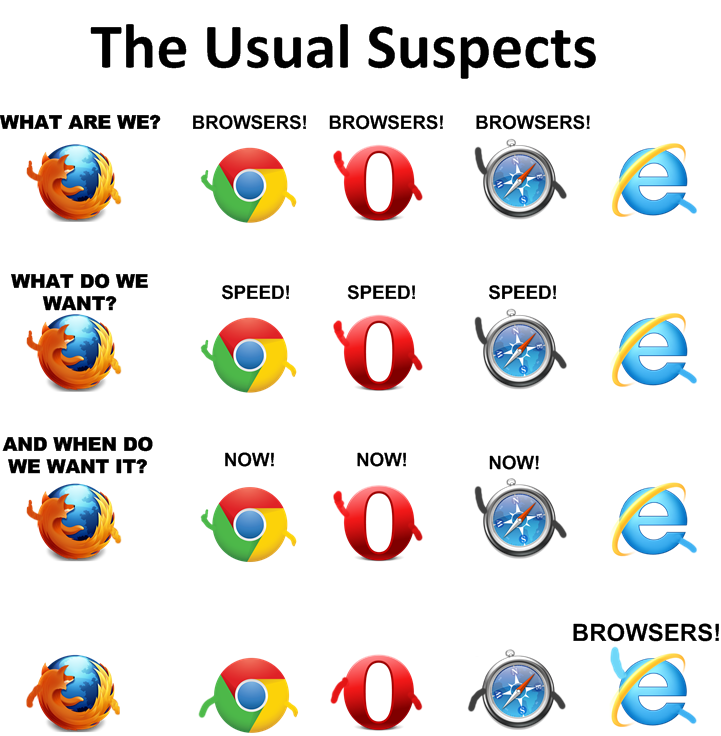
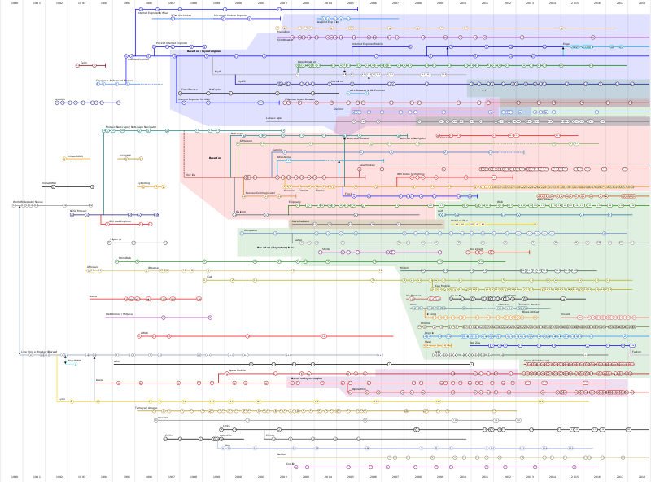
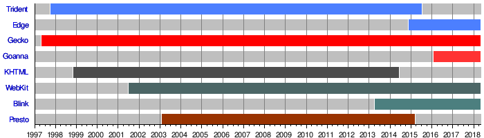
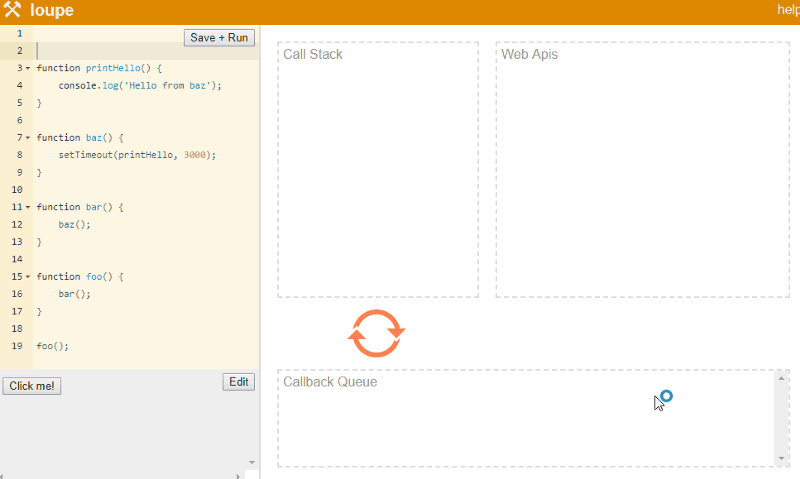
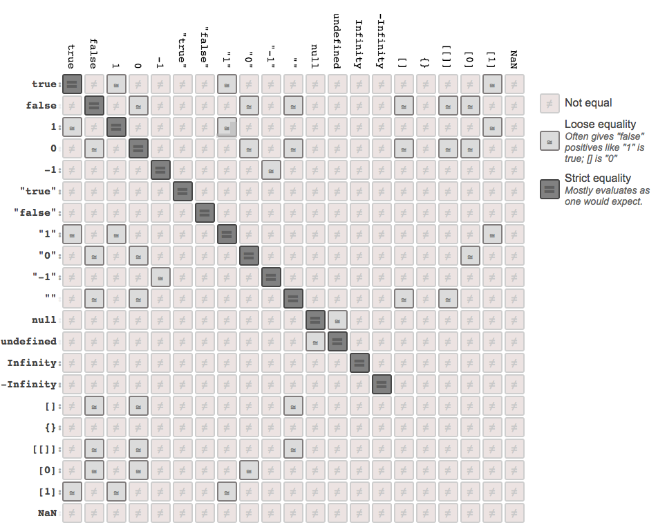
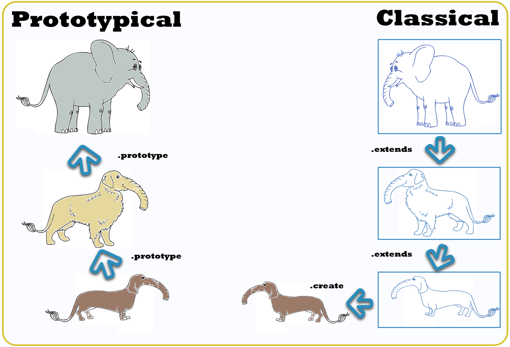
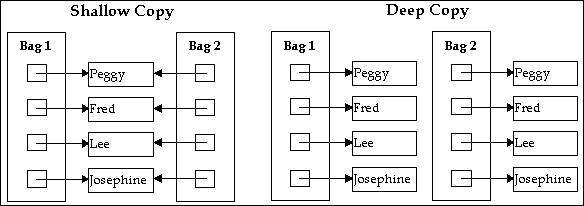

# Curso Incompany para PROCESIA
### HTML5 APIs, ECMA6, Patrones de diseño, AJAX avanzado, APIs externas, JS para Frontend, Automatización...


[FICTIZIA » Cursos a medida para empresas](https://www.fictizia.com/formacion-empresas)

## Clase 2

### Arrays

- Creando un array:
    ```javascript
	var arreglo = [];
	arreglo = [1, "platano", "piscina", "manzana", true];
    ```

- Usando el Índice:
    ```javascript
	arreglo[1];
    ```

- Cambiar un valor del Índice:
    ```javascript
	arreglo[0] = "fresa";
	arreglo[4] = "pera";
	arreglo[2] = "limón";
    ```

- delete *sobrescribe a undefined*
    ```javascript
    delete arreglo[0];
    ```

- Elementos vacios:
    ```javascript
    arreglo[0] = undefined;
    ```

**Propiedades**

- Índice total:
    ```javascript
    	arreglo.length;
    ```

- Usando el Índice total en un bucle:
    ```javascript
	var numeros = [1, 2, 3, 4, 5];
	for (var i = 0; i < numeros.length; i++) {
	  numeros[i] *= 10;
	}
    ```

**Métodos**

- .isArray() *Confirmar que se trata de un Array*:
    ```javascript
    	var arreglo = [1,2,3]
    	
    	// true
    	Array.isArray([1]);
    	Array.isArray(arreglo);
    	
    	// false
    	Array.isArray();
	Array.isArray({});
	Array.isArray(null);
	Array.isArray(undefined);
    ```

- .toLocalString() *Retorna como string (configuración regional) todos los elementos*:
    ```javascript
	var numero = 1337.89;
	var fecha = new Date();
	var miArray = [numero, fecha, 'más datos'];
	
	var arrayConvertida = miArray.toLocaleString(); 
	console.log(arrayConvertida);     
    ```

- .toString() *Retorna una cadena de texto con todos los nombres*:
    ```javascript
	var amigos = ['Luis', 'Carlos', 'Marco', 'Eduardo'];
	console.log(amigos.toString());
    ```

- .push() *Añadir elemento al índice*:
    ```javascript
	arreglo.push("nuevo");
    ```

- .pop() *Eliminar el último elemento del índice*:
    ```javascript
    	arreglo.pop();
    ```

- .shift() *Eliminar el primer elemento*:
    ```javascript
    	arreglo.shift();
    ```

- .unShift() *Añade nuevos elementos al principio del array y devuelve la longitud actualizada*:
    ```javascript
	var miArray = [1, 2];
	
	miArray.unshift(true, "otros datos...");
	console.log(miArray);
    ```

- .splice() *Borrar*:
    ```javascript
    	var manzana = arreglo.splice(3, 1);
    ```


- .slice() *Devuelve un nuevo Array con un segmento determinado del Array original*:
    ```javascript
	var frutas = ['Platano', 'Naranja', 'Limón', 'Manzana', 'Mango'];
	var citricos = frutas.slice(1, 3);
	console.info(citricos);
    ```

- .concat() *Retorna un nuevo Array con los Arrays especificados concatenados*:
   - Dos Arrays:
    ```javascript
    	var arreglo = ['a', 2, true];
    	var arreglo2 = [1, 2, 4];
    
    	var nuevaArray = arreglo.concat(arreglo2);

	console.log(nuevaArray); 
    ```
   - Múltiples Arrays:
    ```javascript
    	var arreglo = ['a', 2, true];
    	var arreglo2 = [1, 2, 4];
    	var otroArreglo = ['abc', 1, false]
    
    	var nuevaArray = arreglo.concat(arreglo2, [5.25, 100], otroArreglo);

	console.log(nuevaArray);
    ```


- .join() *Une todos los elementos en una cadena*:
    ```javascript
	var array = ['dato1', 2, , 'masDatos'];
	var datosJuntos = array.join();      // 'dato1,2,masDatos'
	var datosJuntos2 = array.join('');    // 'dato12masDatos'
	var datosJuntos3 = array.join(' + '); // 'dato1 + 2 + masDatos'
    ```

- .indexOf() *Devuelve la posición donde se escuentra el elemnto o -1 si no lo encuentra*:
    ```javascript
	var array = [2, 5, 9];
	var index = array.indexOf(9); // 2
	var index = array.indexOf(12); // -1
    ```

- .lastIdexOf() *Devuelve la posición del último elemento que coincide o -1 si no lo encuentra*:
    ```javascript
	var array = [7, 1, 3, 7];
	array.lastIndexOf(7); // 3
	array.lastIndexOf(2); // -1
    ```

- .sort() *Ordenación de los elementos*:
    ```javascript
	var frutas = ['Platano', 'Naranja', 'Limón', 'Manzana', 'Mango'];
	frutas.sort(); // ["Limón", "Mango", "Manzana", "Naranja", "Platano"]
	
	var miArray = ['uno', 2, true, 'más datos...'];
	miArray.sort(); // [2, "más datos...", true, "uno"]
    ```

- .reverse() *Invierte el orden de un Array*:
    ```javascript
	var miArray = ['uno', 2, true, 'más datos...'];
	miArray.reverse(); 
	console.log(miArray) // ["más datos...", true, 2, "uno"]
    ```

- .forEach() *Se ejecuta la función por cada elemnto del array*:
    ```javascript
	function logger(element, index, array) {
	    console.log("array[" + index + "] = " + element);
	}
	[2, 5, 9].forEach(logger);
    ```

- .map():
    ```javascript
	var arreglo = ["plátano", "fresa", "lima", "manzana"];
	var resultado = arreglo.map(function (elemento){return elemento + " modificado!"});
	console.log(resultado);
    ```

- .some() *Verifica si alguno de los elementos en el arreglo pasan la prueba implementada por la función dada:*:
    ```javascript
	function tamañoValido(elemento, indice, arrreglo) {
	  return elemento >= 10;
	}
	[12, 5, 8, 130, 44].some(tamañoValido);   // true
	[12, 54, 18, 130, 44].some(tamañoValido); // true
    ```


- .every() *verifica si todos los elementos en el arreglo pasan la prueba implementada por la función dada:*
    ```javascript
	function tamañoValido(elemento, indice, arrreglo) {
	  return elemento >= 10;
	}
	[12, 5, 8, 130, 44].every(tamañoValido);   // false
	[12, 54, 18, 130, 44].every(tamañoValido); // true    
    ```

- .filter() *Crea un nuevo array con aquellos elementos que cumplan la condición*:
    ```javascript
	function tamañoValido(elemento) {
	  return elemento >= 10;
	}
	var filtrados = [true, 134, 10, 0, null, "Hola"].filter(tamañoValido);
    ```

- .reduce() *Aplica una función a un acumulador y a cada valor de un vector para reducirlo a un único valor (de izquierda a derecha)*:
    - Base:
    ```javascript
	var reduce = [0,-3,1,2,4,6].reduce(function(valorAnterior, valorActual, indiceActual, array){
	  return valorAnterior + valorActual;
	});
	console.log(reduce); // 10
    ```
    
    - Sumar los valores de un Array:
    ```javascript
    var total = [0, 1, 2, 3].reduce(function(a, b){ return a + b; });
    ```
    
    - Fusionar varios Arrays en uno solo:
    ```javascript
    var integrado = [[0,1], [2,3], [4,5]].reduce(function(a,b) {
      return a.concat(b);
    });
    console.log("integrado es", integrado); //[0, 1, 2, 3, 4, 5]
    ```

- .reduceRight() *Aplica una función a un acumulador y a cada valor (de izq. a dcha.) de un vector para reducirlo a un único valor (de derecha a izquierda)*:
    ```javascript
  	var reduceRight = [0,-3,1,2,4,6].reduce(function(valorAnterior, valorActual, indiceActual, array){
	  return valorAnterior + valorActual;
	});
	console.log(reduceRight); // 10
    ```

**Arreglos avanzados**
```javascript
var arreglo1 = ["plátano", "fresa", "lima", "manzana"];
var arreglo2 = ["entrante", "primero", "segundo", "postre"];

var juntandoArreglos = [arreglo1, arreglo2];

function testArreglos () {
    console.log(juntandoArreglos[0][0]);
    console.log(juntandoArreglos[1][3]);
};
```

### Ejercicios

> Vamos a crear un sistema de control para el metro. Nuestro objetivo será desarrollar una aplicación para gestionarlo todo. Con este ejercicio nos centraremos en aplicar conceptos básicos de JavaScript


**1 -** Imprimimos por consola el estado de cada tren en movimiento de manera individualizada... usando *while*.

```javascript
// Tu solución
```

- Respuesta esperada (consola):

```
El tren número 1 esta funcionando
El tren número 2 esta funcionando
El tren número 3 esta funcionando
El tren número 4 no esta funcionando
El tren número 5 no esta funcionando
El tren número 6 no esta funcionando
El tren número 7 no esta funcionando
El tren número 8 no esta funcionando
```

**2 -** Imprimimos por consola el estado de cada tren en movimiento de manera individualizada...  usando *Do... While*.

```javascript
// Tu solución
```


**3 -** Imprimimos por consola el estado de cada tren en movimiento de manera individualizada...  usando *for*.

```javascript
// Tu solución
```


**4 - #compliquemos!** Servicio nocturno en el tren 10.
*Nota: Frente al ejercicio anterior, en este caso queremos que siempre que hablemos del
tren 10 se especifique que es nocturno. Independientemente de si esta parado o funcionando.*

```javascript
// Tu solución
```


**5 - ¡Refactoricemos!** ¿Y si todos los trenes están en las vías funcionando o por el contrario si ninguno de los trenes esta funcionando?.

```javascript
// Tu solución
```

**6 -** El servicio nocturno se queda un poco corto y necesitamos añadir un nuevo tren de refuerzo. El 12 será destinado a cubrir esta necesidad, exactamente igual que el 10 anteriormente.

```javascript
// Tu solución
```


**7 -** El departamento de Marketing ha decidido lanzar un nuevo servicio los sábados.
 El "tren fiestero" será un tren adaptado a un público más intrépido y funcionará solo en los sábados.
 Este tren será el número 13.

*NOTA: EL TREN 13 SOLO FUNCIONA LOS SÁBADOS. Es necesario incluir el día de la semana en tu código*

```javascript
// Tu solución
```


### Objetos

- [MDN Object](https://developer.mozilla.org/en-US/docs/Web/JavaScript/Reference/Global_Objects/Object)
- [w3schools Objects](http://www.w3schools.com/js/js_objects.asp)

**Objetos Literales**

- Propiedades:
    ```javascript
	var miObjeto = {
	    cadena: 'esto es una cadena',
	    numero: 2,
	    booleano: false
	};
	```


- Métodos:
    ```javascript
	var miObjeto = {
	    saludar: function(){
			console.log("hola!");
		}
	};
	```
	
- Trabajando con espacios y caracteres especiales:
    ```javascript
	var miObjeto = {
		nombre: "objeto",
	    "año": 2015,
	    "estado del sistema": "correcto"
	};
	
	console.log(miObjeto["año"]);
	miObjeto["estado del sistema"] = "fuera de servicio";
	console.log(miObjeto["estado del sistema"]);
	```

- Acortar objetos:

    ```javascript
	var objetoAbreviado = objeto.muy.muy.largo.que.tiene.muchos["metodos y propiedades"];
	
	objetoAbreviado.propiedad1;
	objetoAbreviado.metodo1();

	```

**Métodos**

- .defineProperties() *Define nuevas o modifica propiedades existentes directamente en el objeto, returnando el objeto.*:
    ```javascript
    	var miObjeto = {propiedad: "Propiedad original..."}
	Object.defineProperties(miObjeto, {
	  "propiedad1": {
	    value: true,
	    writable: true
	  },
	  "propiedad2": {
	    value: "Cadena de texto",
	    writable: false
	  }
	});
	console.info(miObjeto);
	miObjeto.propiedad = "Propiedad original Modificada";
	console.info(miObjeto.propiedad);
	miObjeto.propiedad2 = "Cadena de texto... ¿modificada?";
	console.info(miObjeto.propiedad2);
    ```

- .getOwnPropertyDescriptor() *Devuelve las detalles de los objetos y métodos del objeto. Undefined en caso de no existir*:
    ```javascript
	var miObjeto = {
	  metodo: function() {
	  	console.log(miObjeto.propiedad1)
	  },
	  propiedad1: "Datos"
	};

	console.info(Object.getOwnPropertyDescriptor(miObjeto, 'propiedad1'));
	// Object {value: "Datos", writable: true, enumerable: true, configurable: true}
	
	console.info(Object.getOwnPropertyDescriptor(miObjeto, 'inventado'));
	// undefined
    ```

- .getOwnPropertyNames() *Devuelve un array con todos los nombres de las propiedades y métodos del objeto*:
    ```javascript
	var miObjeto = {
	  metodo: function() {
	  	console.log(miObjeto.propiedad1)
	  },
	  propiedad1: "Datos"
	};
	
	console.log(Object.getOwnPropertyNames(miObjeto));
	// ["metodo", "propiedad1"]
    ```

- .isExtensible() *Determina si un objeto es extensible*:
    ```javascript
	var miObjeto = {
	  metodo: function() {
	  	console.log(miObjeto.propiedad1)
	  },
	  propiedad1: "Datos"
	};
	
	console.log("¿Se puede extender?", Object.isExtensible(miObjeto));
	
	var sellado = Object.seal(miObjeto);
	console.log("¿Se puede extender?", Object.isExtensible(sellado));
	
	var congelado = Object.freeze(miObjeto);
	console.log("¿Se puede extender?", Object.isExtensible(congelado));
	
	Object.preventExtensions(miObjeto);
	console.log("¿Se puede extender?", Object.isExtensible(miObjeto));
    ```


- .hasOwnProperty() *Devuelve true o false si l apropiedad existe o no*:
    ```javascript
	var miObjeto = {
	  metodo: function() {
	  	console.log(miObjeto.propiedad1)
	  },
	  propiedad1: "Datos"
	};
	
	console.log("¿Tiene la propiedad \"propiedad1\"?", miObjeto.hasOwnProperty('propiedad1'));
	console.log("¿Tiene la propiedad \"propiedad2\"?", miObjeto.hasOwnProperty('propiedad2'));
    ```


- .propertyIsEnumerable() *Devuelve true o false si la propiedad es especificada es enumerable.*:
    ```javascript
	var miObjeto = {
	  metodo: function() {
	  	console.log(miObjeto.propiedad1)
	  },
	  propiedad1: "Datos"
	};
	
	console.log("¿Es enumerable \"propiedad1\"?", miObjeto.propertyIsEnumerable('propiedad1'));
	console.log("¿Es enumerable \"metodo\"?", miObjeto.propertyIsEnumerable('propiedad2'));
    ```

- .toLocaleString() *Retorna como string (configuración regional) todas las propiedades*:
    ```javascript
	var fecha = new Date();
	
	var miObjeto = {
	  metodo: function() {
	  	console.log(miObjeto.propiedad1)
	  },
	  propiedad1: "Datos",
	  fecha: fecha
	};
	
	miObjeto.toLocaleString()
	console.log("La fecha es ", miObjeto.fecha);
    ```

**For... in**

Itera sobre todas las propiedades de un objeto, en un orden arbitriario.
```javascript
	var objeto1 = {
		propiedad1: "hola",
		propiedad2: 2,
		propiedad3: false,
		propiedad4: [true,2,5, "..."],
		propiedad5: {
			dato: "más datos..."
		},
		metodo: function(){
			console.log("hola");
		}
	}
	function mostrar_propiedades(objeto, nombreObjeto) {
	   var resultado = "";
	   for (var i in objeto) {
	      resultado += nombreObjeto + "." + i + " = " + objeto[i] + "\n";
	   }
	   return resultado;
	}
	
	mostrar_propiedades(objeto1, "objeto1");
```

### Funciones


- Propiedad *name*:
    ```javascript
  function miFuncion (){
    // vacia
  };

  console.log(miFuncion.name);
    ```


- **Declaración y ejecución**:
    ```javascript
  function dameTrue (){
    return true
  };

  function dameFalse () {
    return false
  };

  dameTrue();
  dameFalse();
    ```

- **this**:
  - como función (*this* contexto *window*)
    ```javascript
    function ambitoGlobal () {
      return this;
    }
    
    ambitoGlobal()
    ```
  - como método en un objeto (*this* contexto objeto al que pertenece el método)
    ```javascript
    var objeto = {};
    
    objeto.miMetodo = function () {
      return this;
    }
    
    objeto.miMetodo();
    ```   
  - como constructor de un objeto (*this* contexto objeto creado)
  - .apply() y .call() (modificación explícita de *this*)

- **Argumentos:**
  - El exceso de argumentos no es un problema
  - La falta de argumento crea un valor indefinido
    - El Objeto Arguments no es un Array, solo es similar.
    ```javascript    
  
	  function pruebaArguemntos () {
	  console.log(arguments);
	  console.info(arguments[0]);
	  console.info(arguments[1]);
	  }
	  
	  pruebaArguemntos (1, "vale", true);
	  
    ```
- [Objeto Arguments](https://developer.mozilla.org/es/docs/Web/JavaScript/Referencia/Funciones/arguments)


- **Retorno**
```javascript
  function sumaCuadrados (a, b) {
    return (a*a) + (b*b);
  };
```

### Scope

- Declaración y ejecución:
    ```javascript
  var numero = 450;
  var otroNumero = 23;

  function sumaCuadrados (a, b) {
    var numero = a;
    var otroNumero = b;
    var calculo = (numero*numero) + (otroNumero*otroNumero);
    console.log("\"numero\" es \""+numero+"\", local");
    console.log("\"otroNumero\" es \""+otroNumero+"\", local");
  };

  function verificarGlobales() {
    console.log("\"numero\" es \""+numero+"\", global");
    console.log("\"otroNumero\" es \""+otroNumero+"\", global");
  };
    ```

### Funciones Avanzadas

- Anónimas (expresiones):
    ```javascript
  var sumaCuadrados = function (a, b) {
    return (a*a) + (b*b);
  };
    
    console.log("El .name de sumaCuadrados es "+sumaCuadrados.name)
    ```

- Funciones como dato:
    ```javascript
  function saludo () {
    console.log("hola!");
  };

  function lanzar (funcion){
    funcion();
  };
    ```

- Funciones anónimas autoejecutables:
    ```javascript
  (function() {
    console.log("hola Amigo/a")

  }) (); //ex:Jquery
    ```


- Funciones anónimas con parámetros:
    ```javascript
  ( function(quien){
     console.log("hola " + quien);
  })("Amigo/a");
    ```


- Función que devuelve una función anónima:
  - Asignando una variable:
    ```javascript
  function saludo(quien){
          return function(){
                  alert("hola " + quien);
          }
  }
  var saluda = saludo("Amigo/a");
  saluda();
    ```

  - Sin asignar una variable:
    ```javascript
  function saludo(quien){
          return function(){
                  alert("hola " + quien);
          }
  }
  saludo("Amigo/a")();
    ```


### Funciones Avanzadas: Anidación

**Con variables**
```javascript
function saludar(quien){
    function alertasaludo(){
            console.log("hola " +  quien);
    }
    return alertasaludo;
}
var saluda = saludar("Amigo/a");
saluda();
```

**Ejecución directa**
```javascript
function saludar(quien){
    function alertasaludo(){
            console.log("hola " +  quien);
    }
    return alertasaludo;
}
saludar("Amigo/a")();
```
    
### Funciones Avanzadas: Recursión

- Calcular el [factorial](https://www.wikiwand.com/es/Factorial).
  
    ```javascript
    function factorial(n){
      return n <= 1 ? 1 : n * factorial(n-1);
    }
    
    factorial(0); // n! = 1
    factorial(1); // n! = 1
    factorial(2); // n! = 2
    factorial(3); // n! = 6 (3*2*1)
    factorial(4); // n! = 24 (4*3*2*1)
    factorial(5); // n! = 120 (5*4*3*2*1)
    factorial(6); // n! = 720 (...)
    // ...
    ```

### Funciones Avanzadas: Closures

> Los closures son funciones que manejan variables independientes. En otras palabras, la función definida en el closure "recuerda" el entorno en el que se ha creado.

> No es aconsejable crear innecesariamente funciones dentro de otras funciones si no se necesitan los closures para una tarea particular ya que afectará negativamente el rendimiento del script tanto en consumo de memoria como en velocidad de procesamiento.
> [Closures MDN](https://developer.mozilla.org/es/docs/Web/JavaScript/Closures)

- Fábrica de función:
    ```javascript
  function sumador(x) {
    return function(y) {
      return x + y;
    };
  }

  var sum1 = sumador(10); //Closure
  var sum2 = sumador(30); //Closure

  console.log(sum1(2)); // Devuelve 12
  console.log(sum2(2)); // Devuelve 32
  console.log(sumador(20)(2)); //Devuelve 22
    ```

- Otro ejemplo, ahora temporizado:
    ```javascript
  function saludar(segundos){
    var hola = "Hola, Hola!";

    setTimeout(function(){
      console.info(hola);
    },segundos*1000);
  }

  saludar(2);
    ```

- Otro ejemplo... más útil:
    ```javascript
      var varGlobal = "Soy un dato Global";
      var burbuja;

      function nivel1() {
        var varInterna = "Soy un dato interno. -> nivel1";

        function nivel2() {
          console.log("Estoy dentro de la funcion -> nivel2")
          console.log("Estoy dentro de la funcion -> nivel2 y puedo acceder al nivel1: "+varInterna)
        }

        burbuja = nivel2;

      }

      nivel1();

      burbuja();
      console.log("Burbuja recuerda su contexto original")
    ```

### Funciones Avanzadas: Callbacks

> En programación de computadoras, una devolución de llamada o retrollamada (en inglés: callback) es una función "A" que se usa como argumento de otra función "B". Cuando se llama a "B", ésta ejecuta "A". Para conseguirlo, usualmente lo que se pasa a "B" es el puntero a "A".
> [Callbacks en Wikiwand](https://www.wikiwand.com/es/Callback_(inform%C3%A1tica))

- Ejemplo condensado:
    ```javascript
  var quieroCallback = function(parametro, callback){
      if ((callback) && (typeof callback === 'function')){
          callback(parametro);
      }
      else
          console.log(parametro, callback);
  }
   
  quieroCallback('a', 'b');
   
  quieroCallback('a', function(val){
      console.log(val);
  });
    ```


- Ejemplo con Jquery:
    ```javascript
    $('#elemento').fadeIn('slow', function() {
      // código del callback
  });
    ```


- Otro ejemplo:
    ```javascript
    function comerSandwich(elemento1, elemento2, callback) {
      console.info('ñam ñam... empiezo con el sándwich.\n\nMe gusta porque tiene tiene ' + elemento1 + ', ' + elemento2);
      callback();
  }

  comerSandwich('jamón', 'queso', function() {
      console.info('Ya terminé...');
  });
    ```


- Ejemplo con Callback opcional:
    ```javascript
    function comerSandwich(elemento1, elemento2, callback) {
      console.info('ñam ñam... empiezo con el sándwich.\n\nMe gusta porque tiene tiene ' + elemento1 + ', ' + elemento2);
      
      if (callback) {
          callback();
      }

  }

  comerSandwich('jamón', 'queso');
    ```


- Sanitizar el Callback:
    ```javascript
    function comerSandwich(elemento1, elemento2, callback) {
      console.info('ñam ñam... empiezo con el sándwich.\n\nMe gusta porque tiene tiene ' + elemento1 + ', ' + elemento2);
      
      if (callback && typeof(callback) === "function") {
          callback();
      }

  }

  comerSandwich('jamón', 'queso');
    ```


### Funciones Avanzadas: Asincronia
```javascript
	    function comerSandwich(elemento1, elemento2, callback) {
	      console.info('ñam ñam... empiezo con el sándwich.\n\nMe gusta porque tiene tiene ' + elemento1 + ', ' + elemento2);
	    
	    setTimeout(alarma, 5000);
	    function alarma(){
	      console.log("ring! ring!.. pasaron los 5 segundos!");
	    };
	
	    
	      if (callback && typeof(callback) === "function") {
	          callback();
	      }
	  }
	
	  comerSandwich('jamón', 'queso', function() { 
	      console.log('Ya terminé...');
	  });
```


- Más información: 
  - [Callback Functions in JavaScript de Louis Lazaris](http://www.impressivewebs.com/callback-functions-javascript/)
  - [Creando y utilizando callbacks de Pablo Novas en fernetjs](https://fernetjs.com/2011/12/creando-y-utilizando-callbacks/)

### Funciones Avanzadas: Funciones anónimas autoejecutadas

- **Sintaxis:**
```javascript
    (function(){
      console.log('Hola Mundo!');
    })();
```

- **Incluyendo referencias y manipulando otros elementos:**
```javascript
    var myApp = myApp || {};
    
    (function(w, doc, ns){
      
      ns.accesoWindow = function(){
        return w === window;
      };
      ns.accesoDocument = function(){
        return doc === document;
      };
      ns.confirmacion = function(){
        console.log('Hola Mundo! Mis caracteristicas son: \n Acceso a Window: '+this.accesoWindow()+'\n Acceso a Document: '+this.accesoDocument());
      }
    })(window, document, myApp);

    
    // myApp.confirmacion()
```

### Ejercicios

#### Trenes

**8 -** Hagamos una lista de pasajeros efectiva usando Arrays e imprimamos cada pasajero de la lista y su número de asiento (basado en el orden del índice).
*Nota: El primer asiento del tren es el 1 y no el 0.*

```javascript
// Tu solución
```

- Respuesta esperada (consola):
```
	El pasajero Alicia Gutierrez tiene reservado el asiento 1
	El pasajero Alfonso Gomez tiene reservado el asiento 2
	El pasajero Luis Navarro tiene reservado el asiento 3
	El pasajero Oscar Garcia tiene reservado el asiento 4
	El pasajero Andres Fernandez tiene reservado el asiento 5
	El pasajero Lucia Mellado tiene reservado el asiento 6
```


**9 -** Necesitamos una función para agregar y otra para borrar pasajeros de la lista.
*Nota: Pensemos que a la larga pueden existir más listas.*

```javascript
// Tu solución
```


**10 -** La compañía de trenes ha decidido que los viajeros podrán reservar el asiento asignado, pero quiere evitar que los pasajeros cambien de asiento constantemente cuando se anula un o varios billetes.
*Nota: Al borrar en el ejercicio anterior las posiciones de los pasajeros cambiaban y los billetes quedaban desactualizados.*

```javascript
// Tu solución
```


**11 -** Una de las vías principales esta en obras. Así que nuestra compañía decidió usar antiguas vías para hacer transbordos directos entre las estaciones afectadas.

Nuestra Misión es añadir el tiempo estimado en los billetes para las estaciones afectadas Tetuán,
Moncloa y Hortaleza. Es necesario incluir un texto informativo y el nombre del usuario también en el billete.

*Nota: Intenta utilizar Closures*

Info: 	
	- Tetuán (12)
   	- Moncloa (19)
   	- Hortaleza (21)

```javascript
// Tu solución
```


### Los Navegadores



### Los Navegadores: Historia


**Evolución**
[](https://en.wikipedia.org/wiki/History_of_the_web_browser#/media/File:Timeline_of_web_browsers.svg)


**Recursos**
- [:tv: Project Code Rush - The Beginnings of Netscape / Mozilla Documentary](https://www.youtube.com/watch?v=4Q7FTjhvZ7Y)
- [:tv: Download:The True Story of the Internet: La Guerra de los Navegadores Subtitulada](https://www.youtube.com/watch?v=zpm0tAixurg)
- [Browser Wars: La historia de la guerra de navegadores y la historia de los userAgents](https://www.emezeta.com/articulos/browser-wars-la-historia-de-la-guerra-de-navegadores)
- [Wikipedia | Guerra de navegadores](https://es.wikipedia.org/wiki/Guerra_de_navegadores)
- [PC Mag | Browsers: A Brief History](https://www.pcmag.com/feature/262125/browsers-a-brief-history)
- [The Telegraph | Web browsers: a brief history](https://www.telegraph.co.uk/technology/microsoft/11577364/Web-browsers-a-brief-history.html)
- [A Brief History of Web Browsers and How They Work](https://crossbrowsertesting.com/blog/test-automation/history-of-web-browsers/)
- [Wikipedia | History of the web browser](https://en.wikipedia.org/wiki/History_of_the_web_browser)

### Los Navegadores: Motores actuales


**Browser Engine**
- Activos	
	- [Blink (Chrome/Opera)](https://en.wikipedia.org/wiki/Blink_(web_engine)) 
	- [EdgeHTML](https://en.wikipedia.org/wiki/EdgeHTML)
	- [Gecko (Firefox)](https://en.wikipedia.org/wiki/Gecko_(software))
	- [Goanna](https://en.wikipedia.org/wiki/Goanna_(software))
	- [Servo](https://en.wikipedia.org/wiki/Servo_(software))
	- [WebKit (Safari)](https://en.wikipedia.org/wiki/WebKit)
- Discontinuados	
	- [KHTML](https://en.wikipedia.org/wiki/KHTML) 
	- [Mariner](https://en.wikipedia.org/wiki/Mariner_(browser_engine))
	- [Presto](https://en.wikipedia.org/wiki/Presto_(browser_engine))
	- [Tasman](https://en.wikipedia.org/wiki/Tasman_(layout_engine))
	- [Tkhtml](https://en.wikipedia.org/wiki/Tkhtml)
	- [Trident](https://en.wikipedia.org/wiki/Trident_(software))


### Los Navegadores: Interpretes de JS


**El Motor JavaScript (JavaScript Engine)**
- [V8 Engine de Google](https://github.com/v8/v8)
- [Chakra de Microsoft](https://github.com/Microsoft/ChakraCore)
- [SpiderMonkey de Mozilla](https://developer.mozilla.org/en-US/docs/Mozilla/Projects/SpiderMonkey)
- [JavaScriptCore de Apple](https://en.wikipedia.org/wiki/JavaScriptCore)
- [Carakan de Opera (Inactivo)](https://dev.opera.com/blog/carakan/)
- [Comparativa de Motores](https://en.wikipedia.org/wiki/Comparison_of_JavaScript_engines)

**Recursos**
- [Introducing: Goanna](https://forum.palemoon.org/viewtopic.php?f=1&t=8607&sid=ba5882946848eb6d4ac7241f6bab2e34)
- [MDN | Gecko](https://developer.mozilla.org/es/docs/Gecko)

### Los Navegadores: Funcionamiento

**Arquitectura a alto nivel**


**Afinando los detalles**


**[Philip Robers es un genio!](http://latentflip.com/loupe/)**



**Recursos**
- [How JavaScript works in browser and node?](https://itnext.io/how-javascript-works-in-browser-and-node-ab7d0d09ac2f)
- [HTML5 Rocks! | How Browsers Work: Behind the scenes of modern web browsers](https://www.html5rocks.com/en/tutorials/internals/howbrowserswork/#The_parsing_algorithm)
- [Philip Roberts: What the heck is the event loop anyway? | JSConf EU](https://www.youtube.com/watch?v=8aGhZQkoFbQ)
- [Behind the scenes of modern web browsers](http://taligarsiel.com/Projects/howbrowserswork1.htm)
- [Does JavaScript use stack or heap for memory allocation or both?](https://hashnode.com/post/does-javascript-use-stack-or-heap-for-memory-allocation-or-both-cj5jl90xl01nh1twuv8ug0bjk)
- [How JavaScript works: the rendering engine and tips to optimize its performance](https://blog.sessionstack.com/how-javascript-works-the-rendering-engine-and-tips-to-optimize-its-performance-7b95553baeda)
- [An overview of the engine, the runtime, and the call stack](https://blog.sessionstack.com/how-does-javascript-actually-work-part-1-b0bacc073cf)
- [Inside Google’s V8 engine + 5 tips on how to write optimized code](https://blog.sessionstack.com/how-javascript-works-inside-the-v8-engine-5-tips-on-how-to-write-optimized-code-ac089e62b12e)
- [Memory management + how to handle 4 common memory leaks](https://blog.sessionstack.com/how-javascript-works-memory-management-how-to-handle-4-common-memory-leaks-3f28b94cfbec)
- [The event loop and the rise of Async programming + 5 ways to better coding with async/await](https://blog.sessionstack.com/how-javascript-works-event-loop-and-the-rise-of-async-programming-5-ways-to-better-coding-with-2f077c4438b5)


## Hablemos de JavaScript y más allá...


**Recursos**
- [:tv: Douglas Crockford: The JavaScript Programming Language](https://www.youtube.com/watch?v=v2ifWcnQs6M)
- [:tv: The Post JavaScript Apocalypse - Douglas Crockford](https://www.youtube.com/watch?v=NPB34lDZj3E)
- [:tv: dotJS 2012 - Brian Leroux - WTFJS](https://www.youtube.com/watch?v=et8xNAc2ic8)
- [:tv: What the... JavaScript?](https://www.youtube.com/watch?v=2pL28CcEijU)


### Las funciones en JS: Funciones anónimas autoejecutadas (IIFE)

```javascript
// Classic
(function(){})();
 
// Crockford's favorite
(function(){}());
 
// Unary versions
+function(){}();
 
// Facebook version
!function(){}();
 
// Crazy version
!1%-+~function(){}();
```

**Recursos**
- [Immediately-Invoked Function Expression (IIFE)](http://benalman.com/news/2010/11/immediately-invoked-function-expression/)
- [Funciones autoejecutables en Javascript](http://www.etnassoft.com/2011/03/14/funciones-autoejecutables-en-javascript/)

### Las funciones en JS: Funciones variádicas
- La gestión de argumentos es muy pocos restrictiva
- EL úmero de argumentos es variable, por defecto su valor es siempre `undefined`
- `arguments` no es un array y tendremos que manejarlo con cuidado o convertirlo usando `prototype`

```javascript
function func(arg1, arg2, arg3) { 
	console.log("arg1:", arg1)
	console.log("arg2:", arg2)
	console.log("arg3:", arg3)
	console.log("Arguments:" arguments)
	console.log("Arguments eres una Array?", Array.isArray(arguments))
}
func(2); //arg1: 2 
		 //arg2: undefined
		 //arg3: undefined
```

**Recursos**
- [Bitácora del desarrollador: ¿Qué son las funciones variádicas?](https://jherax.wordpress.com/2014/07/06/javascript-funciones-variadicas/)

### Las funciones en JS: Ciudadanos de primera clase

```javascript
function func() {}
var func = function (){}
var obj = {
	func(){}
}
var func = new Function('arg1', 'arg2', 'console.log(arg1, arg2)');
```

### Las funciones en JS: Comportamiento de objetos

```javascript
function func() {console.log("Soy una función", typeof(func))}
func.metodo = function() {console.log("Soy un método", typeof(func.metodo))}
func.propiedad = "Dato almacenado..."
console.log("Tengo propiedades", typeof(func.propiedad)) //Tengo propiedades string
func.metodo() //Soy un método function
func() //Soy una función function
```

### Las funciones en JS: Entidades de orden superior

```javascript
function funcAsincrona (dato, callback)  {
    return callback(dato+5);
}

funcAsincrona(5, data => console.log) //10
```

```javascript
function funcEspecial () {
	console.log("Una sola vez...")
    return function () {
        console.log("Muchas veces...")
    }
}

var nuevaFunc = funcEspecial(); //Una sola vez...
nuevaFunc(); //Muchas veces...
nuevaFunc(); //Muchas veces...
```

**Recursos**
- [Higher-Order Functions in JavaScript](https://www.sitepoint.com/higher-order-functions-javascript/)

### Las funciones en JS: Recursión
**Partes**
- Caso base: *es el caso más simple y determina la salida de la función*
- Caso recursivo: *vamos reduciendo la causistica y llamando a la propia función*

**Ejemplo**
```javascript
// Sin recursión
let counter = 100;
while(counter > 0) {
    console.log(counter--);
}

// Con recursión
const cuentaAtras = function(value) {
    if (value > 0) {
        console.log("Valor actual:", value);
        cuentaAtras(value - 1);
    } else {
        console.log("Fin de la historia:", value);
    }
};
cuentaAtras(100);
```

**Recursos**
- [Recursion in Functional JavaScript](https://www.sitepoint.com/recursion-functional-javascript/)
- [JS-Challenges/recursion-prompts](https://github.com/JS-Challenges/recursion-prompts)
- [Understanding Recursion in JavaScript](https://medium.com/@zfrisch/understanding-recursion-in-javascript-992e96449e03)
- [Recursion in JavaScript](https://medium.freecodecamp.org/recursion-in-javascript-1608032c7a1f)
- [Learn and Understand Recursion in JavaScript](https://codeburst.io/learn-and-understand-recursion-in-javascript-b588218e87ea)
- [Stackoverflow | Calling a javascript function recursively](https://stackoverflow.com/questions/7065120/calling-a-javascript-function-recursively)
- [Programming with JS: Recursion](https://hackernoon.com/programming-with-js-recursion-31371e2bf808)
- [¿Qué es la recursividad o recursión? - Un ejemplo con JavaScript](https://www.campusmvp.es/recursos/post/Que-es-la-recursividad-o-recursion-Un-ejemplo-con-JavaScript.aspx)
- [Understanding Recursion in JavaScript with Confidence](https://www.thecodingdelight.com/understanding-recursion-javascript/)

### Las funciones en JS: Los ambitos

**Global**
```javascript
const global = "Dato global";
function func() {
    console.log(global);
}
func(); // Dato global
```

**Local clásico**
```javascript
function func() {
    const local = 5;
}
console.log(local); // undefined.
```

**Local con ES6**
- Usando `var` el scope se define por la función donde se declaró, `function-level scope`
- Usando `let` y `const` el scope también se define en `if`, `while`, `for` o `switch`, `block-level scope`.

```javascript
var uno = 1;
var diez = 10;
 
if (uno === 1) {
  let uno = 3; // El alcance es dentro del bloque if
  var diez = 5; // El alcance es dentro de la función
 
  console.log(uno);  // 3
  console.log(diez);  // 5
} 
 
console.log(uno); // 1
console.log(diez); // 5
```


### Las funciones en JS: Closures


> Un closure o clausura es la combinación de una función y el ámbito léxico en el que se declaró dicha función. Es decir los closures o clausuras son funciones que manejan variables independientes. **En otras palabras, la función definida en el closure "recuerda" el ámbito en el que se ha creado**. [MDN](https://developer.mozilla.org/es/docs/Web/JavaScript/Closures)

**Claves**
- Simplemente: la función definida en el closure "recuerda" el ámbito en el que se ha creado
- En resumen nos permite encapsular código pero con acceso a su contexto
- Todo ese contexto que recuerda ataca a la memoria RAM
- No debemos abusar de este hack por temas de rendimiento
- Es muy útil para emular métodos privados entre otras cosas

**Ejemplo clásico**
```javascript
function creaSumador(x) {
  return function(y) {
    return x + y;
  };
}

var suma5 = creaSumador(5);
var suma10 = creaSumador(10);

console.log(suma5(2));  // muestra 7
console.log(suma10(2)); // muestra 12 
```

**Ejemplo aplicado**
```javascript
function makeSizer(size) {
  return function() {
    document.body.style.fontSize = size + 'px';
  };
}

var size12 = makeSizer(12);
var size14 = makeSizer(14);
var size16 = makeSizer(16);
```

**Recursos**
- [JavaScript Closures Demystified](https://www.sitepoint.com/javascript-closures-demystified/)
- [MDN | Closures](https://developer.mozilla.org/es/docs/Web/JavaScript/Closures)
- [JavaScript Closure y su funcionamiento](https://www.arquitecturajava.com/javascript-closure-funcionamiento/)
- [Stackoverflow | How do JavaScript closures work?](https://stackoverflow.com/questions/111102/how-do-javascript-closures-work)
- [Understand JavaScript Closures With Ease](http://javascriptissexy.com/understand-javascript-closures-with-ease/)
- [Understanding JavaScript Closures: A Practical Approach](https://scotch.io/tutorials/understanding-javascript-closures-a-practical-approach)
- [Understanding JavaScript: Closures](https://hackernoon.com/understanding-javascript-closures-4188edf5ea1b)
- [Understanding JavaScript Closures](https://codeburst.io/understanding-javascript-closures-da6aab330302)
- [Closures en JavaScript (ES5)](https://jherax.wordpress.com/2015/02/13/javascript-closures/)
- [JavaScript. ¿Para qué sirven los closures?](https://charlascylon.com/2013-11-19-javascript-para-que-sirven-los-closures)
- [Closures in Javascript for beginners](https://tech.io/playgrounds/6516/closures-in-javascript-for-beginners)
- [CSS-Tricks | JavaScript Scope and Closures](https://css-tricks.com/javascript-scope-closures/)
- [Entendiendo closures en JavaScript](https://medium.com/entendiendo-javascript/entendiendo-closures-en-javascript-8fb9a284964e)
- [I never understood JavaScript closures](https://medium.com/entendiendo-javascript/entendiendo-closures-en-javascript-8fb9a284964e)
- [Definiendo conceptos: Closure y Scope en JavaScript](https://medium.com/@sergiodxa/definiendo-conceptos-closure-y-scope-en-javascript-9081f1e113e6)

### Conceptos: Hoisting (elevamiento)

- Antes de ejecutar el código, las variables se mueven al inicio del contexto de ejecución
- Declarar una variable en cualquier parte es lo mismo que declararla al inicio
- Las variables pueden usarse antes de ser declaradas

```javascript
//ES5
(function () {
	if(true) {
		var ifScope = "data"
	}
    for(var forScope = 0; forScope < 3; forScope += 1) {
        console.log(forScope);
    }
    console.log("forScope ?", forScope);	// 3
    console.log("ifScope ?", ifScope);		// data
}());

// ES6
(function () {
	if(true) {
		let ifScope = "data"
	}
    for(let forScope = 0; forScope < 3; forScope += 1) {
        console.log(forScope);
    }
    console.log("forScope ?", forScope);	// Uncaught ReferenceError: forScope is not defined
    console.log("ifScope ?", ifScope);		// Uncaught ReferenceError: ifScope is not defined
}());
```

```javascript
console.log("fn1", fn1()); // Uncaught TypeError: fn1 is not a function
console.log("fn2", fn2()); // 2
 
//function expression
var fn1 = function() { return 1; };
 
//function declaration
function fn2() { return 2; }

console.log("fn1", fn1()); // 1
console.log("fn2", fn2()); // 2
```

**Recursos**
- [Understanding Hoisting in JavaScript](https://scotch.io/tutorials/understanding-hoisting-in-javascript)
- [Bitácora del desarrollador: Hoisting en JavaScript](https://jherax.wordpress.com/2014/07/04/javascript-hoisting/)
- [JavaScript Scoping and Hoisting](http://www.adequatelygood.com/JavaScript-Scoping-and-Hoisting.html)
- [JavaScript Hoisting Explained](https://code.tutsplus.com/tutorials/javascript-hoisting-explained--net-15092)
- [Diferencia entre let y var en ES6 y TypeScript](https://victorroblesweb.es/2016/08/27/diferencia-let-var-es6-typescript/)


### Conceptos: Programación defensiva


> La programación defensiva (defensive programming en inglés) es una forma de diseño defensivo aplicada al diseño de software que busca garantizar el comportamiento de todo elemento de una aplicación ante cualquier situación de uso por incorrecta o imprevisible que ésta pueda parecer. En general, esto supone multiplicar las comprobaciones que se realizan en todos los módulos programados, con la consiguiente penalización en carga de procesador, tiempo y aumento en la complejidad del código. Las técnicas de programación defensiva se utilizan especialmente en componentes críticos cuyo mal funcionamiento, ya sea por descuido o por ataque malicioso, podría acarrear consecuencias graves o daños catastróficos. [Wikipedia](https://es.wikipedia.org/wiki/Programaci%C3%B3n_defensiva)

**Recursos**
- [Wikipedia | Programación defensiva](https://es.wikipedia.org/wiki/Programaci%C3%B3n_defensiva)
- [The Art of Defensive Programming](https://medium.com/web-engineering-vox/the-art-of-defensive-programming-6789a9743ed4)
- [Defensive Programming In JavaScript](https://speakerdeck.com/byrichardpowell/defensive-programming-in-javascript)
- [Defensive coding examples](https://glebbahmutov.com/blog/defensive-coding-examples/)
- [Defensive JavaScript? Yes, Please!](https://blog.javascripting.com/2015/03/18/defensive-javascript/)
- [Defensive programming: the good, the bad and the ugly](https://enterprisecraftsmanship.com/2016/04/27/defensive-programming-the-good-the-bad-and-the-ugly/)
- [What is “Defensive Programming”?](http://scottdorman.github.io/2008/07/04/what-is-ldquodefensive-programmingrdquo/)
- [An In-Depth Look at Defensive Programming](https://www.zuehlke.com/blog/an-in-depth-look-at-defensive-programming/)

### Conceptos: Lenguaje de programación dinámico

> Un lenguaje de programación dinámico es un lenguaje de programación en el que las operaciones realizadas en tiempo de compilación pueden realizarse en tiempo de ejecución. Por ejemplo, en JavaScript es posible cambiar el tipo de una variable o agregar nuevas propiedades o métodos a un objeto mientras el programa está en ejecución. [MDN](https://developer.mozilla.org/es/docs/Glossary/Dynamic_programming_language)

**Recursos**
- [MDN | Lenguaje de programación dinámico](https://developer.mozilla.org/es/docs/Glossary/Dynamic_programming_language)


### Conceptos: duck typing


> Si parece un pato, nada como un pato, y grazna como un pato, entonces probablemente sea un pato.

**Conceptos**
- Podemos saber si un objeto es una instancia de otra por las propiedades que hereda o no...
- `typeof` es muy limitado para saber que es algo, especialmento con objetos
- `Instanceof` es útil cuando evaluamos nuestras propias construcciones

**El problema de `typeof`**
```javascript
//@see: http://www.etnassoft.com/2011/02/07/duck-typing-en-javascript-chequeando-los-tipos-de-datos/
console.log( typeof new String( 'Fictizia' ) );				//object
console.log( typeof new Number( 1 ) );							//object
console.log( typeof [ "platano", true, "coche", 4 ] );			//object
console.log( typeof new Array( "platano", true, "coche", 4 ) ); //object
```

**El problema de `instanceof`**
```javascript
// @see: http://www.etnassoft.com/2011/02/07/duck-typing-en-javascript-chequeando-los-tipos-de-datos/
// construciones propias:
function constructor(){}
function otro_constructor(){}
constructor.prototype = otro_constructor;
console.log( new constructor() instanceof constructor );			// true
console.log( new otro_constructor() instanceof otro_constructor );	// true
console.log( new otro_constructor() instanceof constructor );		// false

// construciones del lenguaje:
console.log( new String( 'Fictizia' ) instanceof String );			// true
console.log( new String( 'Fictizia' ) instanceof Object );			// true
console.log( 'Fictizia' instanceof String );						// false
console.log( 'Fictizia' instanceof Object );						// false
console.log( new Array( 1, true, "banana" ) instanceof Array ); 	// true
console.log( new Array( 1, true, "banana" ) instanceof Object );	// true
console.log( [ 1, true, "banana" ] instanceof Array );				// true
console.log( [ 1, true, "banana" ] instanceof Object ); 			// true
```

**Entendiendo la validación**
```javascript
// https://github.com/jashkenas/underscore/blob/master/underscore.js#L1315
function isArray( obj ){
  return toString.call( obj ) === '[object Array]';
}

// Aproximación como Duck Typing
function isArray( obj ){
  return obj && typeof obj === "object" && "push" in obj;
}

//@see: http://www.etnassoft.com/2011/02/07/duck-typing-en-javascript-chequeando-los-tipos-de-datos/
// Aproximación como Duck Typing en modo paranoico
function isArray( obj ){
  return obj &&
  typeof obj === "object" &&
  "splice" in obj &&
  "join" in obj &&
  "push" in obj;
}
```

**Recursos**
- [Wikipedia | Test del pato](https://es.wikipedia.org/wiki/Test_del_pato)
- [Wikipedia | Duck Typing](https://es.wikipedia.org/wiki/Duck_typing)
- [Duck Typing en Javascript Chequeando los tipos de datos](http://www.etnassoft.com/2011/02/07/duck-typing-en-javascript-chequeando-los-tipos-de-datos/)
- [`instanceof` considered harmful (or how to write a robust `isArray`)](http://perfectionkills.com/instanceof-considered-harmful-or-how-to-write-a-robust-isarray/)
- [All about types in Javascript – Type detection](https://www.united-coders.com/matthias-reuter/all-about-types-part-4/)
- [Stackoverflow | Duck Typing in Javascript](https://stackoverflow.com/questions/3379529/duck-typing-in-javascript)
- [JavaScript and Duck Typing](https://medium.com/front-end-hacking/javascript-and-duck-typing-7d0f908e2238)
- [Duck Typing in JavaScript](https://www.htmlgoodies.com/beyond/javascript/duck-typing-in-javascript.html)
- [Using Duck Typing to Avoid Conditionals in JavaScript](http://adripofjavascript.com/blog/drips/using-duck-typing-to-avoid-conditionals-in-javascript.html)
- [branneman/javascript-duck-typing.js](https://gist.github.com/branneman/9dfc8ed59ea0814d6415)

### Conceptos: weak typing (Tipado Blando)
- JavaScript permite cambiar los tipos de datos de las variables de forma mas o menos automatica (sumar cadena a un numero..)
- Ofrece mucha flexibilidad pero también hace el codigo potencialmente inestable
- Es importnate tener controlado esto cuando manejamos datos externos (Ajax/JSON)

**Ejemplo**

```javascript
var txt = "Cadena";
var num = 100;
var bol = false;
var otroNum = "10"

console.log(typeof(txt))	 //string
console.log(typeof(num))	 //number
console.log(typeof(bol))	 //boolean
console.log(typeof(otroNum)) //string
```

**Problema Típico: Ajax/Json**
- Inconsistencia de datos
- Inconsistencia en el tipo de datos
```javascript
[
    {
        'id': 1,
        'name': 'Dr. Evil',
        'role': 'Evil Boss',
        'external_agency': false,
        'security_level': 5
        'started_at': 'unknown'
    }, {
        'id': "N1001",
        'name': 'Mr. Hacker',
        'role': 501,
        'security_level': "TOP SECRET"
        'external_agency': "Evil Mega Corp",
        'started_at': 125869547
    }
];
```

**Solución (Programación defensiva) con tipos primarios**
```javascript
// @see: http://www.etnassoft.com/2016/10/17/tipado-seguro-en-javascript/
//Closure
var typeOf = ( type ) => ( x ) => {
    if ( typeof x === type ) return x;
    throw new TypeError( "Error: " + type + " expected, " + typeof x + " given." );
};
 
var str = typeOf( 'string' );

// Correct
console.info( str( 'Hello World' ) ); // Hello World
// Error / Exception
console.info( str( 123 ) ); // Error: string expected, number given

/* --- Ejemplo Real ---*/
function sum ( x, y ) {
    return num( x ) + num( y );
}
 
console.info( sum( 2, 4 ) ); // 6
console.info( sum( 2, '3' ) ); // Error: number expected, string given
```

**Solución (Programación defensiva) con Objetos**

```javascript
//@see: http://www.etnassoft.com/2016/10/17/tipado-seguro-en-javascript/
const objectTypeOf = name => obj => {
    let toType = ( {} ).toString.call( obj ).match( /\s([a-z|A-Z]+)/ )[ 1 ].toLowerCase();
    if ( toType === name ) return obj;
 
    throw new TypeError( "Error: " + name + " expected, " + toType + " given." );
}
 
const obj = objectTypeOf( 'object' ),
    arr = objectTypeOf( 'array' ),
    date = objectTypeOf( 'date' );
    
// Correct
console.info( obj( {} ) ); // Object {}
console.info( arr( [] ) ); // []
console.info( date( new Date() ) ); // Date { ... }
 
// Error / Exception
console.info( obj( [] ) ); // Error: object expected, array given.
console.info( arr( {} ) ); // Error: array expected, object given.
console.info( date( '13/11/2016' ) ); // Error: date expected, string given.

/* --- Ejemplo Real ---*/

const map = function( fn, a ) {
    return arr( a ).map( func( fn ) );
}
 
map( String.toUpperCase, [ 'foo', 'bar' ] ); // [ 'FOO', 'BAR' ]
map( String.toUpperCase, 'Hello World' ); // Error: array expected, string given
```


**Recursos**
- [Tipado seguro en Javascript](http://www.etnassoft.com/2011/01/27/tipado-blando-en-javascript/)
- [The Shocking Secret About Static Types](https://medium.com/javascript-scene/the-shocking-secret-about-static-types-514d39bf30a3)
- [JavaScript’s type system](http://2ality.com/2013/09/types.html)
- [Reddit | How do you deal with weak typing?](https://www.reddit.com/r/javascript/comments/8810ci/how_do_you_deal_with_weak_typing/)
- [Quora | How is Javascript typed?](https://www.quora.com/How-is-Javascript-typed)
- [Understanding Loose Typing in JavaScript](https://dzone.com/articles/understanding-loose-typing-jav)
- [Introducing Type Safety To Your JavaScript Project? Think Again](https://medium.freecodecamp.org/stop-bringing-strong-typing-to-javascript-4da0666cba6e)
- [Wikipedia | Strong and weak typing](https://en.wikipedia.org/wiki/Strong_and_weak_typing)
- [Strong and weak typing](https://www.destroyallsoftware.com/compendium/strong-and-weak-typing?share_key=6b0dd1ec18ab6102)


### Conceptos: Coercion (Coerción/Imposición/Condicionamiento a la fuerza)

**Importante**
- Se fuerza a que un elemento cambie su comportamiento y se comporte como otro de forma temporal
- [Es dificil recordar todas las reglas](https://delapouite.com/ramblings/javascript-coercion-rules.html)
- Jugar con esto es complejo y peligroso, deberias de evitarlo de forma consciente
- Javascript hace mucho juego de coerción por debajo y es necesario controlarlo
- La coercion SOLO aplica a los Tipos primitivos (Primitive Types): `Boolean`, `Number`, `String`, `Null`, `Undefined`, `Symbol`.
- La coercion JAMAS aplica en Objetos ni funciones, a excepción de `null` porque `object == object` siempre es false

**Coerción implicita vs. Explicita**
- Explicita es cuando lo gestionamos directaente `Boolean()`, `Number()`, `String()`, `parseloat()`, etc...
- Implicita es cuando delegamos esa conversion con operadores como `+`, `==`, `!=`, `-`, etc...
- `===` NO implica una coerción de tipos ya que valida por tipo primero (comparación estricta)

**Solo existen tres tipos de coerciones**
- `+dato` y `-dato` fuerza la coercion a número
- `algo + string` o `algo - string` fuerza a coerción de cadena
- `!value`, `if(value)` fuerzan a la coerción boolena, `Boolean(x)`

**Ámbitos del Juego**
- `cualquier cosa -> boolean`
- `numbero -> string`
- `string -> number`
- `boolean -> number`
- `null or undefined -> number`
- `null or undefined -> string`

**Lógica aceptable**
- Una cadena que no pueda representar un número será `NaN`
- Todo es True, a excepción de las cosas sin valor real (`0`, `-0`, `false`, `null`, `undefined`, `""`)
- Undefined es NaN, `isNaN(undefined)`

```javascript
//Un clasico
Array(16).join( 'hero'-1) + "Batman";
// NaNNaNNaNNaNNaNNaNNaNNaNNaNNaNNaNNaNNaNNaNNaNBatman

//@see: https://wtfjs.com/
//@see: https://github.com/getify/You-Dont-Know-JS/blob/master/types%20%26%20grammar/ch4.md#edge-cases
console.log('+true:', +true);									//1
console.log('-true:', -true);									//-1
console.log('true + false:', true + false); 					// 1
console.log('12 / "6":', 12 / "6"); 							// 2
console.log('"number" + 15 + 3:', "number" + 15 + 3);			//number153
console.log('15 + 3 + "number":', 15 + 3 + "number");			//18number
console.log('[1] > null:', [1] > null); 						//true
console.log('"foo" + + "bar":', "foo" + + "bar");				//fooNaN
console.log('"true" == true:', "true" == true); 				//false
console.log('false == "false":', false == "false"); 			//false
console.log('null == "":', null == ""); 						//false
console.log('!!"false" == !!"true":', !!"false" == !!"true");	//true
console.log('["x"] == "x":', ["x"] == "x");						//true
console.log('[] + null + 1:', [] + null + 1);					//null1
console.log('[1,2,3] == [1,2,3]:', [1,2,3] == [1,2,3]);			//false
console.log('{}+[]+{}+[1]:', {}+[]+{}+[1]);						//[object Object][object Object]1
console.log('!+[]+[]+![]:', !+[]+[]+![]);						//truefalse
console.log('new Date(0) - 0:', new Date(0) - 0);				//0
console.log('new Date(0) + 0:',new Date(0) + 0);				//Thu Jan 01 1970 01:00:00 GMT+0100 (hora estándar de Europa central)0
```


**Un buen esquema estructural**



**Recursos**
- [Coerción de datos en Javascript](http://www.etnassoft.com/2011/04/06/coercion-de-datos-en-javascript/)
- [Coercion en JavaScript](https://jherax.wordpress.com/2014/07/05/javascript-coercion/)
- [Understanding JS: Coercion](https://hackernoon.com/understanding-js-coercion-ff5684475bfc)
- [JavaScript type coercion explained](https://medium.freecodecamp.org/js-type-coercion-explained-27ba3d9a2839)
- [What exactly is Type Coercion in Javascript?](https://stackoverflow.com/questions/19915688/what-exactly-is-type-coercion-in-javascript)
- [Understanding Javascript Coercion in 5 Easy Steps](https://medium.com/@ashbygreg/understanding-javascript-coercion-in-5-easy-steps-347f9f1a4e36)
- [You Don't Know JS: Types & Grammar. Chapter 4: Coercion](https://github.com/getify/You-Dont-Know-JS/blob/master/types%20%26%20grammar/ch4.md#edge-cases)


### This: Lo básico


**Importante**
- `this` es uno de los conceptos peor entendidos y más odiados
- `this` se establece en tiempo de ejecución
- `this` es dinámico y varia constantemente
- `this` es una de las herramientas más potentes del lenguaje
- `this` es extensamente usando en la Programación Orientada a Objetos (POO) en JavaScript

**Dominando los Contextos de `this`**
- Window:
```javascript
console.log( this === window );
 
function prueba(){
  console.log( this === window);
}
 
prueba();
```

- Otro Contexto:
```javascript
var usuario = {
  nombre : 'Yo',
  apellido : 'Mismo',
  nombreCompleto : this.nombre + this.apellido,
  metodoNombre: function(){
    return this.nombre + " " + this.apellido
  },
  valorThis: function (){
    console.log(this);
  }
}

console.log(usuario.nombreCompleto); // ERROR - Undefined  -> this=window
console.log(usuario.metodoNombre()); // this=usuario
usuario.valorThis(); // this=usuario
```

**Recursos**
- [Entendiendo de verdad `this` en Javacript con Jorge Barrachina](https://www.youtube.com/watch?v=gr0FdCcsvCw)
- [MDN | This](https://developer.mozilla.org/es/docs/Web/JavaScript/Referencia/Operadores/this)
- [La palabra clave this en JavaScript](http://xurxodeveloper.blogspot.com/2014/06/la-palabra-clave-this-en-javascript.html)
- [Entendiendo el significado de ‘this’ en JavaScript](https://dreyacosta.com/entendiendo-el-significado-de-this-en-javascript/)
- [La palabra this y el contexto en Javascript](https://desarrolloweb.com/articulos/palabra-this-contexto-javascript.html)
- [Why THIS is so powerful in JavaScript](https://medium.com/@kristyburge/why-this-is-so-powerful-in-javascript-34116f1ca5f2)

### This: `_self`, un salvavidas

**Usando `this` correctamente**
```javascript
var objeto = {
    valor: 0,
    incrementar: function(incremento){
       this.valor += incremento;
    }
};

objeto.incrementar(6);
console.log("objeto.valor:", objeto.valor) //6
```


**Empiezan los problemas con `this` por el scope**
```javascript
var objeto = {
    valor: 0,
    incrementar: function(incremento){
       function otraFuncion(unValor){
           this.valor += unValor;
       }
       otraFuncion(incremento);
    }
};

objeto.incrementar(6);
console.log("objeto.valor:", objeto.valor) //0!!
```

**`_self` al rescate**
```javascript
var objeto = {
    valor: 0,
    incrementar: function(incremento){
       var _self = this;
       function otraFuncion(unValor){
           _self.valor += unValor;
       }
       otraFuncion(incremento);
    }
};

objeto.incrementar(6);
console.log("objeto.valor:", objeto.valor) //6
```

**Recursos**
- [Por qué hacemos self = this en JS?](http://javierholguera.com/2015/01/01/por-que-hacemos-self-this-en-js/)


### This: Modificadores de contexto
- Nos permite hacer un código muy modular
- Nos permite crear mucho código reutilizable
- Existen tres formas de modificar el contexto
	- `call()` Nos devuelve la ejecución con el contexto cambiado (this), *[documentación](https://developer.mozilla.org/es/docs/Web/JavaScript/Referencia/Objetos_globales/Function/call)*
	- `apply()` Nos devuelve la ejecución con el contexto cambiado (this), *[documentación](https://developer.mozilla.org/es/docs/Web/JavaScript/Referencia/Objetos_globales/Function/apply)*
	- `bind()` Nos devuelve una nueva funcion con el contexto modificado (this), *[documentación](https://developer.mozilla.org/es/docs/Web/JavaScript/Referencia/Objetos_globales/Function/bind)*
	- `call()` y `apply()` se diferencian por como se pasan los argumentos a la función que modificamos

**Ejemplo Sencillo**
```javascript
var objeto = {
  multiplicador: 2,
  sumatorio: function(num1, num2){
     return (num1 + num2) * this.multiplicador;
  }
};

var objeto_de_cambio = {
  multiplicador: 5
};

var resultado = objeto.sumatorio(2,2);
console.log(resultado); // 20


/* -- Tres formas de lograr lo mismo -- */

var resultado_call = objeto.sumatorio.call(objeto_de_cambio, 5, 5);
var resultado_apply = objeto.sumatorio.apply(cambio, [5,5]);
var cambiandoFuncion = objeto.sumatorio.bind(cambio);

console.log(resultado_call); // 50
console.log(resultado_apply); // 50
console.log(cambiandoFuncion(5, 5)); // 50
```


**Ejemplo más real**

```javascript
var usuarios = [{
  nombre: "Yo",
  apellido: "Mismo",
  user: "me"
}, {
  nombre: "Doctor",
  apellido: "Maligno",
  user: "MrEvil"
}];
 
function nombreCompleto (){
	console.log( this.nombre + ' ' + this.apellido + ' (@'+this.user+')' );
}

function premium (isPremium, until) {
	var user = '@'+this.user;
	console.log( isPremium ? user + " es premium hasta "+ until : user + " NO es premium");
}


nombreCompleto() //Error (window...)		// undefined undefined (@undefined)
nombreCompleto.apply(usuarios[1])			// Doctor Maligno (@MrEvil)

premium.apply(usuarios[1], [true, 'Mayo'])	// @MrEvil es premium hasta Mayo
premium.call(usuarios[0], true, 'Enero')	// @me es premium hasta Enero
premium.call(usuarios[0], false)			// @me NO es premium
```


### Protype:



**Las claves**
- Puede ser complejo de entender si vienes de lenguajes Orientados a Objetos
- Todo es prototype de algo, incluido el propio core de JavaScript
- Nunca debes modificar metodos de objetos nativos
- La modificación del prototipo se extiende a todo el sistema

**Uso de prototype**
```javascript
var elementosDom = document.querySelectorAll('div');
var elementos = Array.prototype.slice.call(elementosDom);
```

**Extensión de objetos nativos**
```javascript
var amigosOriginales = ["Charlie", "Marco", "Oscar"];
amigosOriginales.coincidencias("Jose"); //amigosOriginales.coincidencias is not a function

Array.prototype.coincidencias = function(palabra) {
    var coincidencias = 0;
    //
    for (var i=0; i<this.length; i++) {
        if (this[i] == palabra) {
            coincidencias++;
        }
    }
    console.warn("Se encontraron "+coincidencias+" coincidencia(s) de la palabra");
};

var amigos = ["Charlie", "Marco", "Luis", "Jose", "Miguel", "Jose", "Luis", "Oscar"];
amigos.coincidencias("Jose");			// Se encontraron 2 coincidencia(s) de la palabra
amigosOriginales.coincidencias("Jose"); // Se encontraron 0 coincidencia(s) de la palabra
```


**Recursos**
- [Wikipedia | Programación basada en prototipos](https://es.wikipedia.org/wiki/Programaci%C3%B3n_basada_en_prototipos)
- [MDN | Herencia y la cadena de prototipos](https://developer.mozilla.org/es/docs/Web/JavaScript/Herencia_y_la_cadena_de_protipos)
- [MDN | Inheritance in JavaScript](https://developer.mozilla.org/en-US/docs/Learn/JavaScript/Objects/Inheritance)
- [Decoding the Prototypal Inheritance in JavaScript: Everything you need to know!](https://medium.com/@Gaurav.Chaudhary/decoding-the-prototypal-inheritance-in-javascript-everything-you-need-to-know-9c56bfc32129)
- [Javascript inheritance behind the scene __proto__, [[prototype]] and prototype](https://hackernoon.com/understand-nodejs-javascript-object-inheritance-proto-prototype-class-9bd951700b29)
- [Stackoverflow | __proto__ VS. prototype in JavaScript](https://stackoverflow.com/questions/9959727/proto-vs-prototype-in-javascript)
- [JavaScript Prototype Explained By Examples](http://www.javascripttutorial.net/javascript-prototype/)
- [Quora | What is the difference between "__proto__" and "prototype"?](https://www.quora.com/What-is-the-difference-between-__proto__-and-prototype)
- [JavaScript's Pseudo Classical Inheritance diagram](http://kenneth-kin-lum.blogspot.com/2012/10/javascripts-pseudo-classical.html)
- [Master the JavaScript Interview: What’s the Difference Between Class & Prototypal Inheritance?](https://medium.com/javascript-scene/master-the-javascript-interview-what-s-the-difference-between-class-prototypal-inheritance-e4cd0a7562e9)
- [Prototypal inheritance](https://javascript.info/prototype-inheritance)
- [Understanding JavaScript: Prototype and Inheritance](https://hackernoon.com/understanding-javascript-prototype-and-inheritance-d55a9a23bde2)
- [Demystifying ES6 Classes And Prototypal Inheritance](https://scotch.io/tutorials/demystifying-es6-classes-and-prototypal-inheritance)
- [A Definitive Guide to JavaScript Prototypes](https://hackernoon.com/a-definitive-guide-to-javascript-prototypes-2c263788021e)

### Objetos: ¿Los punteros son amor?

**Importante saber**
- La variables primitivas (Undefined, Null, Boolean, Number y String) se copian por valor.
- Los objetos se copian por referencia (shallow copy), no es una copia real.. solo otra forma de llamarlo
- Para clonar objetos, necesitaremos hacer una recreación completa (deep copy) desde cero.



**El problema de los punteros**
```javascript
var primitivo1 = "BANANA";
var primitivo2 = primitivo1;
primitivo2 = "MANDARINA";
console.log(primitivo1); //"BANANA"
console.log(primitivo2); //"MANDARINA"

// ¯\_(ツ)_/¯
var array1 = [1, 2, 3];
var array2 = array1;
array2.push("MANDARINA");
console.log(array1); //[1, 2, 3, "MANDARINA"]
console.log(array2); //[1, 2, 3, "MANDARINA"]
```

**El problema de las estructuras circulares**
```javascript
var kom256 = {
    nombre: "Ulises",
    rol: "profesor",
    curso: "Master de JS y Node",
    amigos: []
};
 
var codingCarlos = {
    nombre: "Carlos",
    rol: "profesor",
    curso: "Master de JS y Node",
    amigos: []
};
var josheriff = {
	nombre: "José Manuel",
    rol: "profesor",
    curso: "Curso de JS",
    amigos: []
}
 
codingCarlos.amigos = [kom256, josheriff];
kom256.amigos = [codingCarlos, josheriff];
josheriff.amigos = [kom256, codingCarlos];
```

**Posibles Soluciones**
- Iterando propiedades con bucles, las propiedades de tipo objeto sera copiadas por referencia
- `JSON.parse` ignora funciones y objetos con estructuras circulares
- En ES6 con `Object.assign()`, spread operator(...), etc...
- Librerias: [`$.extend`](http://api.jquery.com/jquery.extend/), [`_.CloneDeep`](https://lodash.com/docs/4.17.10#cloneDeep), [`_.Clone`](https://lodash.com/docs/4.17.10#clone)

```javascript
var array1 = [1, 2, 3];
var array2 = JSON.parse(JSON.stringify(array1));
array2.push("MANDARINA");
console.log(array1); //[1, 2, 3]
console.log(array2); //[1, 2, 3, "MANDARINA"]
```


**Recursos**
- [Clonando objetos en JavaScript](https://jherax.wordpress.com/2014/07/20/js-clonando-objetos/)
- [Copying Objects in JavaScript](https://scotch.io/bar-talk/copying-objects-in-javascript)
- [Best way to copy an object in JavaScript?](https://dev.to/ptasker/best-way-to-copy-an-object-in-javascript-827)
- [What is the most efficient way to deep clone an object in JavaScript?](https://stackoverflow.com/questions/122102/what-is-the-most-efficient-way-to-deep-clone-an-object-in-javascript)
- [How to Copy a JavaScript Object](https://raddevon.com/articles/copy-javascript-object/)
- [Immutable structures and cloning](http://www.jstips.co/en/javascript/immutable-structures-and-cloning/)

### Resumen de la clase :muscle::muscle:


