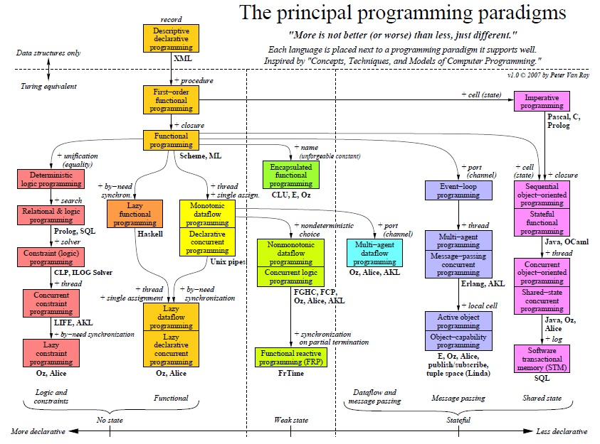

# Curso Incompany para PROCESIA
### HTML5 APIs, ECMA6, Patrones de diseño, AJAX avanzado, APIs externas, JS para Frontend, Automatización...


[FICTIZIA » Cursos a medida para empresas](https://www.fictizia.com/formacion-empresas)

## Clase 3


### ECMA6

- **Soporte**
	- [Compatibilidad de kangax](https://kangax.github.io/compat-table/es6/)

- **Compiladores y transpiladores**
	- [Babel - web](https://babeljs.io/)
	- [Babel - Github](https://babeljs.io/repl/)
	- [Lebab by David Walsh](https://davidwalsh.name/lebab)
	- [lebab - web](https://lebab.io/try-it)
	- [Lebab - Github](https://github.com/lebab/lebab)

- **Recursos**
	- [ES6 para humanos](https://github.com/metagrover/ES6-for-humans/tree/spanish-version)
	- [Pensar asíncronamente en un mundo síncrono](https://medium.com/@ulisesGascon/pensar-as%C3%ADncronamente-en-un-mundo-s%C3%ADncrono-8e25cfcafd83)
	- [ECMAScript 6 Features - jsfeatures.in](https://jsfeatures.in/ES6)
	- [ECMAScript 6 Features by Luke Hoban](https://github.com/lukehoban/es6features#readme)
	- [Learn ES2015 - A detailed overview of ECMAScript 6 features by Babel team](https://babeljs.io/docs/learn-es2015/)
	- [ECMAScript 6 Cheatsheet by Erik Moeller](http://help.wtf/es6)
	- [First Steps with ECMAScript 6 by Axel Rauschmayer](http://exploringjs.com/es6/ch_first-steps.html)
	- [JS Features by Hemanth.HM](http://jsfeatures.in/)
	- [Minimalist examples of ES6 functionalities by Hemanth.HM](https://github.com/hemanth/paws-on-es6)
	- [Understanding ECMAScript 6 by Nicholas C. Zakas](https://leanpub.com/understandinges6/read/)
	- [ES6 Overview in 350 Bullet Points by Ponyfoo](https://ponyfoo.com/articles/es6)
	- [Promise visualization playground for the adventurous](https://bevacqua.github.io/promisees/)
	- [ECMAScript 6 equivalents in ES5 by Addi Osmani](https://github.com/addyosmani/es6-equivalents-in-es5)

- **Libros**
	- [Understanding ECMAScript 6](https://leanpub.com/understandinges6) - [read online](https://leanpub.com/understandinges6/read)
	- [JS.next: A Manager’s Guide](http://chimera.labs.oreilly.com/books/1234000001623/index.html)
	- [You Don't Know JS: ES6 & Beyond](https://github.com/getify/You-Dont-Know-JS/blob/master/es6%20&%20beyond/README.md#you-dont-know-js-es6--beyond)
	- [ECMAScript 6 Succinctly](https://www.syncfusion.com/resources/techportal/details/ebooks/ECMAScript_6_Succinctly)
	- [Let's Learn ES6](https://letslearnes6.com/)
	- [ES6 in Practice](https://leanpub.com/es6-in-practice)

- **[ECMAScript 6 Learning](https://github.com/ericdouglas/ES6-Learning)**


### [Principales cambios](http://es6-features.org/)

### ECMA6: Constantes
```javascript
  const PI = 3.141593
  
  PI = 3.1; // Uncaught TypeError: Assignment to constant variable.
  
  const objeto = {
    usuario: "yo mismo",
    role: "profe"
  }
  
  objeto.role = "estudiante" // Propiedades no protegidas al cambio
  objeto.nuevo = "" // Se peuden crear nuevas propiedades
  objeto = "" // Uncaught TypeError: Assignment to constant variable. 
  
```

### ECMA6: Scoping

**Variables Internas (let)**
```javascript
for (let i = 0; i < a.length; i++) {
	let = a[i];
	//...
}

/* ECMA5
for (var i = 0; i < a.length; i++) {
	var = a[i];
	//...
}
*/


var uno = 1;
let dos = 2;
if( uno === 1 ){
  var uno = 10;
  let dos = 20;
  console.log(uno); // 10
  console.log(dos); // 20
}
console.log(uno); // 10
console.log(dos); // 2

```

**Funciones Internas**
```javascript
{
    function nivel1 () { return 1 }
    nivel1 ();
    {
        function nivel2() { return 2 }
        nivel2 ();
    }
}

/* ECMA5
(function () {
    var nivel1 = function () { return 1; }
    nivel1();
    (function () {
        var nivel2 = function () { return 2; };
        nivel2();
    })();
})();
*/
```

### ECMA6: Arrow Functions (lo básico)
- No pueden usarse con `yield`
- No pueden ser usadas como constructores
```javascript
var Foo = () => {};
var foo = new Foo(); // TypeError: Foo is not a constructor
```
- No tienen una propiedad de prototipo `prototype`
```javascript
var Foo = () => {};
console.log(Foo.prototype); // undefined
```
- No pueden tener saltos de línea
```javascript
var func = ()
       => 1; 
// SyntaxError: expected expression, got '=>'
```
- Retorno de objetos literales
```javascript
var func = () => {  foo: 1  };               
// Al llamar func() retorna undefined!

var func = () => {  foo: function() {}  };   
// Error de sintaxis: SyntaxError: function statement requires a name

// Funciona correctamente
var func = () => ({ foo: 1 });
```
- Orden de parseo
```javascript
let callback;

callback = callback || function() {}; // ok

callback = callback || () => {};      
// SyntaxError: invalid arrow-function arguments

callback = callback || (() => {});    // ok
```
- Siempre son anónimas:
```javascript
	impares  = numeros.map(v => v + 1);
	pares = evens.map(v => ({ even: v, odd: v + 1 }))
	otrosNumeros  = evens.map((v, i) => v + i)

	/* ECMA5
	impares  = numeros.map(function (v) { return v + 1; });
	pares = evens.map(function (v) { return { even: v, odd: v + 1 }; });
	otrosNumeros  = numeros.map(function (v, i) { return v + i; });
	*/

```

### ECMA6: Arrow Functions (manejo del retorno)
- `return` implicito en declaración inline
```javascript
	var odds = [1,2,3,4,5].filter(num => num % 2);
	console.log(odds); // Array [ 1, 3, 5 ]
```
- `return` con cuerpo de bloque
```javascript
var func = x => x * x;                  
// sintaxis de cuerpo conciso, el "return" está implícito

var func = (x, y) => { return x + y; }; 
// con cuerpo de bloque, se necesita "return" explícito
```

### ECMA6: Arrow Functions (`this` contextual)
- `this` contextual:
```javascript
this.nums.forEach((v) => {
    if (v % 5 === 0)
        this.fives.push(v)
})

/* ECMA 5
var self = this;
this.nums.forEach(function (v) {
    if (v % 5 === 0)
        self.fives.push(v);
});
*/
```

### ECMA6: Arrow Functions  (Avanzado)
- Las Arrow functions no exponen un objeto arguments 
```javascript
var arguments = 42;
var arr = () => arguments;

arr(); // 42

function foo() {
  var f = () => arguments[0]; // Referencia al objeto arguments
  return f(2);
}

foo(1); // 1
```
- El parámetro rest es la mejor alternativa
```javascript
function foo() { 
  var f = (...args) => args[0]; 
  return f(2); 
}

foo(1); // 2
```
- Arrow functions usadas como métodos
```javascript
var obj = {
  i: 10,
  b: () => console.log(this.i, this),
  c: function() {
    console.log(this.i, this);
  }
}
obj.b(); // prints undefined, Window {...} (or the global object)
obj.c(); // prints 10, Object {...}
```
```javascript
var obj = {
  a: 10
};

Object.defineProperty(obj, 'b', {
  get: () => {
    console.log(this.a, typeof this.a, this);
    return this.a + 10; // represents global object 'Window', therefore 'this.a' returns 'undefined'
  }
});
```
- Invocación a través de los métodos call y apply
```javascript
var adder = {
  base : 1,
    
  add : function(a) {
    var f = v => v + this.base;
    return f(a);
  },

  addThruCall: function(a) {
    var f = v => v + this.base;
    var b = {
      base : 2
    };
            
    return f.call(b, a);
  }
};

console.log(adder.add(1));         // Imprime 2 como es esperado
console.log(adder.addThruCall(1)); // También imprime 2 aunque se esperaba 3
```
- Sintaxis básica
```javascript
(param1, param2, paramN) => {declaraciones} 
(param1, param2, paramN) => expresion
// Equivalente a: () => { return expresion; } 

// Los paréntesis son opcionales cuando sólo dispone de un argumento: singleParam => { statements } 
singleParam => expresion 

// Una función sin argumentos requiere paréntesis: 
() => { declaraciones }
```
- Sintaxis Avanzada
```javascript
// Incluir entre paréntesis el cuerpo para retornar un objeto literal:
params => ({foo: bar})

// Soporta parámetros rest y parámetros por default
(param1, param2, ...rest) => { statements }
(param1 = valorPredef1, param2, ..., paramN = valorPredefN) => { statements }

// Destructuración mediante la lista de parámetros también es soportada
var f = ([a, b] = [1, 2], {x: c} = {x: a + b}) => a + b + c; f(); // 6
```


### ECMA6: ¿Cuando usar Arrow Functions?


### ECMA6: Gestión de Parámetros en funciones
- Parametros opcionales:
```javascript
	function f (x, y = 7, z = 42) {
	    return x + y + z
	}

	/* ECMA5
	function f (x, y, z) {
	    if (y === undefined){
			y = 7;
		}
	    z = z || 42;
	    return x + y + z;
	};
	*/
```

- Parametros adicionales:
```javascript
	function f (x, y, ...a) {
	    return (x + y) * a.length
	}

	/* ECMA5
	function f (x, y) {
	    var a = Array.prototype.slice.call(arguments, 2);
	    return (x + y) * a.length;
	};
	*/
```

### ECMA6: Las plantillas de cadena de texto:
- Concepto:
```javascript
	`cadena de texto ${expresión} texto`
```
- Multiples líneas:
```javascript
	console.log(`línea 1 de texto
	línea 2 de texto`);

	/* ECMA5
	console.log("línea 1 de texto\nlínea 2 de texto");
	*/
```
- Expresiones:
```javascript
	var customer = { name: "Foo" }
	var card = { amount: 7, product: "Bar", unitprice: 42 }
	message = `Hello ${customer.name},
	want to buy ${card.amount} ${card.product} for
	a total of ${card.amount * card.unitprice} bucks?`

	/* ECMA5
	var customer = { name: "Foo" };
	var card = { amount: 7, product: "Bar", unitprice: 42 };
	message = "Hello " + customer.name + ",\n" +
	"want to buy " + card.amount + " " + card.product + " for\n" +
	"a total of " + (card.amount * card.unitprice) + " bucks?";
	*/
```
- Raw (No se procesan):
```javascript
function trabajandoCrudo(texto) {
	console.log( texto );		// [ "Hello
								// World" ]
	console.log( texto.raw );	// [ "Hello\nWorld" ]
}

trabajandoCrudo(`Hello\nWorld`);
```


### ECMA6: Mejoras en Objetos:
- Acortador de propiedades
```javascript
let obj = { x, y }

/* ECMA5
var obj = { x: x, y: y };
*/
```
- Definición de propiedades computerizadas:
```javascript
	obj = {
	    foo: "bar",
	    [ "prop_" + foo() ]: 42
	}

	/* ECMA5
	obj = {
	    foo: "bar"
	};
	obj[ "prop_" + foo() ] = 42;
	*/
```
- Métodos:
```javascript
	obj = {
	    foo (a, b) {
	        …
	    },
	    bar (x, y) {
	        …
	    },
	    // Generador
	    *quux (x, y) {
	        …
	    }
	}

	/* ECMA5
	obj = {
	    foo: function (a, b) {
	        …
	    },
	    bar: function (x, y) {
	        …
	    },
	    //  quux: no equivalent in ES5
	    …
	};
	*/
```

### ECMA6: Parsear Binarios y Octales:
```javascript
	0b111110111 === 503
	0o767 === 503

	/* ECMA 5
	parseInt("111110111", 2) === 503;
	parseInt("767", 8) === 503;
	*/
```


### ECMA6: Asignación desestructurada:
- Objetos:
```javascript
//Object Matching, Shorthand Notation & Deep Matching
var { op: a, lhs: { op: b }, rhs: c } = getASTNode()

//Default Values
var obj = { a: 1 }
var { a, b = 2 } = obj

// Parameter Context Matching
function g ({ name: n, val: v }) {
	console.log(n, v)
}
function h ({ name, val }) {
    console.log(name, val)
}
g({ name: "foo", val:  7 })
h({ name: "bar", val: 42 })

/* ECMA5
//Object Matching, Shorthand Notation & Deep Matching
var tmp = getASTNode();
var a = tmp.op;
var b = tmp.lhs.op;
var c = tmp.rhs;

//Default Values
var obj = { a: 1 };
var a = obj.a;
var b = obj.b === undefined ? 2 : obj.b;

// Parameter Context Matching
function g (arg) {
    var n = arg.name;
    var v = arg.val;
    console.log(n, v);
};
function h (arg) {
    var name = arg.name;
    var val  = arg.val;
    console.log(name, val);

g({ name: "foo", val:  7 });
h({ name: "bar", val: 42 });
*/
```
- Arrays:
```javascript
	// Matching
	var list = [ 1, 2, 3 ]
	var [ a, , b ] = list

	// Parameter Context Matching
	function f ([ name, val ]) {
	    console.log(name, val)
	}

	f([ "bar", 42 ]);

	// Fail-Soft Destructuring
	var list2 = [ 7, 42 ]
	var [ a = 1, b = 2, c = 3, d ] = list2

	/* ECMA5
	// Matching
	var list = [ 1, 2, 3 ];
	var a = list[0], b = list[2];

	// Parameter Context Matching
	function f (arg) {
	    var name = arg[0];
	    var val  = arg[1];
	    console.log(name, val);
	};

	f([ "bar", 42 ]);

	// Fail-Soft Destructuring
	var list2 = [ 7, 42 ];
	var a = typeof list2[0] || 1;
	var b = typeof list2[1] || 2;
	var c = typeof list2[2] !== "undefined" ? list2[2] : 3;
	var d = typeof list2[3] !== "undefined" ? list2[3] : undefined;
	*/
```


### ECMA6: Generadores

- [Ejemplo de Miguel Sánchez](http://miguelsr.js.org/2015/06/08/es6-generators.html)
```javascript
	function* greatGenerator(name) {
	    yield "Hola " + name + "!";
	    yield "Esta línea saldrá en la segunda ejecución";
	    yield "Esta otra, en la tercera";
	    if (name === "Miguel") yield "Esta otra, saldrá en la cuarta solo si te llamas miguel"
	}
	var generatorInstance = greatGenerator("paco");
	console.log(generatorInstance.next().value); // Hola paco!
	console.log(generatorInstance.next().value); // Esta línea saldrá la segunda ejecución
	console.log(generatorInstance.next().value); // Esta otra, en la tercera
	console.log(generatorInstance.next().value); // undefined
```

### ECMA6: Map
- Manejando datos independientes con una estructura clave/valor
```javascript
	let miMap = new Map();
	let miArray = [];

	miMap.set('cadena', 'Hola!');
	miMap.set(miArray, [500, "hola", true, false]);

	console.log(miMap.get(miArray)); // [500, "hola", true, false]
	console.log(miMap.get('cadena')); // Hola!

	console.log(miMap.size); // 2

	miMap.delete('cadena');

	console.log(miMap.size); // 1
```

### ECMA6: Set
- Es un array de valores únicos
```javascript
	let s = new Set()
	s.add("hello").add("goodbye").add("hello")
	s.size === 2
	s.has("hello") === true
	for (let key of s.values()) // insertion order
	    console.log(key)
```
- Set vs Map:
```javascript
	//@see: https://stackoverflow.com/a/24085746
	var array = [1, 2, 3, 3];
	
	var set = new Set(array); // Will have [1, 2, 3]
	assert(set.size, 3);
	
	var map = new Map();
	map.set('a', 1);
	map.set('b', 2);
	map.set('c', 3);
	map.set('C', 3);
	map.set('a', 4); // Has: a, 4; b, 2; c: 3, C: 3
	assert(map.size, 4);
```

### ECMA6: WeakSet
- Solamente se coleccionan objetos
- Los objetos son únicos dentro de la colección
- Los WeakSets no son enumerables
- Si ya no hay otra referencia a un objeto almacenado en el  WeakSet, ellos pueden ser removidos por el recolector de basura. Esto también significa que no hay ninguna lista de objetos almacenados en la colección.
```javascript
var ws = new WeakSet();
var obj = {};
var foo = {};

ws.add(window);
ws.add(obj);

ws.has(window); // true
ws.has(foo);    // false, foo no fue agregado al conjunto

ws.delete(window); // elimina window del conjunto
ws.has(window);    // false, window fue eliminado
```

### ECMA6: WeakMap
- `null` es tratado como `undefined`
- Las claves de los WeakMaps solamente pueden ser del tipo `Object`
- Las claves de WeakMap no son enumerables
```javascript
var wm1 = new WeakMap(),
    wm2 = new WeakMap(),
    wm3 = new WeakMap();
var o1 = {},
    o2 = function(){},
    o3 = window;

wm1.set(o1, 37);
wm1.set(o2, "azerty");
wm2.set(o1, o2); // un valor puede ser cualquier cosa, incluidos objetos o funciones
wm2.set(o3, undefined);
wm2.set(wm1, wm2); // claves y valores pueden ser objetos cualesquiera. !Incluso WeakMaps!

wm1.get(o2); // "azerty"
wm2.get(o2); // undefined, porque no hay valor para o2 en wm2
wm2.get(o3); // undefined, porque es es el valor del conjunto
wm1.has(o2); // true
wm2.has(o2); // false
wm2.has(o3); // true (incluso si el valor es 'undefined')

wm3.set(o1, 37);
wm3.get(o1); // 37

wm1.has(o1);   // true
wm1.delete(o1);
wm1.has(o1);   // false
```


### ECMA6: Symbol
- Es un nuevo primitivo
- No podemos usar `new` porque no es constructor
- Trabajan como identificadores (como el `id` en HTML)
- Los simbolos son únicos y e inmutables

```javascript
var simbolo = Symbol();
console.log(typeof simbolo); // Me devuelve symbol

const a = Symbol("Yo mismo");
const b = Symbol("Yo mismo");
console.log(a === b); // Devuelve false

const a = Symbol.for("Yo mismo");
const b = Symbol.for("Yo mismo");
console.log(a === b); // Devuelve false


Symbol("foo") !== Symbol("foo")
const foo = Symbol()
const bar = Symbol()
typeof foo === "symbol"
typeof bar === "symbol"
let obj = {}
obj[foo] = "foo"
obj[bar] = "bar"
JSON.stringify(obj) // {}
Object.keys(obj) // []
Object.getOwnPropertyNames(obj) // []
Object.getOwnPropertySymbols(obj) // [ foo, bar ]
```


### ECMA6: Typed Array


- Pensado para trabajar con datos binarios puros (ws, audio, vídeo...)
- No son arrays convencionales, asi que `Array.isArray()` es `false`
- Tenemos que trabajar con buffers, [ArrayBuffer](https://developer.mozilla.org/es/docs/Web/JavaScript/Referencia/Objetos_globales/ArrayBuffer)
- `DataView` provee una interfaz de bajo nivel para la lectura y escritura de diferentes tipos de números dentro de un `ArrayBuffer`
```javascript
// creando un ArrayBuffer con un tamaño específico en bytes
var buffer = new ArrayBuffer(16);

// Creando un par de vistas...
var view1 = new DataView(buffer);
var view2 = new DataView(buffer,12,4);	//desde el byte 12 por los siguientes 4 bytes
view1.setInt8(12, 42);					// guarda 42 en el slot 12
console.log(view2.getInt8(0));			// 42
```

- `TypedArray` provee una interfaz similar a un array dentro de un `ArrayBuffer`
```javascript
const typedArray1 = new Int8Array(8);
typedArray1[0] = 32;

const typedArray2 = new Int8Array(typedArray1);
typedArray2[1] = 42;

console.log(typedArray1); //Int8Array [32, 0, 0, 0, 0, 0, 0, 0]

console.log(typedArray2); //Int8Array [32, 42, 0, 0, 0, 0, 0, 0]
```


### ECMA6: Metaprogramación 

**Proxy()**
- Nos permite interceptar propiedades en los objetos y detectar cambios
- Puedes capturar infinidad de métodos. [Lista aquí](https://developer.mozilla.org/en-US/docs/Web/JavaScript/Reference/Global_Objects/Proxy#A_complete_traps_list_example)
```javascript
// Interceptar un objeto
var target = {};
 
var superhero = new Proxy(target, {
   get: function(target, name, receiver) {
       console.log('ejecutado "get" para propiedad: ', name);
       return target[name];
   }
});
 
superhero.power = 'Flight';
console.log(superhero.power);
```


**Reflect**
> Reflect  es un objecto incorporado que proporciona metodos para interceptar operaciones de javascript. Los métodos son los mismos que los de proxy handlers. Reflect no es un objeto de funciones y por lo tanto no es constructible. [MDN | Reflect](https://developer.mozilla.org/es/docs/Web/JavaScript/Reference/Global_Objects/Reflect)

```javascript
let obj = { a: 1 }
Object.defineProperty(obj, "b", { value: 2 })
obj[Symbol("c")] = 3
Reflect.ownKeys(obj) // [ "a", "b", Symbol(c) ]

/* ECMA5
var obj = { a: 1 };
Object.defineProperty(obj, "b", { value: 2 });
// no equivalent in ES5
Object.getOwnPropertyNames(obj); // [ "a", "b" ]
*/
```


### ECMA6: Internationalization & Localization

**Collation**
```javascript
// in German,  "ä" sorts with "a"
// in Swedish, "ä" sorts after "z"
var lista = [ "ä", "a", "z" ]
var DE = new Intl.Collator("de")
var SV = new Intl.Collator("sv")
DE.compare("ä", "z") === -1
SV.compare("ä", "z") === +1
console.log(lista.sort(DE.compare)) // [ "a", "ä", "z" ]
console.log(lista.sort(SV.compare)) // [ "a", "z", "ä" ]
```

**Números**
```javascript
var US = new Intl.NumberFormat("en-US")
var DE = new Intl.NumberFormat("de-DE")
US.format(1234567.89) === "1,234,567.89"
DE.format(1234567.89) === "1.234.567,89"
```

**Moneda**
```javascript
var USD = new Intl.NumberFormat("en-US", { style: "currency", currency: "USD" })
var GBP = new Intl.NumberFormat("en-GB", { style: "currency", currency: "GBP" })
var EUR = new Intl.NumberFormat("de-DE", { style: "currency", currency: "EUR" })
USD.format(100200300.40) === "$100,200,300.40"
GBP.format(100200300.40) === "£100,200,300.40"
EUR.format(100200300.40) === "100.200.300,40 €"
```

**Fecha**
```javascript
var US = new Intl.DateTimeFormat("en-US")
var DE = new Intl.DateTimeFormat("de-DE")
US.format(new Date("2015-01-02")) === "1/2/2015"
DE.format(new Date("2015-01-02")) === "2.1.2015"
```

### ECMA6: For... of 
- Iteración sobre valores y no propiedades
```javascript
  let arr = [3, 5, 7];
  arr.foo = "hello";

  for (let i in arr) {
     console.log(i);
     // "0", "1", "2", "foo"
  }

  for (let i of arr) {
     console.log(i);
     // "3", "5", "7"
  }

```


### ECMA6: Cadenas (extras)

- **[repeat()](https://developer.mozilla.org/es/docs/Web/JavaScript/Referencia/Objetos_globales/string/repeat)**
```javascript
" ".repeat(4 * depth)
"foo".repeat(3)

/* ECMA5
Array((4 * depth) + 1).join(" ");
Array(3 + 1).join("foo");
*/
```

- **[startsWith()](https://developer.mozilla.org/es/docs/Web/JavaScript/Referencia/Objetos_globales/string/startsWith), [includes()](https://developer.mozilla.org/es/docs/Web/JavaScript/Referencia/Objetos_globales/string/includes) y [endsWith()](https://developer.mozilla.org/es/docs/Web/JavaScript/Referencia/Objetos_globales/string/endsWith)**
```javascript
	"hello".startsWith("ello", 1) // true
	"hello".endsWith("hell", 4)   // true
	"hello".includes("ell")       // true
	"hello".includes("ell", 1)    // true
	"hello".includes("ell", 2)    // false

	/* ECMA5
	"hello".indexOf("ello") === 1;    // true
	"hello".indexOf("hell") === (4 - "hell".length); // true
	"hello".indexOf("ell") !== -1;    // true
	"hello".indexOf("ell", 1) !== -1; // true
	"hello".indexOf("ell", 2) !== -1; // false
	*/
```


### ECMA6: Números (extras)

- **[Number.isNaN()](https://developer.mozilla.org/es/docs/Web/JavaScript/Referencia/Objetos_globales/Number/isNaN)**
Chequear No-Numericos e infinitos:
```javascript
	Number.isNaN(42) === false
	Number.isNaN(NaN) === true

/* ECMA5
	var isNaN = function (n) {
	    return n !== n;
	};
	
	isNaN(42) === false;
	isNaN(NaN) === true;
*/
```

- **[Number.isFinite()](https://developer.mozilla.org/es/docs/Web/JavaScript/Referencia/Objetos_globales/Number/isFinite)**
```javascript
	Number.isFinite(Infinity) === false
	Number.isFinite(-Infinity) === false
	Number.isFinite(NaN) === false
	Number.isFinite(123) === true

	/* ECMA5

	var isFinite = function (v) {
	    return (typeof v === "number" && !isNaN(v) && v !== Infinity && v !== -Infinity);
	};

	isFinite(Infinity) === false;
	isFinite(-Infinity) === false;
	isFinite(NaN) === false;
	isFinite(123) === true;
	*/
```

- **[Number.isSafeInteger()](https://developer.mozilla.org/es/docs/Web/JavaScript/Referencia/Objetos_globales/Number/isSafeInteger)**
```javascript
	Number.isSafeInteger(42) === true
	Number.isSafeInteger(9007199254740992) === false

	/* ECMA5
	function isSafeInteger (n) {
	    return (
	           typeof n === 'number'
	        && Math.round(n) === n
	        && -(Math.pow(2, 53) - 1) <= n
	        && n <= (Math.pow(2, 53) - 1)
	    );
	}
	isSafeInteger(42) === true;
	isSafeInteger(9007199254740992) === false;
	*/
```

- **[Math.trunc()](https://developer.mozilla.org/es/docs/Web/JavaScript/Referencia/Objetos_globales/Math/trunc)**
```javascript
console.log(Math.trunc(42.7)) // 42
console.log(Math.trunc( 0.1)) // 0
console.log(Math.trunc(-0.1)) // -0

/* ECMA5
function mathTrunc (x) {
    return (x < 0 ? Math.ceil(x) : Math.floor(x));
}
console.log(mathTrunc(42.7)) // 42
console.log(mathTrunc( 0.1)) // 0
console.log(mathTrunc(-0.1)) // -0
*/
```

### ECMA6: Arrays (extras)

- **[of()](https://developer.mozilla.org/es/docs/Web/JavaScript/Referencia/Objetos_globales/Array/of)**
```javascript
var lista = Array( 3 );
console.log(lista.length);			// 3
console.log(lista[0]);				// undefined

var lista2 = Array.of( 1, 2, 3 );
console.log(lista2.length);			// 3
console.log(lista2);				// [1,2,3]
```

- **[from()](https://developer.mozilla.org/es/docs/Web/JavaScript/Referencia/Objetos_globales/Array/from)**
```javascript
console.log(Array.from('fictizia'));	// ["f", "i", "c", "t", "i", "z", "i", "a"]
console.log(Array.from([1, 2, 3], x => x + x));		// [2, 4, 6]
```

- **[fill()](https://developer.mozilla.org/es/docs/Web/JavaScript/Referencia/Objetos_globales/Array/fill)**
```javascript
var lista = [1, 2, 3, 4];
// fill con 0 desde [2] hasta [4]
console.log(lista.fill(0, 2, 4));	// [1, 2, 0, 0]
// fill con 5 desde [1]
console.log(lista.fill(5, 1));		// [1, 5, 5, 5]
console.log(lista.fill(6));			// [6, 6, 6, 6]
```

- **[find()](https://developer.mozilla.org/es/docs/Web/JavaScript/Referencia/Objetos_globales/Array/find)**
```javascript
var lista = [5, 12, 8, 130, 44];

var coincidencia = lista.find(function(elemento) {
  return elemento > 10;
});

console.log("coincidencia:", coincidencia); // 12
```

- **[findIndex()](https://developer.mozilla.org/es/docs/Web/JavaScript/Referencia/Objetos_globales/Array/findIndex)**
```javascript
var lista = [5, 12, 8, 130, 44];

function numeroGrande(elemento) {
  return elemento > 13;
}

console.log(lista.findIndex(numeroGrande)); // 3
```

- [copyWithin()](https://developer.mozilla.org/es/docs/Web/JavaScript/Referencia/Objetos_globales/Array/copyWithin)


### ECMA6: Objetos (extras)

- **[Object.assign()](https://developer.mozilla.org/es/docs/Web/JavaScript/Referencia/Objetos_globales/Object/assign)**
```javascript
	var dst  = { quux: 0 }
	var src1 = { foo: 1, bar: 2 }
	var src2 = { foo: 3, baz: 4 }
	Object.assign(dst, src1, src2)

	// Verificación
	dst.quux === 0
	dst.foo  === 3
	dst.bar  === 2
	dst.baz  === 4

	/* ECMA5
	var dst  = { quux: 0 };
	var src1 = { foo: 1, bar: 2 };
	var src2 = { foo: 3, baz: 4 };
	Object.keys(src1).forEach(function(k) {
	    dst[k] = src1[k];
	});
	Object.keys(src2).forEach(function(e) {
	    dst[k] = src2[k];
	});

	// Verificación
	dst.quux === 0;
	dst.foo  === 3;
	dst.bar  === 2;
	dst.baz  === 4;
	*/
```

- **[Object.is()](https://developer.mozilla.org/en-US/docs/Web/JavaScript/Reference/Global_Objects/Object/is)**
```javascript
Object.is( NaN, NaN );		// true
NaN === NaN;				// false
var obj = {}
Object.is(obj, obj);		// true
obj === obj					// false
```
- [Object.getOwnPropertySymbols()](https://developer.mozilla.org/es/docs/Web/JavaScript/Referencia/Objetos_globales/Object/getOwnPropertySymbols)
- [Object.setPrototypeOf()](https://developer.mozilla.org/es/docs/Web/JavaScript/Referencia/Objetos_globales/Object/setPrototypeOf) 

### ECMA6: Promesas


> A promise represents the eventual result of an asynchronous operation. The primary way of interacting with a promise is through its *then* method, which registers callbacks to receive either a promise’s eventual value or the reason why the promise cannot be fulfilled.
> From [promisesaplus.com/](http://promisesaplus.com/)

- Estados:
    - Fulfilled – La acción en relación con la promesa se logró.
    - Rejected – La acción en relación con la promesa falló.
    - Pending – Pendiente, no se ha cumplido o rechazado aún.
    - Settled - Arreglada, se ha cumplido o se ha rechazado (resuelta).
- [Soporte en navegadores](http://caniuse.com/#search=promise)  
- Una promesa
```javascript
    var cuentaPromesas = 0;
    var errorMode = false;
    function testPromesa() {

      var numPromesaActual = ++cuentaPromesas;

      console.warn("Promesa Asíncrona numero ("+numPromesaActual+") - Iniciada")

      var miPromesa = new Promise(
        function(resolve, reject) {       

          console.info("Promesa Asíncrona numero ("+numPromesaActual+") - Proceso asincrónico empezado");

          if(errorMode){
              reject(numPromesaActual)
          } else{
            window.setTimeout(
              function() {
                resolve(numPromesaActual)
              }, Math.random() * 2000 + 1000);
          }
        });
      miPromesa.then(
        function(val) {
          console.info("Promesa Asíncrona numero ("+val+") - Proceso asincrónico terminado");
          console.warn("Promesa Asíncrona numero ("+numPromesaActual+") - Finalizada");
        }).catch(
          function(val){
            console.error("Promesa Asíncrona numero ("+val+") - ERROR FATAL");
        });
    };

    testPromesa();
```
- **.race()**
```javascript   
    var p1 = new Promise(function(resolve, reject) {
        setTimeout(resolve, 500, "uno");
    });
    var p2 = new Promise(function(resolve, reject) {
        setTimeout(resolve, 100, "dos");
    });

    Promise.race([p1, p2]).then(function(value) {
      console.log(value); // "dos" - p2 más rápida
    });
```
- **.all()**
```javascript
    var errorMode = false

    var p1 = new Promise(function(resolve, reject) {
      console.log("P1 - Iniciada");
      setTimeout(resolve, 1000, "P1 - Terminada");
    });
    var p2 = new Promise(function(resolve, reject) {
      console.log("P2 - Iniciada");
      setTimeout(resolve, 2000, "P2 - Terminada");
    });
    var p3 = new Promise(function(resolve, reject) {
      if(errorMode){
        reject("errorMode-Activado");
      } else {
        console.log("P3 - Iniciada");
        setTimeout(resolve, 3000, "P3 - Terminada");
      }

    });
    var p4 = new Promise(function(resolve, reject) {
      console.log("P4 - Iniciada");
      setTimeout(resolve, 4000, "P4 - Terminada");
    });

    Promise.all([p1, p2, p3, p4]).then(function(value) {
      console.info("Promise.all -> TODO TERMINADO", value)
    }, function(reason) {
      console.log("Parece... que fallamos!", reason)
    });
```

### ECMA6: Promesas (alternativas) 
- [Q](https://github.com/kriskowal/q)
    - Muy utilizada en Nodejs
    - [Q.js](https://rawgit.com/kriskowal/q/v1/q.js);
    - [Q Docs](https://github.com/kriskowal/q/wiki/API-Reference)
    ```javascript
        function primeraFuncion() {
            var deferred = Q.defer();
            setTimeout(function() {
                console.info('Primera funcion');
                deferred.resolve();
            }, 2000);
            return deferred.promise;
        }

        function segundaFuncion() {
            var deferred = Q.defer();
            setTimeout(function() {
                console.info('Segunda funcion');
                deferred.resolve();
            }, 1000);
            return deferred.promise;
        }
        Q()
            .then(primeraFuncion)
            .then(segundaFuncion)
            .done();        
    ```

- [RSVP.js](https://github.com/tildeio/rsvp.js)
- [When.js](https://github.com/cujojs/when)
- [Async](https://caolan.github.io/async/)


### ECMA6: Módulos (Exportación)
- Único
```javascript
	// config.js
	let config = {
		token: "secreto",
	}

	export default config;
```
- Mutiples
```javascript
	// config.js
	let config = {
		token: "secreto",
	}

	let config_details = {
		detalles: "más datos"
	}

	export config;
	export config_details;
```
- Combinada
```javascript
	// config.js
	let config = {
		token: "secreto",
	}

	let config_details = {
		detalles: "más datos"
	}

	let configuraciones = {config, config_details}

	export default configuraciones;
	export config;
	export config_details;
```

### ECMA6: Módulos (Importación)
- Síncrona
```javascript
	// único
	import config from './config.js';

	// Multiples
	import * as config from './config.js';

	// Combinandos
	import configuraciones from './config.js';
	import { config, config_details } from './config.js';
```
- Asíncrona (solo un módulo)
```javascript
	System.import('modulo')

    .then(modulo => {
        // Uso del módulo importado
    })
    .catch(error => {
        // Gestión de errores
    });
```
- Asíncrona (multiples módulos)
```javascript
    Promise.all(
        ['module1', 'module2', 'module3']
        .map(x => System.import(x)))
    .then(([module1, module2, module3]) => {
        // Use module1, module2, module3
    });
```

### ECMA6: Módulos (Avanzado)
- Export/Import
```javascript
//  lib/math.js
export function sum (x, y) { return x + y }
export var pi = 3.141593

//  someApp.js
import * as math from "lib/math"
console.log("2π = " + math.sum(math.pi, math.pi))

//  otherApp.js
import { sum, pi } from "lib/math"
console.log("2π = " + sum(pi, pi))

/* ECMA5
//  lib/math.js
LibMath = {};
LibMath.sum = function (x, y) { return x + y };
LibMath.pi = 3.141593;

//  someApp.js
var math = LibMath;
console.log("2π = " + math.sum(math.pi, math.pi));

//  otherApp.js
var sum = LibMath.sum, pi = LibMath.pi;
console.log("2π = " + sum(pi, pi));

*/
```
- Default & Wildcard
```javascript
//  lib/mathplusplus.js
export * from "lib/math"
export var e = 2.71828182846
export default (x) => Math.exp(x)

//  someApp.js
import exp, { pi, e } from "lib/mathplusplus"
console.log("e^{π} = " + exp(pi))

/* ECMA5
//  lib/mathplusplus.js
LibMathPP = {};
for (symbol in LibMath)
    if (LibMath.hasOwnProperty(symbol))
        LibMathPP[symbol] = LibMath[symbol];
LibMathPP.e = 2.71828182846;
LibMathPP.exp = function (x) { return Math.exp(x) };

//  someApp.js
var exp = LibMathPP.exp, pi = LibMathPP.pi, e = LibMathPP.e;
console.log("e^{π} = " + exp(pi));
*/
```

## Beyond ES6


### Recursos
- [Compatibilidad 2016+](http://kangax.github.io/compat-table/esnext/)
- [Axel Rauschmayer blog | ES2016](http://2ality.com/2016/01/ecmascript-2016.html)
- [What’s coming to Javascript (ES7 + ES8)](https://medium.com/@Murcul/whats-coming-to-javascript-es7-es8-8ce73c9a8ec9)
- [ES7 and ES8 Features](https://node.university/blog/1621685/es7es8)
- [Exploring ES2016 and ES2017](http://exploringjs.com/es2016-es2017.html)


### Implementados

### Iteraciones

**[Array.prototype.entries()](https://developer.mozilla.org/es/docs/Web/JavaScript/Referencia/Objetos_globales/Array/entries)**
```javascript
var lista = ['a', 'b', 'c'];
var iterador = lista.entries();

console.log(iterador.next().value); // [0, "a"]
console.log(iterador.next().value); // [1, "b"]
```

**[Array.prototype.values()](https://developer.mozilla.org/es/docs/Web/JavaScript/Referencia/Objetos_globales/Array/values)**
```javascript
var lista = ['f', 'i', 'c', 't', 'i', 'c', 'i', 'a']; 
var iterator = lista.values();

console.log(iterator.next().value); // f 
console.log(iterator.next().value); // i 
console.log(iterator.next().value); // c 
console.log(iterator.next().value); // t 
console.log(iterator.next().value); // i
//...
```

**[Array.prototype.keys() - ES6](https://developer.mozilla.org/es/docs/Web/JavaScript/Referencia/Objetos_globales/Array/keys)**
```javascript
var lista = ['a', 'b', 'c'];
var iterator = lista.keys(); 
  
for (let key of iterator) {
  console.log(key); // expected output: 0 1 2
}
```

**En la práctica...**
```javascript
var a = [1,2,3];
[...a.values()];	// [1,2,3]
[...a.keys()];		// [0,1,2]
[...a.entries()];	// [ [0,1], [1,2], [2,3] ]
```


### [Array.prototype.includes](http://2ality.com/2016/02/array-prototype-includes.html)
- Retorna un booleno si encuentra el elemento. Tiene muchas mejoras respecto `Array.prototype.indexOf`
- Propuesto por Domenic Denicola y Rick Waldron
- [ECMA documentation](http://www.ecma-international.org/ecma-262/7.0/index.html#sec-array.prototype.includes)

```javascript
['a', 'b', 'c'].includes('a') // true
['a', 'b', 'c'].includes('d') // false

// similitud con indexOf:
// arr.includes(x) -> arr.indexOf(x) >= 0

[NaN].includes(NaN) // true
[NaN].indexOf(NaN) // -1

// @see: http://speakingjs.com/es5/ch11.html#two_zeros
[-0].includes(+0) // true

// Arrays tipados también lo incluyen
let arrTip = Uint8Array.of(12, 5, 3);
console.log(arrTip.includes(5)); // true
```


### [Exponentiation Operator](http://2ality.com/2016/02/exponentiation-operator.html)
- Añade el operador exponencial `x ** y`, su comportamiento es igual que `Math.pow(x, y)`
- Propuesto por Rick Waldron, Claude Pache y Brendan Eich
- [ECMA documentation](http://www.ecma-international.org/ecma-262/7.0/index.html#sec-exp-operator)

```javascript
let cuadrado = 3 ** 2; // 9
let numero = 3;
numero **= 2; // 9
```

## ES2017 (ES8)


### Recursos
- [Async Functions for ECMAScript](https://github.com/tc39/ecmascript-asyncawait)
- [Simplifying asynchronous computations via generators (section in “Exploring ES6”)](http://exploringjs.com/es6/ch_generators.html#sec_co-library)
- [ES proposal: async functions](http://2ality.com/2016/02/async-functions.html)
- [Compatibilidad 2016+](http://kangax.github.io/compat-table/esnext/)
- [Axel Rauschmayer blog | ES2017](http://2ality.com/2016/02/ecmascript-2017.html)
- [Shared memory and atomics for ECMAscript](https://github.com/tc39/ecmascript_sharedmem)
- [ES8, el estándar Javascript de 2017 de Enrique Oriol](http://blog.enriqueoriol.com/2017/07/es8-estandar-javascript-2017.html)
- [Exploring ES2018 and ES2019](http://exploringjs.com/es2018-es2019/index.html)
- [ECMAScript - A Taste from ES2018 (ES9)](https://nitayneeman.com/posts/a-taste-from-ecmascript-2018/)
- [6 Reasons Why JavaScript’s Async/Await Blows Promises Away (Tutorial)](https://hackernoon.com/6-reasons-why-javascripts-async-await-blows-promises-away-tutorial-c7ec10518dd9)


### Implementados cambios principales

#### [Async Functions](http://2ality.com/2016/02/async-functions.html)
Propuesto por Brian Terlson


**Código asíncrono utilizando promesas y generadores**
- Nativo

```javascript
function fetchJson(url) {
    return fetch(url)
    .then(request => request.text())
    .then(text => {
        return JSON.parse(text);
    })
    .catch(error => {
        console.log(`ERROR: ${error.stack}`);
    });
}
fetchJson('http://example.com/some_file.json')
.then(obj => console.log(obj));
```

- Usando la librería [CO](https://github.com/tj/co)

```javascript
const fetchJson = co.wrap(function* (url) {
    try {
        let request = yield fetch(url);
        let text = yield request.text();
        return JSON.parse(text);
    }
    catch (error) {
        console.log(`ERROR: ${error.stack}`);
    }
});
```

- Funciones Asíncronas

```javascript
async function fetchJson(url) {
    try {
        let request = await fetch(url);
        let text = await request.text();
        return JSON.parse(text);
    }
    catch (error) {
        console.log(`ERROR: ${error.stack}`);
    }
}
```

- Variantes

```javascript
// Declaración
async function foo() {}

// Expresión
const foo = async function () {};

// Método
let obj = { async foo() {} }

// Formato Arrow Function
const foo = async () => {};
```

#### [Shared memory and atomics](http://2ality.com/2017/01/shared-array-buffer.html)
- Gestiona multithreading en Javascript, basicamente *web wrokers* con `ArrayBuffer`. 
- Muy bajo nivel
- Propuesto por Lars T. Hansen

### Implementados cambios menores

#### [Object.values/Object.entries](http://2ality.com/2015/11/stage3-object-entries.html)
- Retornan un array o una matriz con los valores o las propiedades iterables de los objetos
- Propuesto por Jordan Harband

**Objetos**
```javascript
const data = { elemnto: 'primero', otro_dato: 1 };
Object.values(data); // ["primero", 1]
Object.entries(data); // [["elemnto", "primero"], ["otro_dato", 1]]
```

**Arrays**
```javascript
const obj = ['p1', 'p2', 'p3']; // equivale a { 0: 'a', 1: 'z', 2: '5' };
Object.values(obj); // ["p1", "p2", "p3"]
Object.entries(obj); // [["0", "p1"], ["1", "p2"], ["2", "p3"]]
```

**Cadenas**
```javascript
Object.values('Fictizia'); // ["F", "i", "c", "t", "i"]
Object.entries('Ficti'); // [["0", "F"], ["1", "i"], ["2", "c"], ["3", "t"], ["4", "i"]]
```


#### [String padding](http://2ality.com/2015/11/string-padding.html)
- Se rellena una cadena por delante con `padStart` o por detras con `padEnd`, puedes especificar el relleno
- Propuesto por Jordan Harband y Rick Waldron

```javascript
// .padStart()
'data'.padStart(1);          // "data"
'data'.padStart(7);          // "   data"
'data'.padStart(6, '-');     // "--data"
'data'.padStart(10, 'info'); // "infoindata"
'data'.padStart(5, '*');     // "*data"

// .padEnd()
'data'.padEnd(1);          // "data"
'data'.padEnd(7);          // "data   "
'data'.padEnd(6, '-');     // "data--"
'data'.padEnd(10, 'info'); // "datainfoin"
'data'.padEnd(5, '*');     // "data*"
```

#### [Object.getOwnPropertyDescriptors()](http://2ality.com/2016/02/object-getownpropertydescriptors.html)
- No confundir con `Object.getOwnPropertyDescriptor()`
- Devulve las descripciones de las propiedades del objeto
- Esta pensado para facilitar el clonado de objetos ya que no se muestran propiedades heredadas por prototype
- Propuesto por Jordan Harband y Andrea Giammarchi
- [Object.getOwnPropertyDescriptors Proposal ](https://github.com/tc39/proposal-object-getownpropertydescriptors)


#### [Trailing commas in function parameter lists and calls](http://2ality.com/2015/11/trailing-comma-parameters.html)
- Se ignorarán las comas extras al final del último parámetro de una función
- Propuesto por Jeff Morrison

```javascript
//En declaración
function foo(p1, p2, p3,) { 
    //... 
}

//En ejecución
foo("a", "b", "b",);
```

## ES2018 (ES9)

### Recursos
- [Compatibilidad ES Next](http://kangax.github.io/compat-table/esnext/)
- [Compatibilidad 2016+](http://kangax.github.io/compat-table/esnext/)
- [Axel Rauschmayer blog | ES2018](http://2ality.com/2017/02/ecmascript-2018.html?utm_source=hashnode.com)

### Propuestas finalizadas (stage 4)
- [Template Literal Revision](http://2ality.com/2016/09/template-literal-revision.html) *Propuesto por Tim Disney*
- [s (dotAll) flag for regular expressions](http://2ality.com/2017/07/regexp-dotall-flag.html) *Propuesto por Mathias Bynens*
- [Rest/Spread Properties](http://2ality.com/2016/10/rest-spread-properties.html) *Propuesto por Sebastian Markbåge*
- [Asynchronous Iteration](http://2ality.com/2016/10/asynchronous-iteration.html) *Propuesto por Domenic Denicola*
- [RegExp Unicode Property Escapes](http://2ality.com/2017/07/regexp-unicode-property-escapes.html) *Propuesto por Brian Terlson, Daniel Ehrenberg y Mathias Bynens*
- [RegExp named capture groups](http://2ality.com/2017/05/regexp-named-capture-groups.html) *Propuesto por Daniel Ehrenberg y Brian Terlson*
- [Promise.prototype.finally()](http://2ality.com/2017/07/promise-prototype-finally.html) *Propuesto por Jordan Harband*

### Candidatos muy probables (stage 3)
- [Function.prototype.toString revision](http://2ality.com/2016/08/function-prototype-tostring.html) *Propuesto por Michael Ficarra*
- [global](http://2ality.com/2016/09/global.html) *Propuesto por Jordan Harband*
- [import()](http://2ality.com/2017/01/import-operator.html) *Propuesto por Domenic Denicola*
- [RegExp Lookbehind Assertions](http://2ality.com/2017/05/regexp-lookbehind-assertions.html) *Propuesto por Daniel Ehrenberg*
- [BigInt – arbitrary precision integers](http://2ality.com/2017/03/es-integer.html) *Propuesto por Daniel Ehrenberg*
- [Class fields](http://2ality.com/2017/07/class-fields.html) *Propuesto por Daniel Ehrenberg y Jeff Morrison*
- [Optional catch binding](http://2ality.com/2017/08/optional-catch-binding.html) *Propuesto por Michael Ficarra*
- [import.meta](http://2ality.com/2017/11/import-meta.html) *Propuesto por Domenic Denicola*
- [Array.prototype.flatMap/flatten](http://2ality.com/2017/04/flatmap.html) *Propuesto por Brian Terlson y Michael Ficarra*


### TC39 y nuestro futuro


**Recursos**
- [SPEC - Proceso del comite](https://tc39.github.io/process-document/)
- [TC39 and its contributions to ECMAScript](https://medium.freecodecamp.org/tc39-and-its-contributions-to-ecmascript-c178b77f32e1)
- [ECMAScript, TC39, and the History of JavaScript](https://www.youtube.com/watch?v=gytOcNFV1dM)
- [TC39, ECMAScript, and the Future of JavaScript](https://ponyfoo.com/articles/tc39-ecmascript-proposals-future-of-javascript)
- [TC39: We want your help making the next JS—BarcelonaJS](https://www.youtube.com/watch?v=4mm3a6Unjj8)

**Estados**
- [TC39 Meeting Notes](http://tc39.github.io/tc39-notes/#tc39-meeting-notes)
- [Stage 0: Strawman](https://github.com/tc39/proposals/blob/master/stage-0-proposals.md)
- [Stage 1: Proposal](https://github.com/tc39/proposals#stage-1)
- [Stage 2: Draft](https://github.com/tc39/proposals#stage-2)
- [Stage 3: Candidate](https://github.com/tc39/proposals#stage-3)
- [Stage 4: Finished](https://github.com/tc39/proposals/blob/master/finished-proposals.md)
- [Propuestas Inactivas (rechazadas)](https://github.com/tc39/proposals/blob/master/inactive-proposals.md)


### Ejercicios


**1 -** ¿Que tal unas [Katas de ES6](http://es6katas.org/)? 


#### Ayudemos a la NASA!

En Marte tenemos un rover llamado [curiosity](https://es.wikipedia.org/wiki/Curiosity)... Nuestro objetivo es usar la [API de la NASA](https://api.nasa.gov/mars-photos/api/v1/rovers/curiosity/photos) para complementar este ejercicio.

**Problema:**
- La medida del tiempo para esta API son los SOLES, no todos los SOLES tenemos datos, por eso la api retorna un array vacío en algunso soles.
```JSON
{
  "photos": [
    
  ]
}
```

**Recursos**
- [Sacar un token para usar la API de la NASA](https://api.nasa.gov/index.html#apply-for-an-api-key)

**Solución:**
- Nuestro objetivo es hacer una llamada recursiva a la API de tal forma que si un SOL no tiene información útil pasamos al SOL anterior.
- Para evitar baneos necesitamos determinar la frecuencia de las llamadas recursivas en ms
- Así como podemos establecer un límite de llamadas por si salimos mucho de rango.

**Mensajes esperados por consola:**

```
request started for: https://api.nasa.gov/mars-photos/api/v1/rovers/curiosity/photos?sol=2080&api_key=XXX
Delay for next request 1000ms
request started for: https://api.nasa.gov/mars-photos/api/v1/rovers/curiosity/photos?sol=2079&api_key=XXX
Delay for next request 1000ms
request started for: https://api.nasa.gov/mars-photos/api/v1/rovers/curiosity/photos?sol=2078&api_key=XXX
Delay for next request 1000ms
request started for: https://api.nasa.gov/mars-photos/api/v1/rovers/curiosity/photos?sol=2078&api_key=XXX
Delay for next request 1000ms
request started for: https://api.nasa.gov/mars-photos/api/v1/rovers/curiosity/photos?sol=2077&api_key=XXX
Delay for next request 1000ms
request started for: https://api.nasa.gov/mars-photos/api/v1/rovers/curiosity/photos?sol=2076&api_key=XXX
Delay for next request 1000ms
request started for: https://api.nasa.gov/mars-photos/api/v1/rovers/curiosity/photos?sol=2075&api_key=XXX
Delay for next request 1000ms
request started for: https://api.nasa.gov/mars-photos/api/v1/rovers/curiosity/photos?sol=2074&api_key=XXX
Delay for next request 1000ms
request started for: https://api.nasa.gov/mars-photos/api/v1/rovers/curiosity/photos?sol=2073&api_key=XXX
Delay for next request 1000ms
request started for: https://api.nasa.gov/mars-photos/api/v1/rovers/curiosity/photos?sol=2072&api_key=XXX
Delay for next request 1000ms
request started for: https://api.nasa.gov/mars-photos/api/v1/rovers/curiosity/photos?sol=2071&api_key=XXX
Delay for next request 1000ms
request started for: https://api.nasa.gov/mars-photos/api/v1/rovers/curiosity/photos?sol=2070&api_key=XXX
currentValue: [{…}, {…}, {…}, {…}, {…}, {…}, {…}, {…}, {…}, {…}]
```

**Código Esqueleto**
```javascript
const token = "";

function NasaRequest() {
	//Tu solución
};

async function init() {
  /*
    - current sun: 2080
    - limit requests: false
    - frecuency: 1000ms
  */
  const currentValue = await NasaRequest(2080, false, 1000);
  console.log("currentValue:", currentValue);
}
init();
```


### Paradigmas de Programación



> Un paradigma de programación es una propuesta tecnológica adoptada por una comunidad de programadores y desarrolladores cuyo núcleo central es incuestionable en cuanto que únicamente trata de resolver uno o varios problemas claramente delimitados; la resolución de estos problemas debe suponer consecuentemente un avance significativo en al menos un parámetro que afecte a la ingeniería de software.
> Un paradigma de programación representa un enfoque particular o filosofía para diseñar soluciones. Los paradigmas difieren unos de otros, en los conceptos y la forma de abstraer los elementos involucrados en un problema, así como en los pasos que integran su solución del problema, en otras palabras, el cómputo.
> Tiene una estrecha relación con la formalización de determinados lenguajes en su momento de definición. Es un estilo de programación empleado.
> Un paradigma de programación está delimitado en el tiempo en cuanto a aceptación y uso, porque nuevos paradigmas aportan nuevas o mejores soluciones que la sustituyen parcial o totalmente.
> [Wikipedia](https://es.wikipedia.org/wiki/Paradigma_de_programaci%C3%B3n)

**Paradigmas principales**
- [Programación imperativa o por procedimientos](https://es.wikipedia.org/wiki/Programaci%C3%B3n_imperativa) 
	- Extendida en C, BASIC o Pascal.
	- La programación imperativa es la más usada y la más antigua
	- Se basa en dar instrucciones al ordenador de como hacer las cosas en forma de algoritmos.
- [Programación orientada a objetos (POO/OOP)](https://es.wikipedia.org/wiki/Programaci%C3%B3n_orientada_a_objetos)
	- Extendida en C++, C#, Java, Python... 
	- Está basada en el imperativo, pero encapsula elementos denominados objetos que incluyen tanto variables como funciones
- [Programación dirigida por eventos](https://es.wikipedia.org/wiki/Programaci%C3%B3n_dirigida_por_eventos)
	- Tanto la estructura como la ejecución de los programas van determinados por los sucesos que ocurran en el sistema, definidos por el usuario o que ellos mismos provoquen.
- [Programación funcional](https://es.wikipedia.org/wiki/Programaci%C3%B3n_funcional)
	- Basada en la definición los predicados
	- Es de corte más matemático
	- Extendida en Python, Haskell, etc...
- [Programación reactiva](https://es.wikipedia.org/w/index.php?title=Programaci%C3%B3n_reactiva&action=edit&redlink=1)
	- Este paradigma se basa en la declaración de una serie de objetos emisores de eventos asíncronos y otra serie de objetos que se "suscriben" a los primeros (es decir, quedan a la escucha de la emisión de eventos de estos) y *reaccionan* a los valores que reciben. 
	- Es muy común usar la librería Rx de Microsoft (Reactive Extensions)
- [Programación multiparadigma](https://es.wikipedia.org/wiki/Programaci%C3%B3n_multiparadigma)
	- Es el uso de dos o más paradigmas dentro de un programa.

**Otros paradigmas**
- [Programación declarativa](https://es.wikipedia.org/wiki/Programaci%C3%B3n_declarativa)
- [Lenguaje específico del dominio (DSL)](https://es.wikipedia.org/wiki/Lenguaje_espec%C3%ADfico_del_dominio): SQL
- [Programación con restricciones](https://es.wikipedia.org/wiki/Programaci%C3%B3n_con_restricciones)
- [Programación lógica](https://es.wikipedia.org/wiki/Programaci%C3%B3n_l%C3%B3gica)
- [Programación dinámica](https://es.wikipedia.org/wiki/Programaci%C3%B3n_din%C3%A1mica)
- Etc...

### POO: La teoría


>La programación basada en prototipos es un estilo de programación orientada a objetos en la que las clases no están presentes y la reutilización de comportamiento (conocido como herencia en lenguajes basados en clases) se lleva a cabo a través de un proceso de decoración de objetos existentes que sirven de prototipos. Este modelo también se conoce como programación sin clases, orientada a prototipos o basada en ejemplos.
>[Mozilla developer network](https://developer.mozilla.org/es/docs/Web/JavaScript/Introducci%C3%B3n_a_JavaScript_orientado_a_objetos)


**Terminología**
- Clase
	- Define las características del Objeto.
- Objeto
	- Una instancia de una Clase.
- Propiedad
	- Una característica del Objeto, como el color.
- Método
	- Una capacidad del Objeto, como caminar.
- Constructor
	- Es un método llamado en el momento de la creación de instancias.
- Herencia
	- Una Clase puede heredar características de otra Clase.
- Encapsulamiento
	- Una Clase sólo define las características del Objeto, un Método sólo define cómo se ejecuta el Método.
- Abstracción
	- La conjunción de herencia compleja, métodos, propiedades que un objeto debe ser capaz de simular en un modelo de la realidad.
- Polimorfismo
	- Diferentes Clases podrían definir el mismo método o propiedad.

**Recursos**
- [A Simple Explanation of OOP](https://medium.com/@richardeng/a-simple-explanation-of-oop-46a156581214)
- [Chapter 3: What is Object-Oriented Programming?](https://medium.com/learn-how-to-program/chapter-3-what-is-object-oriented-programming-d0a6ec0a7615)
- [JavaScript OOP: A beginners guide](https://carlosbecker.com/posts/oop-coffee-java-script/)
- [Introducción a la POO en Javascript moderno: las nuevas clases en ES6](http://www.etnassoft.com/2016/12/02/introduccion-a-la-poo-en-javascript-moderno-las-nuevas-clases-en-es6/)
- [MDN | Introducción a JavaScript orientado a objetos](https://developer.mozilla.org/es/docs/Web/JavaScript/Introducci%C3%B3n_a_JavaScript_orientado_a_objetos)
- [MDN | Object-oriented JavaScript for beginners](https://developer.mozilla.org/es/docs/Learn/JavaScript/Objects/Object-oriented_JS)
- [Goodbye, Object Oriented Programming](https://medium.com/@cscalfani/goodbye-object-oriented-programming-a59cda4c0e53)
- [Why Object Oriented Programming is Awesome](https://medium.com/@konradmusial/why-object-oriented-programming-is-awesome-92e8578f450a)
- [The Little Guide for OOP in JS](https://hackernoon.com/the-little-guide-for-poo-in-js-3cfff83ad095)
- [Usando Clases en JavaScript](https://medium.com/@jmz12/usando-clases-en-javascript-e07f0e25c67d)

### POO: Lo básico del constructor
**Entendiendo los objetos**
```javascript
/*
[Objeto]{
    [ Propiedad = Variables (no funciónes) ]
    [ Método = Solo funciónes ]
}
*/
```


**Constructor de Objetos**
```javascript
var coche = function (parametros) {
    /* Codigo*/
};
```


**Propiedades del Objeto**
```javascript
var coche = function (marca, modelo, antiguedad, color, tipo) {
    this.marca = marca;
    this.modelo = modelo;
    this.antiguedad = antiguedad
    this.color = color;
    this.tipo = tipo;
};
```

### POO: Métodos

**Asignación en el Constructor**
```javascript
var coche = function (marca, modelo, antiguedad, color, tipo) {
    this.marca = marca;
    this.modelo = modelo;
    this.antiguedad = antiguedad;
    this.color = color;
    this.tipo = tipo;
    this.detalles = function(){
      console.log("Tu coche es un "+this.marca+" "+this.modelo+" con "+this.antiguedad+" años, clase "+this.tipo+" y color "+this.color);
    }
};

var miCoche = new coche ("Seat", "Panda", 20, "azul", "turismo");
miCoche.detalles();
```


**Extensión del prototipo**
```javascript
var coche = function (marca, modelo, antiguedad, color, tipo) {
    this.marca = marca;
    this.modelo = modelo;
    this.antiguedad = antiguedad;
    this.color = color;
    this.tipo = tipo;
};

coche.prototype.detalles = function(){
  console.log("Tu coche es un "+this.marca+" "+this.modelo+" con "+this.antiguedad+" años, clase "+this.tipo+" y color "+this.color);
}

var miCoche = new coche ("Seat", "Panda", 20, "azul", "turismo");
miCoche.detalles();
```


**Vinculación Externa**
```javascript
var coche = function (marca, modelo, antiguedad, color, tipo) {
    this.marca = marca;
    this.modelo = modelo;
    this.antiguedad = antiguedad;
    this.color = color;
    this.tipo = tipo;
    this.detalles = dameDetalles;
};

function dameDetalles(){
  console.log("Tu coche es un "+this.marca+" "+this.modelo+" con "+this.antiguedad+" años, clase "+this.tipo+" y color "+this.color);
}

var miCoche = new coche ("Seat", "Panda", 20, "azul", "turismo");
miCoche.detalles();
```

### POO: Herencia


**Herencia (simplificada)**
```javascript
var perro  = function () {
    this.patas = 4;
    this.ojos = 2;
};

var pastorAleman = function () {
    this.colorLengua = "negra";
    this.colorOjos = "marrón";
    this.capacidadTrabajo = true;
    this.especialidad = "Pastoreo";
};

pastorAleman.prototype = new perro();

var miPerro = new pastorAleman();
console.log("Número patas: "+miPerro.patas+"\n Número ojos: "+miPerro.ojos+"\n Color Lengua: "+miPerro.colorLengua+"\n Color ojos: "+miPerro.colorOjos+"\n Capacidad de trabajo: "+miPerro.capacidadTrabajo+"\n Especialidad: "+miPerro.especialidad);
```

**Herencia clásica**
```javascript
var coche = function (marca, modelo, antiguedad, color, tipo) {
    this.marca = marca;
    this.modelo = modelo;
    this.antiguedad = antiguedad;
    this.color = color;
    this.tipo = tipo;
    this.detalles = dameDetalles;
};

var furgon = function (taraMinima, cargaUtil, volumenCarga) {
    this.taraMinima = taraMinima;
    this.cargaUtil = cargaUtil;
    this.volumenCarga = volumenCarga;
    this.detallesTecnicos = detallesTecnicos;
};


function dameDetalles(){
  console.log("Tu coche es un "+this.marca+" "+this.modelo+" con "+this.antiguedad+" años, clase "+this.tipo+" y color "+this.color);
}

function detallesTecnicos(){
  console.warn("Tu coche tiene una Tara mínima de "+this.taraMinima+". Carga útil de "+this.cargaUtil+" y un volumen de carga de "+this.volumenCarga+"m3");
}

var miPickup = new coche ("Land Rover", "Santana Aníbal", 35, "Marrón tierra", "4x4");
miPickup.prototype = new furgon (1200, 768, 4.5);


miPickup.detalles();
miPickup.prototype.detallesTecnicos();
```


### POO: en la realidad

**Métodos y atributos privados y públicos**
```javascript
var cocheEmpresa = function (marca, modelo, antiguedad, color, tipo) {
    // públicas
    this.marca = marca;
    this.modelo = modelo;
    this.antiguedad = antiguedad;
    this.color = color;
    this.tipo = tipo;
    
    // privadas
    var ITVPasada = true;
    var ITVfrecuencia = "Cada año";
    var seguroEnRegla = true;
    var companySeguros = "SegurExpress";
    var tipoSeguro = "a terceros";
	
	// Público
	this.dameDetalles = function () {
		console.log("Tu coche es un "+marca+" "+modelo+" con "+antiguedad+" años, clase "+tipo+" y color "+color);
    }
	
	// Privadas
    function datosPrivados() {
        if (ITVPasada && seguroEnRegla)
            console.info("INFO: Todo en Regla, tienes que pasar la ITV "+ITVfrecuencia+". Tienes un seguro "+tipoSeguro+" con "+companySeguros);
        else{
            console.error("ALERTA! El coche no puede usarse. El seguro o la ITV no esta en regla.");
        }
    }

    datosPrivados();
    this.dameDetalles();
};

var miCoche = new cocheEmpresa ("Audi", "S8", 2, "negro", "Berlina");
var miCoche2 = new cocheEmpresa ("Audi", "S4", 2, "Rojo", "Compacto");
```

**Datos opcionales**
```javascript
var cocheEmpresa = function (marca, modelo, antiguedad, color) {

    this.marca = marca || "Seat";
    this.modelo = modelo || "Ibiza";
    this.antiguedad = antiguedad || 6;
    this.color = color || "Azul Corporativo";

	this.dameDetalles = function () {
		console.log("Tu coche es un "+this.marca+" "+this.modelo+" con "+this.antiguedad+" años y color "+this.color);
    }
	
    this.dameDetalles();
};

var miCoche = new cocheEmpresa ("Audi", "S8", 2, "negro", "Berlina");
var miCoche2 = new cocheEmpresa ();
var otroCoche = new cocheEmpresa ("Seat", "Leon");
```


**Reutilizando el contexto común**
```javascript
// Creamos un ID
var contador = 0;
var cocheEmpresa = function (marca, modelo, antiguedad, color, tipo) {
    this.marca = marca;
    this.modelo = modelo;
    this.antiguedad = antiguedad;
    this.color = color;
    this.tipo = tipo;
   	this.id = contador++;
    	    
    var ITVPasada = true;
    var ITVfrecuencia = "Cada año";
    var seguroEnRegla = true;
    var companySeguros = "SegurExpress";
    var tipoSeguro = "a terceros";
	
	this.dameDetalles = function () {
		console.log("Tu coche es un "+marca+" "+modelo+" con "+antiguedad+" años, clase "+tipo+" y color "+color);
    }
	
    function datosPrivados() {
        if (ITVPasada && seguroEnRegla)
            console.info("INFO: Todo en Regla, tienes que pasar la ITV "+ITVfrecuencia+". Tienes un seguro "+tipoSeguro+" con "+companySeguros);
        else{
            console.error("ALERTA! El coche no puede usarse. El seguro o la ITV no esta en regla.");
        }
    }

    function identificador(){
        console.warn("Recuerda! Tu coche esta identificado como coche numero "+contador);
    }
	
    datosPrivados();
    this.dameDetalles();
    identificador();
};

var miCoche = new cocheEmpresa ("Audi", "S8", 2, "negro", "Berlina");
var otroCoche = new cocheEmpresa ("Audi", "A8", 5, "gris", "Berlina");
var miCoche2 = new cocheEmpresa ("Seat", "Ibiza", 9, "rojo", "Utilitario");
console.info("Total de coches de empresa hasta el momento "+contador);
```


### POO: Trabajando con prototipos

**[Object.create()](https://developer.mozilla.org/es/docs/Web/JavaScript/Referencia/Objetos_globales/Object/create)**
```javascript
var coche = {
    marca: "Seat",
    modelo: "Panda",
    antiguedad: 20,
    color: "azul",
    tipo: "turismo"
};

var clonCoche = Object.create(coche);

console.log(clonCoche.marca+" "+clonCoche.modelo);
```


**[Object.prototype.isPrototypeOf()](https://developer.mozilla.org/es/docs/Web/JavaScript/Referencia/Objetos_globales/Object/isPrototypeOf)**
```javascript
console.log(coche.isPrototypeOf(clonCoche));
```


**[Object.prototype.constructor](https://developer.mozilla.org/es/docs/Web/JavaScript/Referencia/Objetos_globales/Object/constructor)**
```javascript
function arbol (nombre) {
   this.nombre = nombre;
}

var miArbol = new arbol( "Pino" );
console.log( "miArbol.constructor es " + miArbol.constructor );
```


**[Object.prototype.toString()](https://developer.mozilla.org/es/docs/Web/JavaScript/Referencia/Objetos_globales/Object/toString)**
```javascript
function Perro(nombre, criadero, color, sexo) {
   this.nombre=nombre;
   this.criadero=criadero;
   this.color=color;
   this.sexo=sexo;
}

var elPerro = new Perro("Gabby","Laboratorio","chocolate","femenino");

elPerro.toString();

Perro.prototype.toString = function perroToString() {
  var retorno = "Perro " + this.nombre + " es " + this.sexo + " " + this.color + " " + this.criadero;
  return retorno;
};

elPerro.toString();
```


### POO: con ES6+


**Definición de Clases**

```javascript
class coche{
  constructor(marca, modelo, antiguedad, color, tipo) {
    this.marca = marca;
    this.modelo = modelo;
    this.antiguedad = antiguedad;
    this.color = color;
    this.tipo = tipo;
  }
  detalles() {
    console.log(`Tu coche es un ${this.marca} ${this.modelo} con ${this.antiguedad} años, clase ${this.tipo} y color ${this.color}`);
  }
}

let miCoche = new coche ("Seat", "Panda", 20, "azul", "turismo");
miCoche.detalles();

/* ECMA 5
var coche = function (marca, modelo, antiguedad, color, tipo) {
    // Propiedades
    this.marca = marca;
    this.modelo = modelo;
    this.antiguedad = antiguedad;
    this.color = color;
    this.tipo = tipo;
    // Metodos
    this.detalles = function(){
      console.log("Tu coche es un "+this.marca+" "+this.modelo+" con "+this.antiguedad+" años, clase "+this.tipo+" y color "+this.color);
    }
};

var miCoche = new coche ("Seat", "Panda", 20, "azul", "turismo");
miCoche.detalles();
*/
```

**Extensión de clases**

```javascript
class perro {
  constructor(nombre) {
    this.patas = 4;
    this.ojos = 2;
    this.nombre = nombre;
  }

  ladrar() {
    console.log(`${this.nombre} esta ladrando!`);
  };
}

class pastorAleman extends perro {
  constructor(nombre) {
    super('pastorAleman');
    this.colorLengua = "negra";
    this.colorOjos = "marrón";
    this.capacidadTrabajo = true;
    this.especialidad = "Pastoreo";
  }

  informacion() {
  	console.log(`Nombre: ${this.nombre}
  	Número patas: ${this.patas}
  	Número ojos: ${this.ojos}
  	Color ojos: ${this.colorOjos}
  	Color Lengua: ${this.colorLengua}
  	Capacidad de trabajo: ${this.capacidadTrabajo}
  	Especialidad: ${this.especialidad}`);
  }
}

let miPerro = new pastorAleman('Golden');
miPerro.informacion();
miPerro.ladrar();

/* ECMA 5
var perro  = function (nombre) {
    this.patas = 4;
    this.ojos = 2;
    this.nombre = nombre;
    this.ladrar = function(){
    	console.log(this.nombre + " esta ladrando!");
    }
};

var pastorAleman = function () {
    this.colorLengua = "negra";
    this.colorOjos = "marrón";
    this.capacidadTrabajo = true;
    this.especialidad = "Pastoreo";
    this.informacion = function(){
		console.log("Nombre: "+this.nombre+"\nNúmero patas: "+this.patas+"\nNúmero ojos: "+this.ojos+"\nColor Lengua: "+this.colorLengua+"\nColor ojos: "+this.colorOjos+"\nCapacidad de trabajo: "+this.capacidadTrabajo+"\nEspecialidad: "+this.especialidad);
    }
};

pastorAleman.prototype = new perro("Golden");

var miPerro = new pastorAleman();
miPerro.informacion();
miPerro.ladrar();
*/
```

**Métodos Estáticos**
```javascript
class coche{
  static info (edad){
  	console.info(`Tienes ${edad} años ${ edad >= 18 ? "y puedes conduccir": "y ... ¡Sorpresa! No puedes conduccir."}`);
  }
  constructor(marca, modelo, antiguedad, color, tipo) {
    this.marca = marca;
    this.modelo = modelo;
    this.antiguedad = antiguedad;
    this.color = color;
    this.tipo = tipo;
  }
  detalles() {
    console.log(`Tu coche es un ${this.marca} ${this.modelo} con ${this.antiguedad} años, clase ${this.tipo} y color ${this.color}`);
  }
}

coche.info(50);
coche.info(8);
let miCoche = new coche ("Seat", "Panda", 20, "azul", "turismo");
miCoche.detalles();
```

**Getters/Setters**
```javascript
class Rectangle {
    constructor (width, height) {
        this._width  = width
        this._height = height
    }
    set width  (width)  { this._width = width               }
    get width  ()       { return this._width                }
    set height (height) { this._height = height             }
    get height ()       { return this._height               }
    get area   ()       { return this._width * this._height }
}
var r = new Rectangle(50, 20)
r.area === 1000

/* ECMA5
var Rectangle = function (width, height) {
    this._width  = width;
    this._height = height;
};
Rectangle.prototype = {
    set width  (width)  { this._width = width;               },
    get width  ()       { return this._width;                },
    set height (height) { this._height = height;             },
    get height ()       { return this._height;               },
    get area   ()       { return this._width * this._height; }
};
var r = new Rectangle(50, 20);
r.area === 1000;
*/
```

**Getters/Setters con arrays tipados**
```javascript
//  ES6 class equivalent to the following C structure:
//  struct Example { unsigned long id; char username[16]; float amountDue }
class Example {
    constructor (buffer = new ArrayBuffer(24)) {
        this.buffer = buffer
    }
    set buffer (buffer) {
        this._buffer    = buffer
        this._id        = new Uint32Array (this._buffer,  0,  1)
        this._username  = new Uint8Array  (this._buffer,  4, 16)
        this._amountDue = new Float32Array(this._buffer, 20,  1)
    }
    get buffer ()     { return this._buffer       }
    set id (v)        { this._id[0] = v           }
    get id ()         { return this._id[0]        }
    set username (v)  { this._username[0] = v     }
    get username ()   { return this._username[0]  }
    set amountDue (v) { this._amountDue[0] = v    }
    get amountDue ()  { return this._amountDue[0] }
}

let example = new Example()
example.id = 7
example.username = "John Doe"
example.amountDue = 42.0
```

**Usando Weakmap**
```javascript
class ClearableWeakMap {
  constructor(init) {
    this._wm = new WeakMap(init)
  }
  clear() {
    this._wm = new WeakMap
  }
  delete(k) {
    return this._wm.delete(k)
  }
  get(k) {
    return this._wm.get(k)
  }
  has(k) {
    return this._wm.has(k)
  }
  set(k, v) {
    this._wm.set(k, v)
    return this
  }
}
```

### POO: Las buenas partes


### POO: Las partes malas

