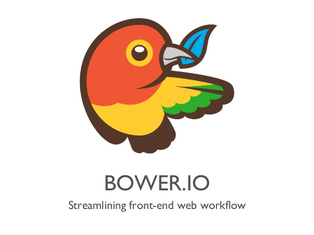
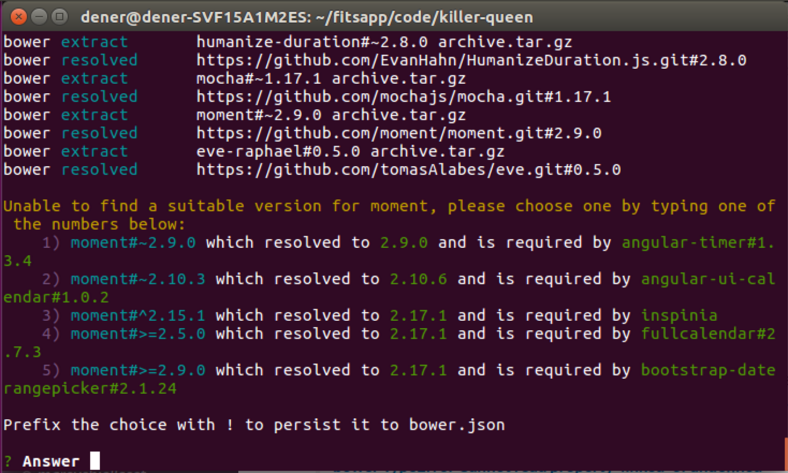
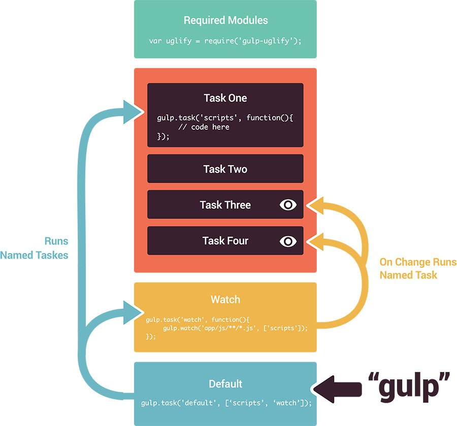
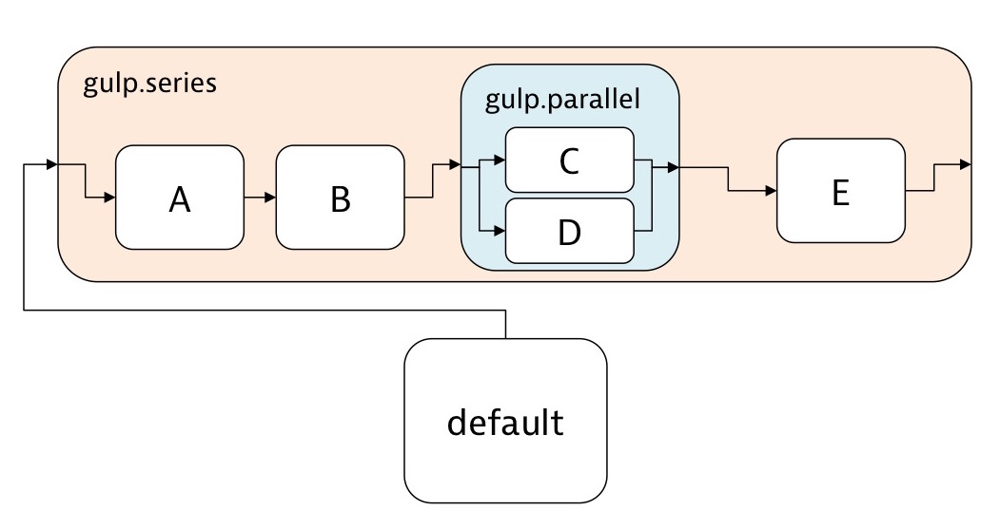
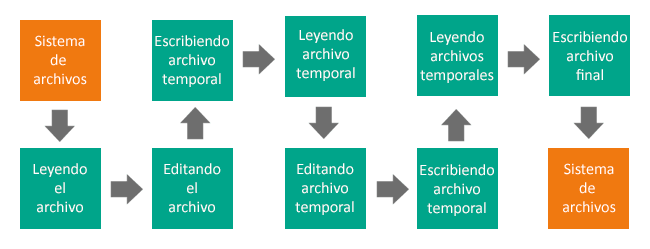
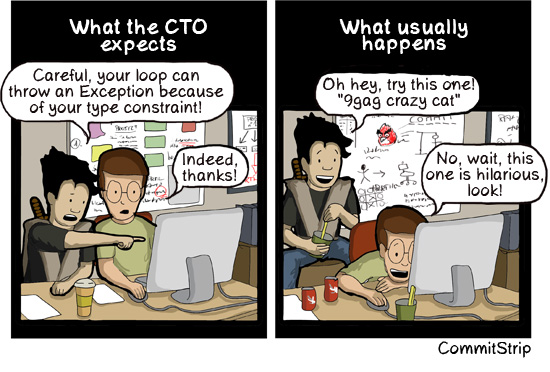
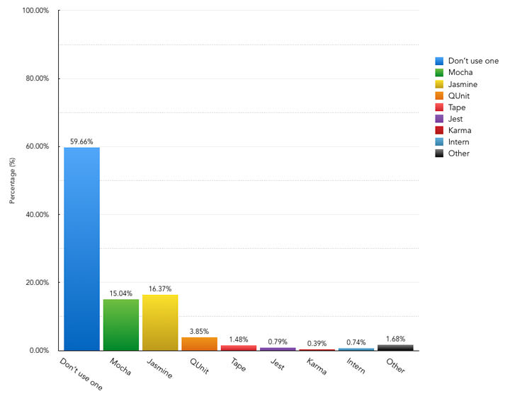
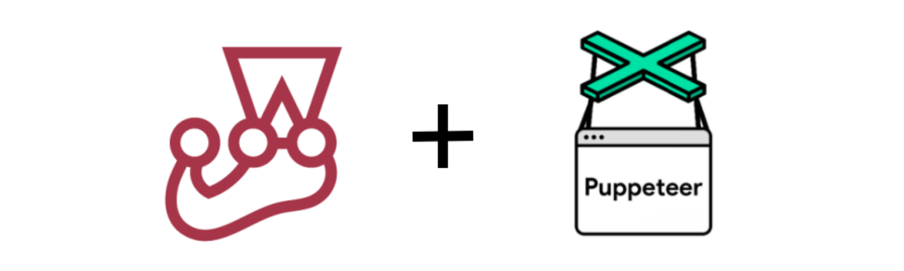

# Curso Incompany para PROCESIA
### HTML5 APIs, ECMA6, Patrones de diseño, AJAX avanzado, APIs externas, JS para Frontend, Automatización...


[FICTIZIA » Cursos a medida para empresas](https://www.fictizia.com/formacion-empresas)

## Clase 7

### NPM


**Documentación**
- [Web Oficial](https://www.npmjs.com/)
- [Features](https://www.npmjs.com/features)
- [Pricing](https://www.npmjs.com/pricing)
- [Documentación](https://docs.npmjs.com/)
- [NPM Community](https://npm.community/)
- [NPM en Github](https://github.com/npm/cli)
- [@npmjs en Twitter](https://twitter.com/npmjs)
- [@npmstatus en Twitter](https://twitter.com/npmstatus)
- [@npm_support en Twitter](https://twitter.com/npm_support)

**Instalar paquetes:**
- global:
```
npm install -g <paquete>
```  

- local:
```
npm install <paquete>
```    

**Buscar paquetes**
```
  npm search <paquete>
```

**Información de los paquetes**
```
  npm view <paquete>
```

**Lista de paquetes instalados**
```
  npm ls
```

**Lista de paquetes instalados globalmente**
```
  npm ls -g
```

**Instalando versiones especificas:**

- la más reciente:
```  
  npm install <paquete>@latest
```  

- versión especifica:
```  
  npm install <paquete>@1.x (1.xx.xx)
```

- Otra versión especifica
```
  npm install <paquete>@2.10.x (2.10.x)
```

**Paquetes desactualziados:**
```
npm outdated
```

**Actualizando paquetes:**
```
npm update <paquete>
```

**Desinstalando paquete:**
```
npm uninstall <paquete>
```

**Información sobre Bugs**
```
npm bugs <paquete>
```

**[Más comandos - CLI](https://docs.npmjs.com/cli/install)**

### Dependency Hell:


**Abyssus abyssum invocat. El abismo llama al abismo (Un paso en falso lleva a otro).**

- [nipster](http://nipstr.com/)
- [Nodei.co](https://nodei.co/)
- [Dependency Hell](http://www.wikiwand.com/en/Dependency_hell)
- [David Dm](https://david-dm.org/)
   - [Ejemplo Twitter-sentiments](https://david-dm.org/UlisesGascon/twitter-sentiments#info=dependencies&view=list)
   - [Ejemplo Grunt](https://david-dm.org/gruntjs/grunt#info=dependencies&view=table)
   - [Ejemplo Express](https://david-dm.org/strongloop/express)
   - [Ejemplo Bower](https://david-dm.org/bower/bower#info=dependencies&view=table)
- [ShieldsIO](http://shields.io/)
   - [Your Badge Service](http://badges.github.io/gh-badges/)


### package.json

- Datos proyecto
- Tareas
- Dependencias (dependencies y devDependencies)
- **[Documentación](https://docs.npmjs.com/files/package.json)**

- **Creación:**
```
  npm init
```

- **Guardar nuevas dependencias:**
```
 npm install <paquete> --save
```

- **Guardar nuevas dependencias (solo para entorno desarrollo):**
```
 npm install <paquete> --save -dev
```

- **Guardando versiones especificas:**
  - (1.xx.xx):
```
  npm install --save <paquete>@1.x
```

  - (2.10.x)
```
  npm install --save <paquete>@2.10.x
```

  - Latest
```
  npm install --save <paquete>@lastest
```

- **Quitando dependencias:**
```
  npm uninstall <paquete> --save
```

- **Instalamos las dependencias en el proyecto:**
  - todo:
```
  npm install (todo)
```

  - Solo production:
```
  npm install --production (solo producción)
```

  - Solo development:
```
  npm install --dev
```

- **[Semantic Versioning](http://semver.org/lang/es/)**
	- Estructura -> X.Y.Z-Extra
	- Cambio Mayor - *No retrocompatible*
	- Cambio Menor - *Retrocompatible - Nuevas funcionaldiades o cambios*
	- Parche - *Retrocompatible - Solución de errores*
	- Extras - Indicativos o versiones especiales (Beta, Alfa, x86, etc...)

### npm scripts (comandos de CLI)

- **Añadiendo comandos:**

```javascript
  // ...
  "scripts": {
      "test": "npm -v",
      "start": "node -v",
      "hola": "echo 'Hola mundo!'"
  }
  // ...
```
- **Mostrando todos los comandos:**
```
    npm run
```

- **Ejecutando comandos:**
  - test
```
    npm test
```

  - start
```
    npm start
```

  - hola
```
    npm run hola
```

### YARN


**Documentación**
- [Web](https://yarnpkg.com/en/)
- [Empezar](https://yarnpkg.com/en/docs/getting-started)
- [Documentación](https://yarnpkg.com/en/docs)
- [Paquetes](https://yarnpkg.com/en/packages/)
- [Blog](https://yarnpkg.com/blog/)
- [Instalar Yarn](https://yarnpkg.com/en/docs/install#debian-stable)

**Iniciar un proyecto**
```
yarn init
```

**Añadir dependencias al proyecto**
```
yarn add [package]
yarn add [package]@[version]
yarn add [package]@[tag]
```

**Añadir dependencias al proyecto en categorías**
```
yarn add [package] --dev
yarn add [package] --peer
yarn add [package] --optional
```

**Actualizar dependencias**
```
yarn upgrade [package]
yarn upgrade [package]@[version]
yarn upgrade [package]@[tag]
```

**Eliminar dependencias**
```
yarn remove [package]
```

**Instalar todas las dependencias**
```
yarn
yarn install
```

**¿quien pidio este paquete?**
```
yarn why [package]
```

**Yarn o NPM@5?**
- Yarn es [mas rapido](https://github.com/artberri/npm-yarn-benchmark)
- Yarn es más seguro

**Recursos**
- [npm@5 — Yarn killer?](https://medium.com/netscape/npm-5-yarn-killer-ba69737b24d0)
- [¿Tiene sentido Yarn ahora que tenemos npm 5?](https://www.campusmvp.es/recursos/post/tiene-sentido-yarn-ahora-que-tenemos-npm-5.aspx)
- [Does NPM 5 deprecate yarn?](https://blog.scottlogic.com/2017/06/06/does-npm5-deprecate-yarn.html)
- [Why I’m Sticking With Yarn (Sorry NPM 5)](https://codingwithspike.wordpress.com/2017/08/11/why-im-sticking-with-yarn/)
- [The npm Blog | v5.0.0](https://blog.npmjs.org/post/161081169345/v500)
- [Why i still don't use yarn](https://intoli.com/blog/node-package-manager-benchmarks/)
- [NPM@5 Arrived. But Is It As Fast As Yarn?](http://blog.diovani.com/technology/2017/05/31/npm-5.html)
- [npm vs Yarn – Which Package Manager Should You Use?](https://www.keycdn.com/blog/npm-vs-yarn/)
- [Yarn vs npm: Everything You Need to Know](https://www.sitepoint.com/yarn-vs-npm/)
- [It depends. The art of dependency management in Javascript](https://blog.softwaremill.com/it-depends-the-art-of-dependency-management-in-javascript-f1f9c3cde3f7)

### Bower



> Web sites are made of lots of things — frameworks, libraries, assets, utilities, and rainbows. Bower manages all these things for you.

- [Bower](http://bower.io/)
- [Documentación - API](http://bower.io/docs/api/)
- [Tendencias Bower](http://bower.io/stats/)
- [Buscador Bower](http://bower.io/search/)


**Bower**
Instalamos Bower globalmente

```
  sudo npm install -g bower
```

Dependencias
```
  /home/ubuntu/.nvm/versions/node/v4.1.1/bin/bower -> /home/ubuntu/.nvm/versions/node/v4.1.1/lib/node_modules/bower/bin/bower
  bower@1.6.6 /home/ubuntu/.nvm/versions/node/v4.1.1/lib/node_modules/bower
  ├── is-root@1.0.0
  ├── destroy@1.0.3
  ├── stringify-object@1.0.1
  ├── junk@1.0.2
  ├── chmodr@1.0.2
  ├── user-home@1.1.1
  ├── q@1.4.1
  ├── abbrev@1.0.7
  ├── opn@1.0.2
  ├── bower-endpoint-parser@0.2.2
  ├── bower-logger@0.2.2
  ├── lockfile@1.0.1
  ├── archy@1.0.0
  ├── graceful-fs@3.0.8
  ├── nopt@3.0.6
  ├── lru-cache@2.7.3
  ├── retry@0.6.1
  ├── tmp@0.0.24
  ├── semver@2.3.2
  ├── md5-hex@1.1.0 (md5-o-matic@0.1.1)
  ├── fs-write-stream-atomic@1.0.4 (graceful-fs@4.1.2)
  ├── p-throttler@0.1.1 (q@0.9.7)
  ├── request-progress@0.3.1 (throttleit@0.0.2)
  ├── shell-quote@1.4.3 (array-filter@0.0.1, array-reduce@0.0.0, jsonify@0.0.0, array-map@0.0.0)
  ├── chalk@1.1.1 (escape-string-regexp@1.0.3, supports-color@2.0.0, ansi-styles@2.1.0, strip-ansi@3.0.0, has-ansi@2.0.0)
  ├── bower-json@0.4.0 (intersect@0.0.3, deep-extend@0.2.11, graceful-fs@2.0.3)
  ├── promptly@0.2.0 (read@1.0.7)
  ├── fstream@1.0.8 (inherits@2.0.1, graceful-fs@4.1.2)
  ├── which@1.2.0 (is-absolute@0.1.7)
  ├── bower-registry-client@1.0.0 (async@0.2.10, graceful-fs@4.1.2, request-replay@0.2.0, mkdirp@0.3.5)
  ├── mkdirp@0.5.0 (minimist@0.0.8)
  ├── glob@4.5.3 (inherits@2.0.1, inflight@1.0.4, once@1.3.3, minimatch@2.0.10)
  ├── fstream-ignore@1.0.3 (inherits@2.0.1, minimatch@3.0.0)
  ├── rimraf@2.4.4 (glob@5.0.15)
  ├── insight@0.7.0 (object-assign@4.0.1, async@1.5.0, tough-cookie@2.2.1, lodash.debounce@3.1.1, configstore@1.3.0, os-name@1.0.3)
  ├── bower-config@1.2.2 (graceful-fs@4.1.2, osenv@0.1.3, optimist@0.6.1)
  ├── github@0.2.4 (mime@1.3.4)
  ├── tar-fs@1.8.1 (pump@1.0.1, tar-stream@1.3.1)
  ├── request@2.53.0 (forever-agent@0.5.2, aws-sign2@0.5.0, caseless@0.9.0, tunnel-agent@0.4.1, oauth-sign@0.6.0, isstream@0.1.2, stringstream@0.0.5, json-stringify-safe@5.0.1, tough-cookie@2.2.1, qs@2.3.3, node-uuid@1.4.7, form-data@0.2.0, mime-types@2.0.14, combined-stream@0.0.7, http-signature@0.10.1, bl@0.9.4, hawk@2.3.1)
  ├── cardinal@0.4.4 (ansicolors@0.2.1, redeyed@0.4.4)
  ├── update-notifier@0.3.2 (is-npm@1.0.0, string-length@1.0.1, semver-diff@2.1.0, latest-version@1.0.1)
  ├── decompress-zip@0.1.0 (mkpath@0.1.0, touch@0.0.3, readable-stream@1.1.13, binary@0.3.0)
  ├── handlebars@2.0.0 (optimist@0.3.7, uglify-js@2.3.6)
  ├── inquirer@0.10.0 (strip-ansi@3.0.0, ansi-regex@2.0.0, figures@1.4.0, ansi-escapes@1.1.0, cli-width@1.1.0, rx-lite@3.1.2, through@2.3.8, readline2@1.0.1, cli-cursor@1.0.2, run-async@0.1.0, lodash@3.10.1)
  ├── mout@0.11.1
  └── configstore@0.3.2 (object-assign@2.1.1, xdg-basedir@1.0.1, uuid@2.0.1, osenv@0.1.3, js-yaml@3.4.5)
```

Arrancamos bower.json
```
  bower init
```

```javascript
  {
    "name": "pruebas_bower",
    "homepage": "https://github.com/UlisesGascon/Curso-in-company-NexTReT",
    "authors": [
      "ulisesgascon"
    ],
    "description": "",
    "main": "",
    "moduleType": [],
    "license": "MIT",
    "private": true,
    "ignore": [
      "**/.*",
      "node_modules",
      "bower_components",
      "test",
      "tests"
    ]
  }
```

Buscamos paquetes
```
  bower search <paquete>
  bower search jquery
```

Instalando Paquetes
```
  bower install <paquete>
  bower install jquery
```

Instalando versiones especificas del paquete
```
  bower install <package>#<version>
```

Instalando Paquetes y guardandolos en bower.json
```
  bower install <paquete> -save
  bower install bootstrap -save
```

```
  ulisesgascon:~/workspace/profe/pruebas_bower (master) $ bower install bootstrap -save
  bower jquery#~2.1.4             cached git://github.com/jquery/jquery.git#2.1.4
  bower jquery#~2.1.4           validate 2.1.4 against git://github.com/jquery/jquery.git#~2.1.4
  bower bootstrap#*           not-cached git://github.com/twbs/bootstrap.git#*
  bower bootstrap#*              resolve git://github.com/twbs/bootstrap.git#*
  bower bootstrap#*             download https://github.com/twbs/bootstrap/archive/v3.3.5.tar.gz
  bower bootstrap#*              extract archive.tar.gz
  bower bootstrap#*             resolved git://github.com/twbs/bootstrap.git#3.3.5
  bower jquery#~2.1.4            install jquery#2.1.4
  bower bootstrap#~3.3.5         install bootstrap#3.3.5
```

```javascript
  // bower.json
  {
    "name": "pruebas_bower",
    "homepage": "https://github.com/UlisesGascon/Curso-in-company-NexTReT",
    "authors": [
      "ulisesgascon"
    ],
    "description": "",
    "main": "",
    "moduleType": [],
    "license": "MIT",
    "private": true,
    "ignore": [
      "**/.*",
      "node_modules",
      "bower_components",
      "test",
      "tests"
    ],
    "dependencies": {
      "jquery": "~2.1.4",
      "bootstrap": "~3.3.5"
    }
  }
```

Borrando paquetes
```
  bower uninstall <paquete>
  bower uninstall jquery
```

Borrando paquetes  y guardandolos en bower.json
```
  bower uninstall <paquete>
  bower uninstall jquery
```

Verificando los paquetes instalados y sus dependencias
```
  bower list
```

```
  ulisesgascon:~/workspace/profe/pruebas_bower (master) $ bower list
  bower check-new     Checking for new versions of the project dependencies...
  pruebas_bower /home/ubuntu/workspace/profe/pruebas_bower
  ├─┬ bootstrap#3.3.5 (latest is 4.0.0-alpha)
  │ └── jquery#2.1.4 (3.0.0-alpha1+compat available)
  └── jquery#2.1.4 (latest is 3.0.0-alpha1+compat)
```

Actualizando todo
```
  bower update
```

Actualizando un paquete específico
```
  bower update <package>
```

Usando Bower
```
  bower list -paths
```

```
  ulisesgascon:~/workspace/profe/pruebas_bower (master) $ bower list -paths

    bootstrap: [
      'public/vendor/bootstrap/less/bootstrap.less',
      'public/vendor/bootstrap/dist/js/bootstrap.js'
    ],
    jquery: 'public/vendor/jquery/dist/jquery.js'
```

```html
  <!DOCTYPE html>
  <html lang="es">
    <head>
      <meta charset="utf-8">
      <meta http-equiv="X-UA-Compatible" content="IE=edge">
      <meta name="viewport" content="width=device-width, initial-scale=1">
      <!-- The above 3 meta tags *must* come first in the head; any other head content must come *after* these tags -->
      <title>Bootstrap 101 Template</title>

      <!-- Bootstrap -->
      <link href="public/vendor/bootstrap/dist/css/bootstrap.min.css" rel="stylesheet">

    </head>
    <body>
      <h1>Hello, world!</h1>

      <!-- jQuery (necessary for Bootstrap's JavaScript plugins) -->
      <script src="public/vendor/jquery/dist/jquery.js"></script>
      <!-- Include all compiled plugins (below), or include individual files as needed -->
      <script src="public/vendor/bootstrap/dist/js/bootstrap.js"></script>
    </body>
  </html>
```

**Bower (Entendiendo el funcionamiento)**

bower.json. ¿Qué necesitamos?
```javascript
  {
      "name": "Mi Aplicación",
      "version": "1.0.0",
      "dependencies": {
          "modernizr": "*",
          "jquery": "~2.0.2",
          "bootstrap": "*",
          "requirejs": "*"
      }
  }
```

.bowerrc ¿Donde lo necesitamos?
```javascript
  {
      "directory": "public/vendor",
      "json": "bower.json"
  }
```

Instalamos todo lo anterior
```
  bower install
```


**Bower (Trucos)**

- Se puede instalar componentes aislados primero y luego hacer *bower init* para generar el *bower.json* con todo incluido.
- Ignoramos la carpeta *bower_components* con *.gitignore*. Recuerda que haciendo *bower.init* se instala todo de nuevo.
- Instalación de paquetes más alla de los definidos en search:

- Paquetes registrados:
```
  $ bower install jquery
```

- Acesso directo -> GitHub:
```
  $ bower install desandro/masonry
```

- .git:
```
  $ bower install git://github.com/user/package.git
```

- URLs:
```
  $ bower install http://example.com/script.js
```

### Los problemas de BOWER



**Limitaciones**
- Gestión de conflictos manual
- Fiarnos del patrón SEMVER por parte de otr@s developers
- Sistema de paquetes propio
- Redundancia respecto a NPM
- Maravillo mundo del [Dependency hell](https://en.wikipedia.org/wiki/Dependency_hell)


### Bower ha muerto


> BOWER is dead. Only use it for legacy reasons.

**Literatura al respecto**

- [Bower/bower #2298: Consider deprecating Bower](https://github.com/bower/bower/issues/2298#issuecomment-289846310)
- [Bower is dead, long live npm. And Yarn. And webpack in snyk.io/blog by Assaf Hefetz](https://snyk.io/blog/bower-is-dead/)
- [Reddit: Is bower dead? Should we start using other dependency managers?](https://www.reddit.com/r/javascript/comments/5ls30m/is_bower_dead_should_we_start_using_other/)
- [Quora: Is Bower dying?](https://www.quora.com/Is-Bower-dying?utm_medium=organic&utm_source=google_rich_qa&utm_campaign=google_rich_qa)

### La nueva generación

**Paso 1: Tus herramientas son las de siempre**
- [NPM](https://www.npmjs.com/features)
- [YARN](https://yarnpkg.com/en/)
- [webpack](https://webpack.js.org/concepts/)

**Paso 2: Pasar del `bower.json` al `package.json`**

**Paso 3: Deja de usar `wiredep` y empieza a usar solamente `require()`**

_Nota: Esto es al estilo Browserify exclusivamente_

- [wiredep: Wire Bower dependencies to your source code](https://github.com/taptapship/wiredep)
- [browserify: browser-side require() the node.js way](https://github.com/browserify)
- Debes instalar browserify de forma global con `npm install -g browserify`
- Ejemplo de carga de dependencias
  ```javascript
  var $ = require('jquery'),
      _ = require('lodash'),
      angular = require('angular');
  //..
  ```
- Puedes comprimir y unificar todo el JS en un solo comando `browserify app.js -o bundle.js` y en un único fichero `<script src="bundle.js"></script>`
- Si ademas instalas [watchify](https://github.com/substack/watchify) con `watchify app.js -o bundle.js` refescas los cambios en tiempo real.

**Extra 1: Cosas Interesantes**
- [Usar el campo `browser` en el `package.json`](https://github.com/substack/node-browserify#browser-field)

**Extra 2: Un mundo de información te espera**

- [Why We Should Stop Using Bower – And How to Do It](https://gofore.com/stop-using-bower/)
- [Browserify VS Webpack - JS Drama](http://blog.namangoel.com/browserify-vs-webpack-js-drama)
- [npm and front-end packaging](http://blog.npmjs.org/post/101775448305/npm-and-front-end-packaging)
- [The jQuery Module Fallacy](https://www.evernote.com/shard/s93/sh/390d6836-8797-4f0c-a7c2-fc77fbb0a9b8/649f084e90bae42f)

### Grunt


```javascript
//export default grunt => {
module.exports = grunt => {

grunt.initConfig({
  jshint: {
    files: ['Gruntfile.js', 'src/**/*.js', 'test/**/*.js'],
    options: {
      globals: {
        jQuery: true
      }
    }
  },
  watch: {
    files: ['<%= jshint.files %>'],
    tasks: ['jshint']
  }
});

grunt.loadNpmTasks('grunt-contrib-jshint');
grunt.loadNpmTasks('grunt-contrib-watch');
grunt.registerTask('default', ['jshint']);

};
```


**Caractísticas**
- Filosofía de configuración sobre codigo
- Basado en archivos temporales
- Ecosistema fuerte
- Poco flexible para cosas fuera de lo común
- Ficheros de configuración sobredimensionados
- Facilmente se desactualiza

**Instalación**
- Instalamos Gulp global
```
npm install -g grunt-cli
```

- Incluimos la dependencia en *package.json*
```
npm install grunt --save-dev
```

**Tareas por defecto**
- Creamos *gruntfile.js* y encapsulamos
- Definición
```javascript
module.exports = grunt => {
  //... resto del código de grunt...
};
```
- Instanciamos la configuración 
```javascript
module.exports = grunt => {
  grunt.initConfig({
    //...resto de configuración...
  })
  //... resto del código de grunt...
};
```
- Cargamos las dependencias (plugins)...
```javascript
module.exports = grunt => {
  grunt.initConfig({
    //...resto de configuración...
  })
  //... resto del código de grunt...
};

grunt.loadNpmTasks('grunt-contrib-NOMBRE-PLUGIN');
grunt.loadNpmTasks('grunt-contrib-NOMBRE-PLUGIN');
//... 
```
- Creamos la tarea por defecto
```javascript
module.exports = grunt => {
  grunt.initConfig({
    jshint: {
      files: ['Gruntfile.js', 'src/**/*.js', 'test/**/*.js'],
      options: {
        // options here to override JSHint defaults
        globals: {
          jQuery: true,
          console: true,
          module: true,
          document: true
        }
      }
    }
  })
};

grunt.loadNpmTasks('grunt-contrib-jshint');
grunt.registerTask('default', ['jshint']);
```
- Creamos tarea watch...
```javascript
module.exports = grunt => {
  grunt.initConfig({
    jshint: {
      files: ['Gruntfile.js', 'src/**/*.js', 'test/**/*.js'],
      options: {
        // options here to override JSHint defaults
        globals: {
          jQuery: true,
          console: true,
          module: true,
          document: true
        }
      }
    },
    watch: {
      files: ['<%= jshint.files %>'],
      tasks: ['jshint']
    }
  })
};

grunt.loadNpmTasks('grunt-contrib-jshint');
grunt.registerTask('default', ['jshint']);
```

**Lanzamiento**
- Lanzar la tarea por defecto `grunt`
- Lanzar el watch `grunt watch`
- lanzar una tarea personalizada `grunt TAREA`


### [Grunt: Plugins](https://gruntjs.com/plugins)
- [The 26 grunt plugins we use at qrator.com | Andy's Blog](http://blog.andyhot.gr/the-26-grunt-plugins-we-use-at-qrator-com/)
- [Living list of most useful plugins for Grunt](https://github.com/Pestov/essential-grunt-plugins)
- [6 essential Grunt plugins you should be using | Creative Bloq](https://www.creativebloq.com/web-design/6-essential-grunt-plugins-you-should-be-using-121518118)
- [7 Essential Plug-ins for those New to GruntJS - Web Design Ledger](https://webdesignledger.com/gruntjs-plugins/#e618defdd7)
- [Essential Grunt Plugins - Donna Peplinskie](http://donnapeplinskie.com/blog/essential-grunt-plugins/)
- [Psychedelic Grunt Plugins - Web Design Weekly](https://web-design-weekly.com/2013/06/15/psychedelic-grunt-plugins/)
- [5 Grunt Plugins for a Better Workflow | Chase Adams](https://chaseadams.io/2013/11/5-useful-grunt-plugins/)
- [Building a Better Grunt Plugin | Sprout Social](https://sproutsocial.com/insights/building-better-grunt-plugin/)
- [Supercharging your Gruntfile](https://www.html5rocks.com/en/tutorials/tooling/supercharging-your-gruntfile/)
- [Take Grunt to the Next Level — Jonathan Suh](https://jonsuh.com/blog/take-grunt-to-the-next-level/)


### Grunt: [gruntfile.js](https://gist.github.com/UlisesGascon/5f32b686cc43037adbf5c0ddf33f55d5#file-gruntfile-js)

```javascript
// Generated on 2018-03-31 using
// generator-webapp 1.1.2
'use strict';

// # Globbing
// for performance reasons we're only matching one level down:
// 'test/spec/{,*/}*.js'
// If you want to recursively match all subfolders, use:
// 'test/spec/**/*.js'

//export default grunt => {
module.exports = grunt => {

  // Time how long tasks take. Can help when optimizing build times
  require('time-grunt')(grunt);

  // Automatically load required grunt tasks
  require('jit-grunt')(grunt, {
    useminPrepare: 'grunt-usemin'
  });

  // Configurable paths
  const config = {
    app: 'app',
    dist: 'dist'
  };

  // Define the configuration for all the tasks
  grunt.initConfig({

    // Project settings
    config,

    // Watches files for changes and runs tasks based on the changed files
    watch: {
      bower: {
        files: ['bower.json'],
        tasks: ['wiredep']
      },
      babel: {
        files: ['<%= config.app %>/scripts/{,*/}*.js'],
        tasks: ['babel:dist']
      },
      babelTest: {
        files: ['test/spec/{,*/}*.js'],
        tasks: ['babel:test', 'test:watch']
      },
      gruntfile: {
        files: ['Gruntfile.js']
      },
      sass: {
        files: ['<%= config.app %>/styles/{,*/}*.{scss,sass}'],
        tasks: ['sass', 'postcss']
      },
      styles: {
        files: ['<%= config.app %>/styles/{,*/}*.css'],
        tasks: ['newer:copy:styles', 'postcss']
      }
    },

    browserSync: {
      options: {
        notify: false,
        background: true,
        watchOptions: {
          ignored: ''
        }
      },
      livereload: {
        options: {
          files: [
            '<%= config.app %>/{,*/}*.html',
            '.tmp/styles/{,*/}*.css',
            '<%= config.app %>/images/{,*/}*',
            '.tmp/scripts/{,*/}*.js'
          ],
          port: 9000,
          server: {
            baseDir: ['.tmp', config.app],
            routes: {
              '/bower_components': './bower_components'
            }
          }
        }
      },
      test: {
        options: {
          port: 9001,
          open: false,
          logLevel: 'silent',
          host: 'localhost',
          server: {
            baseDir: ['.tmp', './test', config.app],
            routes: {
              '/bower_components': './bower_components'
            }
          }
        }
      },
      dist: {
        options: {
          background: false,
          server: '<%= config.dist %>'
        }
      }
    },

    // Empties folders to start fresh
    clean: {
      dist: {
        files: [{
          dot: true,
          src: [
            '.tmp',
            '<%= config.dist %>/*',
            '!<%= config.dist %>/.git*'
          ]
        }]
      },
      server: '.tmp'
    },

    // Make sure code styles are up to par and there are no obvious mistakes
    eslint: {
      target: [
        'Gruntfile.js',
        '<%= config.app %>/scripts/{,*/}*.js',
        '!<%= config.app %>/scripts/vendor/*',
        'test/spec/{,*/}*.js'
      ]
    },

    // Mocha testing framework configuration options
    mocha: {
      all: {
        options: {
          run: true,
          urls: ['http://<%= browserSync.test.options.host %>:<%= browserSync.test.options.port %>/index.html']
        }
      }
    },

    // Compiles ES6 with Babel
    babel: {
      options: {
        sourceMap: true,
        presets: ['es2015']
      },
      dist: {
        files: [{
          expand: true,
          cwd: '<%= config.app %>/scripts',
          src: '{,*/}*.js',
          dest: '.tmp/scripts',
          ext: '.js'
        }]
      },
      test: {
        files: [{
          expand: true,
          cwd: 'test/spec',
          src: '{,*/}*.js',
          dest: '.tmp/spec',
          ext: '.js'
        }]
      }
    },

    // Compiles Sass to CSS and generates necessary files if requested
    sass: {
      options: {
        sourceMap: true,
        sourceMapEmbed: true,
        sourceMapContents: true,
        includePaths: ['.']
      },
      dist: {
        files: [{
          expand: true,
          cwd: '<%= config.app %>/styles',
          src: ['*.{scss,sass}'],
          dest: '.tmp/styles',
          ext: '.css'
        }]
      }
    },

    postcss: {
      options: {
        map: true,
        processors: [
          // Add vendor prefixed styles
          require('autoprefixer')({
            browsers: ['> 1%', 'last 2 versions', 'Firefox ESR']
          })
        ]
      },
      dist: {
        files: [{
          expand: true,
          cwd: '.tmp/styles/',
          src: '{,*/}*.css',
          dest: '.tmp/styles/'
        }]
      }
    },

    // Automatically inject Bower components into the HTML file
    wiredep: {
      app: {
        src: ['<%= config.app %>/index.html'],
        exclude: ['bootstrap.js'],
        ignorePath: /^(\.\.\/)*\.\./
      },
      sass: {
        src: ['<%= config.app %>/styles/{,*/}*.{scss,sass}'],
        ignorePath: /^(\.\.\/)+/
      }
    },

    // Renames files for browser caching purposes
    filerev: {
      dist: {
        src: [
          '<%= config.dist %>/scripts/{,*/}*.js',
          '<%= config.dist %>/styles/{,*/}*.css',
          '<%= config.dist %>/images/{,*/}*.*',
          '<%= config.dist %>/fonts/{,*/}*.*',
          '<%= config.dist %>/*.{ico,png}'
        ]
      }
    },

    // Reads HTML for usemin blocks to enable smart builds that automatically
    // concat, minify and revision files. Creates configurations in memory so
    // additional tasks can operate on them
    useminPrepare: {
      options: {
        dest: '<%= config.dist %>'
      },
      html: '<%= config.app %>/index.html'
    },

    // Performs rewrites based on rev and the useminPrepare configuration
    usemin: {
      options: {
        assetsDirs: [
          '<%= config.dist %>',
          '<%= config.dist %>/images',
          '<%= config.dist %>/styles'
        ]
      },
      html: ['<%= config.dist %>/{,*/}*.html'],
      css: ['<%= config.dist %>/styles/{,*/}*.css']
    },

    // The following *-min tasks produce minified files in the dist folder
    imagemin: {
      dist: {
        files: [{
          expand: true,
          cwd: '<%= config.app %>/images',
          src: '{,*/}*.{gif,jpeg,jpg,png}',
          dest: '<%= config.dist %>/images'
        },{
          expand: true,
          cwd: '<%= config.app %>',
          src: '*.{ico,png}',
          dest: '<%= config.dist %>'
        }]
      }
    },

    svgmin: {
      dist: {
        files: [{
          expand: true,
          cwd: '<%= config.app %>/images',
          src: '{,*/}*.svg',
          dest: '<%= config.dist %>/images'
        }]
      }
    },

    htmlmin: {
      dist: {
        options: {
          collapseBooleanAttributes: true,
          collapseWhitespace: true,
          conservativeCollapse: true,
          removeAttributeQuotes: true,
          removeCommentsFromCDATA: true,
          removeEmptyAttributes: true,
          removeOptionalTags: true,
          // true would impact styles with attribute selectors
          removeRedundantAttributes: false,
          useShortDoctype: true
        },
        files: [{
          expand: true,
          cwd: '<%= config.dist %>',
          src: '{,*/}*.html',
          dest: '<%= config.dist %>'
        }]
      }
    },

    // By default, your `index.html`'s <!-- Usemin block --> will take care
    // of minification. These next options are pre-configured if you do not
    // wish to use the Usemin blocks.
    // cssmin: {
    //   dist: {
    //     files: {
    //       '<%= config.dist %>/styles/main.css': [
    //         '.tmp/styles/{,*/}*.css',
    //         '<%= config.app %>/styles/{,*/}*.css'
    //       ]
    //     }
    //   }
    // },
    // uglify: {
    //   dist: {
    //     files: {
    //       '<%= config.dist %>/scripts/scripts.js': [
    //         '<%= config.dist %>/scripts/scripts.js'
    //       ]
    //     }
    //   }
    // },
    // concat: {
    //   dist: {}
    // },

    // Copies remaining files to places other tasks can use
    copy: {
      dist: {
        files: [{
          expand: true,
          dot: true,
          cwd: '<%= config.app %>',
          dest: '<%= config.dist %>',
          src: [
            '*.txt',
            'images/{,*/}*.webp',
            '{,*/}*.html',
            'fonts/{,*/}*.*'
          ]
        }, {
          expand: true,
          dot: true,
          cwd: '.',
          src: 'bower_components/bootstrap-sass/assets/fonts/bootstrap/*',
          dest: '<%= config.dist %>'
        }]
      }
    },

    // Generates a custom Modernizr build that includes only the tests you
    // reference in your app
    modernizr: {
      dist: {
        devFile: 'bower_components/modernizr/modernizr.js',
        outputFile: '<%= config.dist %>/scripts/vendor/modernizr.js',
        files: {
          src: [
            '<%= config.dist %>/scripts/{,*/}*.js',
            '<%= config.dist %>/styles/{,*/}*.css',
            '!<%= config.dist %>/scripts/vendor/*'
          ]
        },
        uglify: true
      }
    },

    // Run some tasks in parallel to speed up build process
    concurrent: {
      server: [
        'babel:dist',
        'sass'
      ],
      test: [
        'babel'
      ],
      dist: [
        'babel',
        'sass',
        'imagemin',
        'svgmin'
      ]
    }
  });


  grunt.registerTask('serve', 'start the server and preview your app', target => {

    if (target === 'dist') {
      return grunt.task.run(['build', 'browserSync:dist']);
    }

    grunt.task.run([
      'clean:server',
      'wiredep',
      'concurrent:server',
      'postcss',
      'browserSync:livereload',
      'watch'
    ]);
  });

  grunt.registerTask('server', target => {
    grunt.log.warn('The `server` task has been deprecated. Use `grunt serve` to start a server.');
    grunt.task.run([target ? (`serve:${target}`) : 'serve']);
  });

  grunt.registerTask('test', target => {
    if (target !== 'watch') {
      grunt.task.run([
        'clean:server',
        'concurrent:test',
        'postcss'
      ]);
    }

    grunt.task.run([
      'browserSync:test',
      'mocha'
    ]);
  });

  grunt.registerTask('build', [
    'clean:dist',
    'wiredep',
    'useminPrepare',
    'concurrent:dist',
    'postcss',
    'concat',
    'cssmin',
    'uglify',
    'copy:dist',
    'modernizr',
    'filerev',
    'usemin',
    'htmlmin'
  ]);

  grunt.registerTask('default', [
    'newer:eslint',
    'test',
    'build'
  ]);
};
```


### Gulp




**Caractísticas**
- Filosofía de código sobre configuración
- Basado en stream
- No es necesario usar archivos temporales
- Claridad en creación de tareas y seguimiento de procesos
- Gran cantidad de Plugins
- Cuenta con una comunidad sólida y madura
- El sistema de `streams` y `Promises`no es sencillo para developers juniors

**Instalación**
- Instalamos Gulp global
```
npm install --global gulp
```

- Incluimos la dependencia en *package.json*
```
npm install --save-dev gulp
```

**Tareas por defecto**
- Creamos *gulpfile.js* y agregamos dependencias y la primera tarea por defecto
- Definición
```javascript
//import gulp from 'gulp';
const gulp = require('gulp');

gulp.task('default', () => {
  console.log("Estas en la tarea por defecto!")
});
```
- Lanzamiento
```
gulp
```

**Más tareas**
- Creamos una tarea nueva para gestionar la concatenación y minificación de los archivos js.
- Definición
```javascript
/*
import gulp from 'gulp';
import concat from 'gulp-concat';
import uglify from 'gulp-uglify';
*/
const gulp = require('gulp'),
  concat = require('gulp-concat'),
  uglify = require('gulp-uglify');

gulp.task('concat-ugly', () => {
  console.log("Estas en la tarea de concatenación!")  
  gulp.src('js/sources/*.js')
  .pipe(concat('app.min.js'))
  .pipe(uglify())
  .pipe(gulp.dest('dist/js'))
});
```
- Instalamos las nuevas dependencias
```
npm install -save gulp-concat && npm install -save gulp-uglify
```
- Lanzamiento
```
gulp concat-ugly
```

**Agrupando tareas**
- Definición
```javascript
gulp.task('distro-lista', ['imagenes', 'css', 'js']);
```
- Lanzamiento
```
gulp distro-lista
```


**Concatenando tareas**
- Definición
```javascript
gulp.task('css-paso-2', ['css-paso-1'], () => {
  console.log("css-paso-2 empieza solo cuando... css-paso-1 haya termiando!")
});
```
- Lanzamiento
```
gulp css-paso-2
```

**[Ejemplo de gulpfile.js](https://gist.github.com/torgeir/8507130)**


**Entendiendo Gulp**
`gulp.src()` y `gulp.dest()`
- Un solo archivo
```javascript
gulp.src('client/templates/index.jade')
// .pipe(...)
```
- Múltiples archivos
```javascript
gulp.src(['client/*.js', '!client/b*.js', 'client/bad.js'])
// .pipe(...)
```
- Múltiples archivos y carpetas
```javascript
gulp.src('client/templates/**/*.jade')
// .pipe(...)
```
- Exclusión
```
!js/secreto-config.js
```
- Especificando la extensión
```
publico/*.+(js|css)
```
- [Más opciones](https://github.com/isaacs/minimatch)

`gulp.watch()`
- Monitoriza de manera activa uno o varios archivos y dispara tareas específicas cuando se hayan modificado
```javascript
gulp.watch('js/source/*.js', ['js']);
```

### [Gulp: Plugins](http://gulpjs.com/plugins/)
- [gulp-debug](https://www.npmjs.com/package/gulp-debug): BÁSICO para debugear las tareas de GULP y los ficheros en scope de la tarea
- [gulp-concat](https://github.com/contra/gulp-concat): Concatenación de archivos
- [gulp-uglify](https://github.com/terinjokes/gulp-uglify): Comprime javascript usando [UglifyJS2](https://github.com/mishoo/UglifyJS2)
- [gulp-stylus](https://www.npmjs.com/package/gulp-stylus): Compilar de .styl a .css
- [gulp-coffee](https://www.npmjs.org/package/gulp-coffee): Compilar de .coffee a .js
- [gulp-jade](https://www.npmjs.org/package/gulp-jade): Compilador de .jade a .html
- [gulp-if](https://www.npmjs.org/package/gulp-if): Control adiccional para el flujo de subtareas
- [gulp-imagemin](https://www.npmjs.org/package/gulp-imagemin): Minificación de imágenes con formato .png, .jpeg, .gif y .svg, [más opciones](https://github.com/sindresorhus/gulp-imagemin#imageminoptions)
- [gulp-jshint](https://www.npmjs.com/package/gulp-jshint): JSHint
- [gulp.spritesmith](https://www.npmjs.com/package/gulp.spritesmith): Crea Sprites y el css adiccional en diversos formatos (.css, .json, Sass, Less)
- [gulp-zip](https://github.com/sindresorhus/gulp-zip): Compresor ZIP
- [gulp-csslint](https://www.npmjs.com/package/gulp-csslint/): CSS Linter
- [gulp-eslint](https://www.npmjs.com/package/gulp-eslint/): [ESLint](http://eslint.org/)
- [gulp-gh-pages](https://www.npmjs.com/package/gulp-gh-pages/): Gestiona la publicación en GitHub Pages
- [gulp-git](https://www.npmjs.com/package/gulp-git/): Gestiona Git desde Gulp
- [gulp-htmlmin](https://www.npmjs.com/package/gulp-htmlmin/): Minificador de HTML
- [gulp-iconfont](https://www.npmjs.com/package/gulp-iconfont/): Creando fuentes de Iconos desde archivos vectoriales
- [gulp-jsonlint](https://www.npmjs.com/package/gulp-jsonlint): Linter para json
- [gulp-markdown](https://www.npmjs.com/package/gulp-markdown/): Markdown a HTML
- [gulp-sourcemaps](https://www.npmjs.com/package/gulp-sourcemaps/): Crea SourceMaps
- [gulp-uncss](https://www.npmjs.com/package/gulp-uncss/): Elimina CSS que no se use
- [gulp-jsdoc-to-markdown](https://www.npmjs.com/package/gulp-jsdoc-to-markdown/): Conversor de jsdocs a markdown
- [gulp-unzip](https://www.npmjs.com/package/gulp-unzip/): Descompresor ZIP
- [gulp-webstandards](https://www.npmjs.com/package/gulp-webstandards): Verifica prefijos CSS, Versión de librerías js, dcoType, compatibildiad entre navegadores,  etc...
- [gulp-filesize](https://www.npmjs.com/package/gulp-filesize): Muestra el tamaño de los archivos.
- [gulp-grunt](https://github.com/gratimax/gulp-grunt): Tareas de Grutn funcionan en Gulp
- [gulp-shell](https://github.com/sun-zheng-an/gulp-shell): Manejando comandos de terminal


### Interesante de integrar en los proyectos:
- [Easy Accessibility Testing with aXe](https://www.axe-core.org/)
- [puppeteer: Headless Chrome Node API](https://github.com/GoogleChrome/puppeteer)
- [pageres: Genera pantallazos de la web en diversos tamaños](https://github.com/sindresorhus/pageres)
- [PSI: PageSpeed Insights desde la terminal](https://github.com/addyosmani/psi)
- [Lighthouse: Auditing, performance metrics, and best practices for Progressive Web Apps](https://github.com/GoogleChrome/lighthouse)


### Gulp: [gulpfile.js](https://gist.github.com/UlisesGascon/5f32b686cc43037adbf5c0ddf33f55d5#file-gulpfile-js)

```javascript
// generated on 2018-03-31 using generator-webapp 3.0.1
const gulp = require('gulp');
const gulpLoadPlugins = require('gulp-load-plugins');
const browserSync = require('browser-sync').create();
const del = require('del');
const wiredep = require('wiredep').stream;
const runSequence = require('run-sequence');

const $ = gulpLoadPlugins();
const reload = browserSync.reload;

let dev = true;

gulp.task('styles', () => {
  return gulp.src('app/styles/*.scss')
    .pipe($.plumber())
    .pipe($.if(dev, $.sourcemaps.init()))
    .pipe($.sass.sync({
      outputStyle: 'expanded',
      precision: 10,
      includePaths: ['.']
    }).on('error', $.sass.logError))
    .pipe($.autoprefixer({browsers: ['> 1%', 'last 2 versions', 'Firefox ESR']}))
    .pipe($.if(dev, $.sourcemaps.write()))
    .pipe(gulp.dest('.tmp/styles'))
    .pipe(reload({stream: true}));
});

gulp.task('scripts', () => {
  return gulp.src('app/scripts/**/*.js')
    .pipe($.plumber())
    .pipe($.if(dev, $.sourcemaps.init()))
    .pipe($.babel())
    .pipe($.if(dev, $.sourcemaps.write('.')))
    .pipe(gulp.dest('.tmp/scripts'))
    .pipe(reload({stream: true}));
});

function lint(files) {
  return gulp.src(files)
    .pipe($.eslint({ fix: true }))
    .pipe(reload({stream: true, once: true}))
    .pipe($.eslint.format())
    .pipe($.if(!browserSync.active, $.eslint.failAfterError()));
}

gulp.task('lint', () => {
  return lint('app/scripts/**/*.js')
    .pipe(gulp.dest('app/scripts'));
});
gulp.task('lint:test', () => {
  return lint('test/spec/**/*.js')
    .pipe(gulp.dest('test/spec'));
});

gulp.task('html', ['styles', 'scripts'], () => {
  return gulp.src('app/*.html')
    .pipe($.useref({searchPath: ['.tmp', 'app', '.']}))
    .pipe($.if(/\.js$/, $.uglify({compress: {drop_console: true}})))
    .pipe($.if(/\.css$/, $.cssnano({safe: true, autoprefixer: false})))
    .pipe($.if(/\.html$/, $.htmlmin({
      collapseWhitespace: true,
      minifyCSS: true,
      minifyJS: {compress: {drop_console: true}},
      processConditionalComments: true,
      removeComments: true,
      removeEmptyAttributes: true,
      removeScriptTypeAttributes: true,
      removeStyleLinkTypeAttributes: true
    })))
    .pipe(gulp.dest('dist'));
});

gulp.task('images', () => {
  return gulp.src('app/images/**/*')
    .pipe($.cache($.imagemin()))
    .pipe(gulp.dest('dist/images'));
});

gulp.task('fonts', () => {
  return gulp.src(require('main-bower-files')('**/*.{eot,svg,ttf,woff,woff2}', function (err) {})
    .concat('app/fonts/**/*'))
    .pipe($.if(dev, gulp.dest('.tmp/fonts'), gulp.dest('dist/fonts')));
});

gulp.task('extras', () => {
  return gulp.src([
    'app/*',
    '!app/*.html'
  ], {
    dot: true
  }).pipe(gulp.dest('dist'));
});

gulp.task('clean', del.bind(null, ['.tmp', 'dist']));

gulp.task('serve', () => {
  runSequence(['clean', 'wiredep'], ['styles', 'scripts', 'fonts'], () => {
    browserSync.init({
      notify: false,
      port: 9000,
      server: {
        baseDir: ['.tmp', 'app'],
        routes: {
          '/bower_components': 'bower_components'
        }
      }
    });

    gulp.watch([
      'app/*.html',
      'app/images/**/*',
      '.tmp/fonts/**/*'
    ]).on('change', reload);

    gulp.watch('app/styles/**/*.scss', ['styles']);
    gulp.watch('app/scripts/**/*.js', ['scripts']);
    gulp.watch('app/fonts/**/*', ['fonts']);
    gulp.watch('bower.json', ['wiredep', 'fonts']);
  });
});

gulp.task('serve:dist', ['default'], () => {
  browserSync.init({
    notify: false,
    port: 9000,
    server: {
      baseDir: ['dist']
    }
  });
});

gulp.task('serve:test', ['scripts'], () => {
  browserSync.init({
    notify: false,
    port: 9000,
    ui: false,
    server: {
      baseDir: 'test',
      routes: {
        '/scripts': '.tmp/scripts',
        '/bower_components': 'bower_components'
      }
    }
  });

  gulp.watch('app/scripts/**/*.js', ['scripts']);
  gulp.watch(['test/spec/**/*.js', 'test/index.html']).on('change', reload);
  gulp.watch('test/spec/**/*.js', ['lint:test']);
});

// inject bower components
gulp.task('wiredep', () => {
  gulp.src('app/styles/*.scss')
    .pipe($.filter(file => file.stat && file.stat.size))
    .pipe(wiredep({
      ignorePath: /^(\.\.\/)+/
    }))
    .pipe(gulp.dest('app/styles'));

  gulp.src('app/*.html')
    .pipe(wiredep({
      exclude: ['bootstrap-sass'],
      ignorePath: /^(\.\.\/)*\.\./
    }))
    .pipe(gulp.dest('app'));
});

gulp.task('build', ['lint', 'html', 'images', 'fonts', 'extras'], () => {
  return gulp.src('dist/**/*').pipe($.size({title: 'build', gzip: true}));
});

gulp.task('default', () => {
  return new Promise(resolve => {
    dev = false;
    runSequence(['clean', 'wiredep'], 'build', resolve);
  });
});
```

### [Gulp 4](https://github.com/gulpjs/gulp/tree/4.0)

### Gulp 4: Cambios

- Nuevo sistema de dependencias `gulp.task()` solo admite 2 argumentos
- `gulp.series()` y 'gulp.parallel()' son ahora nativas. ¡Adios [runSequence](https://www.npmjs.com/package/run-sequence)!.
- El orden de las tareas es clave y ya no podemos organizarlas como queramos, deben ir por orden de carga
- Es necesario terminar cada tarea con un callback o resolver la promesa. En Gulp3 no era necesario.
- Por el momento tiene poca adopción

> Si tienes un `gulpile.js` funcionando con Gulp 3.x, no merece la pena migrarse.

#### Nuevo sistema de dependencias en detalles

**Antes - Gulp 3.9.x**
```javascript
gulp.task('a', function () {
  // Do something.
});
gulp.task('b', ['a'], function () {
  // Do some stuff.
});

gulp.task('c', ['b'], function () {
    // Do some more stuff.
});
```


**Ahora - Gulp 4.x**



- Las tareas solo tienen 2 argumentos.
- La concatenación de tareas puede ser serializada con `gulp.series()` o paralelizada con 'gulp.parallel()'

```javascript
gulp.task('my-tasks', gulp.series('a', 'b', 'c', function() {
  // Do something after a, b, and c are finished.
}));
```

```javascript
gulp.task('build', gulp.parallel('styles', 'scripts', 'images', function () {
  // Build the website.
}));
```

### Gulp 4: Guías
- [The Complete-Ish Guide to Upgrading to Gulp 4](https://www.joezimjs.com/javascript/complete-guide-upgrading-gulp-4/)
- [Web Tooling and Automatisation using gulp 4](http://nealbuerger.com/2017/04/web-tooling-and-automatisation-using-gulp-4/)
- [How to install Gulp 4 before it's officially released](https://demisx.github.io/gulp4/2015/01/15/install-gulp4.html)
- [Migrating to gulp 4 by example](https://blog.wearewizards.io/migrating-to-gulp-4-by-example)
- [How to Upgrade to Gulp 4](https://www.fastless.com/gulp-4/)
- [Getting started with Gulp 4 for Angular](https://hackernoon.com/getting-started-with-gulp-4-for-angular-1280a78fa91a)
- [A quick guide for switching to gulp 4](https://codeburst.io/switching-to-gulp-4-0-271ae63530c0)


### Gulp 4: Ejemplo

```javascript
/*
import gulp from 'gulp';
import less from 'gulp-less';
import babel from 'gulp-babel';
import concat from 'gulp-concat';
import uglify from 'gulp-uglify';
import rename from 'gulp-rename';
import cleanCSS from 'gulp-clean-css';
import del from 'del';
*/

const gulp = require('gulp'),
  less = require('gulp-less'),
  babel = require('gulp-babel'),
  concat = require('gulp-concat'),
  uglify = require('gulp-uglify'),
  rename = require('gulp-rename'),
  cleanCSS = require('gulp-clean-css'),
  del = require('del');

const paths = {
  styles: {
    src: 'src/styles/**/*.less',
    dest: 'assets/styles/'
  },
  scripts: {
    src: 'src/scripts/**/*.js',
    dest: 'assets/scripts/'
  }
};

/* Not all tasks need to use streams, a gulpfile is just another node program
 * and you can use all packages available on npm, but it must return either a
 * Promise, a Stream or take a callback and call it
 */
function clean() {
  // You can use multiple globbing patterns as you would with `gulp.src`,
  // for example if you are using del 2.0 or above, return its promise
  return del([ 'assets' ]);
}

/*
 * Define our tasks using plain functions
 */
function styles() {
  return gulp.src(paths.styles.src)
    .pipe(less())
    .pipe(cleanCSS())
    // pass in options to the stream
    .pipe(rename({
      basename: 'main',
      suffix: '.min'
    }))
    .pipe(gulp.dest(paths.styles.dest));
}

function scripts() {
  return gulp.src(paths.scripts.src, { sourcemaps: true })
    .pipe(babel())
    .pipe(uglify())
    .pipe(concat('main.min.js'))
    .pipe(gulp.dest(paths.scripts.dest));
}

function watch() {
  gulp.watch(paths.scripts.src, scripts);
  gulp.watch(paths.styles.src, styles);
}

// You can use CommonJS `exports` module notation to declare tasks
/*
export {clean};
export {styles};
export {scripts};
export {watch};
*/
exports.clean = clean;
exports.styles = styles;
exports.scripts = scripts;
exports.watch = watch;

// Specify if tasks run in series or parallel using `gulp.series` and `gulp.parallel`
const build = gulp.series(clean, gulp.parallel(styles, scripts));

// You can still use `gulp.task` to expose tasks
gulp.task('build', build);

// Define default task that can be called by just running `gulp` from cli
gulp.task('default', build);
```

### Grunt vs. Gulp

  

Grunt:



Gulp:


### NPM Scripts


**Recursos**
- [Why I Left Gulp and Grunt for npm Scripts by Cory House](https://medium.freecodecamp.org/why-i-left-gulp-and-grunt-for-npm-scripts-3d6853dd22b8)
- [Task automation with npm run by James Holliday](http://substack.net/task_automation_with_npm_run)
- [Advanced front-end automation with npm scripts by Kate Hudson](https://www.youtube.com/watch?v=0RYETb9YVrk)
- [How to use npm as a build tool by Kieth Cirkel](http://blog.keithcirkel.co.uk/how-to-use-npm-as-a-build-tool/)
- [Introduction to npm as a Build Tool by Marcus Hammarberg](http://app.pluralsight.com/courses/npm-build-tool-introduction)
- [Gulp is awesome, but do we really need it? by Gonto](http://gon.to/2015/02/26/gulp-is-awesome-but-do-we-really-need-it/)


### NPM Scripts: Estrategias y vitaminas

- No conoces a [Ashley Williams](https://github.com/ashleygwilliams) ni has visto ["You Don't Know npm"](https://www.youtube.com/watch?v=l_F9xqIdkzE). [Slides](https://ashleygwilliams.github.io/fwdays-2017/#1)
- Existen [convenciones](https://docs.npmjs.com/misc/scripts) en el `package.json` que solemos ignorar como `preinstall`, `install`, `postinstall`, `uninstall`, `test`, `start`, etc...
- Puedes pasarte variables de entorno en los comandos `NODE_ENV=production server.js`
- Puedes ejecutar otros comandos del `package.json`, con solo mencionarlos `npm run otro-comando && echo otras cosas después...`
- Si quieres mantener soporte con todas las plataformas, debes evitar el uso de comandos de shell y abstraerlo con dependencias. Por ejemplo `rm -rf /` vs [rimraf](https://www.npmjs.com/package/rimraf)
- Puedes agrupar comandos en ficheros y siplemente ejecutarlos como una tarea más, `node fichero-comandos.js`
- No agrupes comandos complejos o muy largos, *divide y venceras*
- Recuerda que existen multiples operadores en Linux y OSX:
  - Puedes paralelismo dentro del mismo comando usando el operador `&` y no unicamente `&&`, ejemplo: `npm run watch-js & npm run watch-css`
  - Puedes unir dos tareas usando `&&`. La seguna tarea solo se ejecutará cuando la primera haya concluido con éxito, ejemplo: `npm install && npm start`
  - Puedes usar `;` para ejecutar el siguiente comando aun cuando el primero no funcionó correctamente, ejemplo: `npm run algo-raro; npm run watch-css`
  - Puedes usar `||` para ejecutar el siguiente comando solo cuando el primero no funcionó correctamente, ejemplo: `npm install-unix || npm install windows`
  - Puedes combinar comandos como `[ -f ~/fichero.txt ] && echo "el fichero existe." || touch ~/fichero.txt`, es decir, si el fichero existe me avisa, pero si no... lo crea!
- Si un comando es muy largo... solo necesitas crearte un `fichero.sh` encabezado por `#!/bin/bash` y agrupando comandos con parentesis. No te olvides de los permisos de ejecuación con `chmod +x FICHERO.sh`
```bash
#!/bin/bash
(cd site/main; echo banana)
(cd site/xyz; echo lorem ipsum...)
```


### Yeoman

> The Yeoman workflow comprises three types of tools for improving your productivity and satisfaction when building a web app: the scaffolding tool (yo), the build tool (Grunt, Gulp, etc) and the package manager (like Bower and npm).

- [Yeoman Instalation Working Flow](https://www.youtube.com/watch?v=zBt2g9ekiug)
- [Yeoman - Generator-webapp](https://github.com/yeoman/generator-webapp)
- [Yeoman - Santa Barbara JavaScript Meetup](http://www.slideshare.net/tim_doherty/yeoman-santa-barbara-bjava-scriptmeetup)
- [Automating Your Front-end Workflow with Yeoman 1.0 (Addy Osmani)](https://www.youtube.com/watch?v=1OAfGm_cI6Y)


### Yeoman: Instalación
Instalamos Yeoman global (incluye Grunt, Bower...)
```
  npm install yo -g
```

Instalamos globalmente el generador de proyectos web
```
  npm install --global generator-gulp-webapp
```

En la carpeta deseada lanzamos el generador para que se cree un pryecto completo
```
  yo gulp-webapp
```

Acabada la instalación con exito
```
  gulp serve
```

Preparando todo para producción
```
  gulp
```

### Yeoman: Gestión de errores

Verificamos que es lo que no funciona.
```
  yo doctor
```

*Resultado esperado:*
```
Yeoman Doctor
Running sanity checks on your system

✔ Global configuration file is valid
✔ Node.js version
✔ No .bowerrc file in home directory
✔ No .yo-rc.json file in home directory
✔ npm version
✔ NODE_PATH matches the npm root
```


### Yeoman: ¡Hagamos nuestro generador! :muscle::muscle:

**Documentación**
- [Getting started](http://yeoman.io/authoring/index.html)
- [Running Context](http://yeoman.io/authoring/running-context.html)
- [User Interactions](http://yeoman.io/authoring/user-interactions.html)
- [Composability](http://yeoman.io/authoring/composability.html)
- [Managing Depedencies](http://yeoman.io/authoring/dependencies.html)
- [Interacting with the file system](http://yeoman.io/authoring/file-system.html)
- [storing user configs](http://yeoman.io/authoring/storage.html)
- [Unit Testing](http://yeoman.io/authoring/testing.html)
- [Debugging Generators](http://yeoman.io/authoring/debugging.html)
- [Integrating Yeoman in other tools](http://yeoman.io/authoring/integrating-yeoman.html)
- [Full API documentation](http://yeoman.io/generator/)

**Recursos**
- [Create A Custom Yeoman Generator in 4 Easy Steps](https://scotch.io/tutorials/create-a-custom-yeoman-generator-in-4-easy-steps)
- [A quick and dirty introduction to Yeoman generator development](https://benclinkinbeard.com/posts/a-quick-and-dirty-introduction-to-yeoman-generator-development/)
- [Building a Yeoman Generator](https://webcake.co/building-a-yeoman-generator/)
- [One Yeoman generator for all your frontend projects](http://fountainjs.io/doc)
- [Creating your own Custom Yeoman Generator](https://devdactic.com/creating-custom-yeoman-generator/)
- [Guide to create and publish a Yeoman generator](https://medium.com/@vallejos/yeoman-guide-adea4d6ea1e3)
- [Build Your Own Yeoman Generator](https://code.tutsplus.com/tutorials/build-your-own-yeoman-generator--cms-20040)

### ¡Viva la ingenieria inversa!


**Objetivo**
- [yeoman/generator-webapp](https://github.com/yeoman/generator-webapp)


### Code Review


> Revisión de código es la examinación sistemática (como en la revisión por pares) del código fuente de un programa informático. Se practica con el objetivo de mejorar la calidad del código que se genera en el proceso de desarrollo del software, mediante la detección temprana de errores en el código de los programas o alternativas más eficientes a la implementación inicial. También se utiliza como técnica para mejorar las cualidades de los desarrolladores involucrados en la práctica, mediante la discusión abierta de posibles mejoras en el programa.

> Se realizan principalmente revisiones de código por parte de las metodologías ágiles que practican programación en pareja como parte del proceso, o en otras que pueden implementar revisiones periódicas de código, tanto informales como formales. [Wikipedia](https://es.wikipedia.org/wiki/Revisi%C3%B3n_de_c%C3%B3digo)

**Las claves**
- Forma parte de algunas metodologías ágiles
- Mejora la comunicación y la calidad del grupo
- No culpar a nadie, ni tomarselo personal
- La culpa de un bug es ahora compartida
- Se sugieren los cambios y se discuten

**¿Que revisar?**
- Arquitectura/Diseño (patrones, errores potenciales, manejo de errores, eficiencia...)
- Estilo (Longitudes, legibilidad, nombres...)
- Testing (Cobertura, mocks, etc...)

**Herramientas**
- [Upsource](https://www.jetbrains.com/upsource/)
- [Crucible](https://es.atlassian.com/software/crucible)
- [Gerrit](https://www.gerritcodereview.com/)
- [Github Code Review](https://github.com/features/code-review/)

### Pair coding



> La Programación en Pareja (o Pair Programming en inglés) requiere que dos programadores participen en un esfuerzo combinado de desarrollo en un sitio de trabajo. Cada miembro realiza una acción que el otro no está haciendo actualmente: Mientras que uno codifica las pruebas de unidades el otro piensa en la clase que satisfará la prueba, por ejemplo.

> La persona que está haciendo la codificación se le da el nombre de controlador mientras que a la persona que está dirigiendo se le llama el navegador. Se sugiere a menudo para que a los dos socios cambien de papeles por lo menos cada media hora o después de que se haga una prueba de unidad. [Wikipedia](https://es.wikipedia.org/wiki/Programaci%C3%B3n_en_pareja)

**Lo bueno**
- Mejor código
- Equipo más fuerte y cohesionado
- Se aprende mucho más
- Mejora la propiedad colectiva del código
- Mejora las habilidades sociales
- Reduce el número de bugs

**Lo malo**
- No todo el mundo se siente cómodo
- No es facil juntar niveles distintos
- Es dificil combinar tiempos (balance, vida personal, etc....)
- Es más dificil en remoto
- Los tiempos de desarrollo son distintos


### QA


**Las claves**
- Persona especializada en asegurar la calidad del proyecto
- Se encarga del diseño y ejecucción de pruebas
- Se encarga de validar la caldiad técnica (rendimeinto, optimización, etc...)
- Define standares, medidas y metricas que debemos cumplir
- Revisa y mantiene seguimiento de la calidad
- Coordina el testeo
- Las funciones pueden cambiar entre proyectos y empresas

**Recursos**
- [¿Qué es QA y por qué no debe faltar en tu proyecto?](https://bbvaopen4u.com/es/actualidad/que-es-qa-y-por-que-no-debe-faltar-en-tu-proyecto)
- [¿Que es un QA Tester?](http://iwantic.com/que-es-un-qa-tester/)
- [Tester vs Quality Assurance](https://www.paradigmadigital.com/dev/tester-vs-quality-assurance/)
- [Wikipedia | Aseguramiento de la calidad](https://es.wikipedia.org/wiki/Aseguramiento_de_la_calidad)
- [Qué es QA](https://josehuerta.es/gestion/proyectos/calidad/que-es-qa)
- [Quality Assurance no es sólo Testing](http://www.softqanetwork.com/quality-assurance-no-es-solo-testing)
- [La misión del QA Manager dentro de la Organización](https://www.globetesting.com/2014/06/la-mision-del-qa-manager-dentro-de-la-organizacion/)
- [QA (Quality Assurance) y su mundo](http://blogs.encamina.com/piensa-en-software-desarrolla-en-colores/2017/11/02/qa-quality-assurance-y-su-mundo/)


### Testing


> Las pruebas de software (en inglés software testing) son las investigaciones empíricas y técnicas cuyo objetivo es proporcionar información objetiva e independiente sobre la calidad del producto a la parte interesada o stakeholder. Es una actividad más en el proceso de control de calidad. [Wikipedia](https://es.wikipedia.org/wiki/Pruebas_de_software)

**Tipos de pruebas**
- Estáticas, No necesitan ejecutar código alguno
- Dinámicas, que requieren ejecucción de código

**Según su ejecucción**
- Manuales, requieren de nuestra interacción para funcionar
- Automáticas, la propia máquina es capaz de relaizar las pruebas sin sufrir alteraciones

**Según el enfoque**
- [Caja Blanca](https://es.wikipedia.org/wiki/Pruebas_de_caja_blanca), nos centramos en el funcionamiento interno de las cosas
- [Caja Negra](https://es.wikipedia.org/wiki/Caja_negra_(sistemas)), nos centramos en las entradas (input) y salidas (output) de las clsas y no en su funcionamiento
- [Pruebas aleatorias](https://en.wikipedia.org/wiki/Random_testing), variante de la caja negra donde el input es aletorio


### Testing: ¿Qué podemos testear?

- [Pruebas unitarias (Unit Testing)](https://es.wikipedia.org/wiki/Prueba_unitaria)
- [Pruebas de integración (Integration testing)](https://es.wikipedia.org/wiki/Pruebas_de_integraci%C3%B3n)
- [Pruebas de sistema (System testing)](https://en.wikipedia.org/wiki/System_testing)
- [Pruebas de sanidad (Sanity check)](https://en.wikipedia.org/wiki/Sanity_testing)
- [Pruebas de humo (Smoke testing)](https://es.wikipedia.org/wiki/Pruebas_de_humo)
- [Pruebas alpha (Alpha Testing)](https://es.wikipedia.org/wiki/Pruebas_alpha)
- [Pruebas beta (Beta Testing)](https://es.wikipedia.org/wiki/Pruebas_beta)
- [Pruebas de aceptación (Acceptance Testing)](https://es.wikipedia.org/wiki/Pruebas_de_aceptaci%C3%B3n_(inform%C3%A1tica))
- [Pruebas de regresión (Regression testing)](https://es.wikipedia.org/wiki/Pruebas_de_regresi%C3%B3n)
- [Pruebas de compatibilidad](https://es.wikipedia.org/wiki/Pruebas_de_compatibilidad)
- [Pruebas de Accesibilidad (Accessibility testing)](https://en.wikipedia.org/wiki/Accessibility)
- [Pruebas de seguridad (Security Testing)](https://en.wikipedia.org/wiki/Security_testing)
- [Pruebas de destrucción (Destructive testing)](https://en.wikipedia.org/wiki/Destructive_testing)
- [Pruebas de Stress (Stress Testing)](https://en.wikipedia.org/wiki/Stress_testing)
- [Pruebas de Carga (Load Testing)](https://en.wikipedia.org/wiki/Load_testing#Software_load_testing)
- [Pruebas de usabilidad (Usability testing)](https://es.wikipedia.org/wiki/Prueba_de_usabilidad)
- [Pruebas de rendimiento (Performance Testing)](https://en.wikipedia.org/wiki/Software_performance_testing)
- [Pruebas de internacionalización y localización](https://en.wikipedia.org/wiki/Internationalization_and_localization)
- [Pruebas de escalabilidad](https://es.wikipedia.org/wiki/Pruebas_de_escalabilidad)
- [A/B testing](https://en.wikipedia.org/wiki/A/B_testing)
- [Pruebas de concurrencia (Concurrent testing)](https://en.wikipedia.org/wiki/Concurrent_testing)
- [Prueba de conformidad (Conformance testing)](https://en.wikipedia.org/wiki/Conformance_testing)

### Testing: ¿Que testeamos en JavaScript?

- Unit Testing
- Integration testing
- End-To-End Testing (e2e)
- Alpha & Beta Testing
- Accessibility testing
- Security Testing
- Stress Testing & Load Testing
- A/B testing


### TDD


> Desarrollo guiado por pruebas de software, o Test-driven development (TDD) es una práctica de ingeniería de software que involucra otras dos prácticas: Escribir las pruebas primero (Test First Development) y Refactorización (Refactoring). Para escribir las pruebas generalmente se utilizan las pruebas unitarias (unit test en inglés). En primer lugar, se escribe una prueba y se verifica que las pruebas fallan. A continuación, se implementa el código que hace que la prueba pase satisfactoriamente y seguidamente se refactoriza el código escrito. El propósito del desarrollo guiado por pruebas es lograr un código limpio que funcione. La idea es que los requisitos sean traducidos a pruebas, de este modo, cuando las pruebas pasen se garantizará que el software cumple con los requisitos que se han establecido. [Wikipedia](https://en.wikipedia.org/wiki/Test-driven_development)

**Las claves**
- Implementar solo lo necesario
- Evitar bugs a toda costa
- Creamos software modular y reutilizable
- No tener miedo de tocar "legacy"

**El Ciclo de desarrollo**
- Elegir un requisito
- Escribir las pruebas
- Verificar que fallan las pruebas
- Escribir suficiente código para pasar las preubas
- Pasar las pruebas
- Refactorizar y pasar las pruebas (hasta estar listo)
- El requisito ha sido implementado

**Filosofías derivadas**
- [Acceptance test–driven development (ATDD)](https://en.wikipedia.org/wiki/Acceptance_test%E2%80%93driven_development)
- [Behavior-driven development (BDD)](https://en.wikipedia.org/wiki/Behavior-driven_development)


**Recursos**
- [¿Cuál es la diferencia entre Unit Testing, TDD y BDD?](https://www.beeva.com/beeva-view/sistemas/cual-es-la-diferencia-entre-unit-testing-tdd-y-bdd/)
- [BDD + TDD para descubrir el diseño de tu código](http://enmilocalfunciona.io/bdd-tdd-para-descubrir-el-diseno-de-tu-codigo/)
- [TDD, BDD & Test de Aceptación](https://www.adictosaltrabajo.com/tutoriales/tdd-bdd-test-de-aceptacion/)
- [TDD vs BDD vs ATDD](https://josepablosarco.wordpress.com/2015/03/31/tdd-vs-bdd-vs-atdd/)
- [BDD y TDD en el mundo real (I) – Metodologías y herramientas](https://www.bit.es/knowledge-center/bdd-y-tdd-en-el-mundo-real-i/)
- [BDD y TDD en el mundo real (II) – Ciclo desde la fuente](https://www.bit.es/knowledge-center/bdd-y-tdd-en-el-mundo-real-ii/)
- [The Difference Between TDD and BDD](https://joshldavis.com/2013/05/27/difference-between-tdd-and-bdd/)
- [Orígenes de TDD, BDD, ATDD y sus diferencias](http://ecosistemasagiles.elecnor-deimos.com/index.php/2018/01/19/origenes-de-tdd-bdd-atdd-y-sus-diferencias/)
- [Wikipedia | Desarrollo guiado por comportamiento](https://es.wikipedia.org/wiki/Desarrollo_guiado_por_comportamiento)
- [¿ATDD? ¿BDD?… ¿Cómo? Aclarando el lío de siglas en Testing](http://www.javiergarzas.com/2015/08/atdd-bdd-como-aclarando-el-lio-de-siglas-en-testing.html)
- [Youtube | BDD vs TDD (explained)](https://www.youtube.com/watch?v=mT8QDNNhExg)
- [De testers y code reviews](https://testingfuncional.wordpress.com/2014/12/02/de-testers-y-code-reviews/)


### Piramide de Test creada por Mike Cohn


### Testing en la práctica



**Las claves**
- Código que verifica el funcionamiento de otro código.
- Deben poder realizarse de manera automática.
- Cubrir mayor cantidad de código posible.
- Independientes entre si.
- Capaces de ejercutarse infinidad de veces.
- Pueden agruparse en Test Suites.
- Uso de colores y mensajes claros.
- [A guide to unit testing in JavaScript](https://github.com/mawrkus/js-unit-testing-guide)

**Ejemplo: Versión Browser**
```javascript
// Función
function sumar (p1, p2){
  return p1 + p2;
}

// Test
function testSumar(){
  if (sumar(1, 2) !== 3) {
    document.write('<p style="color: red;">sumar(1, 2) ERROR - No devuelve 3</\p>');
  } else {
    document.write('<p style="color: green;">sumar(1, 2) OK</p>');
  }

  if (sumar("2", 2) !== 4) {
    document.write('<p style="color: red;">sumar("2", 2) ERROR - No devuelve 4</p>');
  } else {
    document.write('<p style="color: green;">sumar("2", 2) OK</p>');
  }
}
```

**Ejemplo: Versión Node.js**
```javascript
const chalk = require('chalk');
const log = console.log;

// Función
function sumar (p1, p2){
  return p1 + p2;
}

// Test
function trueAssert(msg) {
    log(chalk.bgGreen.white(msg))
}

function falseAssert(msg) {
    log(chalk.bgRed.white(msg))
}

function testSumar(){
  if (sumar(1, 2) !== 3) {
    falseAssert("sumar(1, 2) ERROR")
  } else {
    trueAssert("sumar(1, 2) OK")
  }

  if (sumar("2", 2) !== 4) {
    falseAssert('sumar("2", 2) ERROR - No devuelve 4')
  } else {
    trueAssert('sumar("2", 2) OK')
  }
}

testSumar();
```


### Usando `console.assert`


```javascript
const controlador = false;
console.assert(controlador, "\"controlador\" es igual a \"false\"");
```

### Assert Nodejs


```javascript
const assert = require('assert');

assert.equal(1, 1);     // OK, 1 == 1
assert.equal(1, '1');   // OK, 1 == '1'
assert.equal(1, 2);     // AssertionError: 1 == 2

assert.equal({ a: { b: 1 } }, { a: { b: 1 } }); 
// AssertionError: { a: { b: 1 } } == { a: { b: 1 } }
```

**[Assertion Testing](https://nodejs.org/api/assert.html)**
- [Strict mode](https://nodejs.org/api/assert.html#assert_strict_mode)
- [`assert(value[, message])`](https://nodejs.org/api/assert.html#assert_assert_value_message)
- [`assert.deepEqual(actual, expected[, message])`](https://nodejs.org/api/assert.html#assert_assert_deepequal_actual_expected_message)
- [`assert.deepStrictEqual(actual, expected[, message])`](https://nodejs.org/api/assert.html#assert_assert_deepstrictequal_actual_expected_message)
- [`assert.deepStrictEqual`: Comparison details](https://nodejs.org/api/assert.html#assert_comparison_details)
- [`assert.doesNotReject(block[, error][, message])`](https://nodejs.org/api/assert.html#assert_assert_doesnotreject_block_error_message)
- [`assert.doesNotThrow(block[, error][, message])`](https://nodejs.org/api/assert.html#assert_assert_doesnotthrow_block_error_message)
- [`assert.equal(actual, expected[, message])`](https://nodejs.org/api/assert.html#assert_assert_equal_actual_expected_message)
- [`assert.fail([message])`](https://nodejs.org/api/assert.html#assert_assert_fail_message)
- [`assert.ifError(value)`](https://nodejs.org/api/assert.html#assert_assert_iferror_value)
- [`assert.notDeepEqual(actual, expected[, message])`](https://nodejs.org/api/assert.html#assert_assert_notdeepequal_actual_expected_message)
- [`assert.notDeepStrictEqual(actual, expected[, message])`](https://nodejs.org/api/assert.html#assert_assert_notdeepstrictequal_actual_expected_message)
- [`assert.notEqual(actual, expected[, message])`](https://nodejs.org/api/assert.html#assert_assert_notequal_actual_expected_message)
- [`assert.notStrictEqual(actual, expected[, message])`](https://nodejs.org/api/assert.html#assert_assert_notstrictequal_actual_expected_message)
- [`assert.ok(value[, message])`](https://nodejs.org/api/assert.html#assert_assert_ok_value_message)
- [`assert.rejects(block[, error][, message])`](https://nodejs.org/api/assert.html#assert_assert_rejects_block_error_message)
- [`assert.strictEqual(actual, expected[, message])`](https://nodejs.org/api/assert.html#assert_assert_strictequal_actual_expected_message)
- [`assert.throws(block[, error][, message])`](https://nodejs.org/api/assert.html#assert_assert_throws_block_error_message)


### Frameworks de testing

**BDD/TDD**
- [MochaJS](http://mochajs.org/) - ☕️ simple, flexible, fun javascript test framework for node.js & the browser 
- [Jasmine](http://jasmine.github.io/) - Simple JavaScript testing framework for browsers and node.js
- [Intern](https://theintern.github.io/) - Intern. Software testing for humans.
- [Chai](http://chaijs.com/)- BDD / TDD assertion framework for node.js and the browser that can be paired with any testing framework.
- [Ava](https://github.com/avajs/ava) - 🚀 Futuristic JavaScript test runner

**BDD**
- [CucumberJS](https://github.com/cucumber/cucumber-js) - Cucumber for JavaScript 
- [Unexpected](http://unexpected.js.org/) - The extensible BDD assertion toolkit


### Test Runners
- [Karma](https://github.com/karma-runner/karma) - Spectacular Test Runner for JavaScript 
- [Jest](https://facebook.github.io/jest/) - 🃏 Delightful JavaScript Testing.
- [GlaceJS](https://glacejs.github.io/glace-core) - glace-core is a quick-start functional & unit testing framework based on mocha and extensible with plugins (how plugins work).
- [Apickli](https://github.com/apickli/apickli) - apickl. REST API integration testing framework based on cucumber.js


### Spies, Stubs & Mock frameworks
- [Sinon.JS](http://sinonjs.org/) - Test spies, stubs and mocks for JavaScript.
- [JSMockito](http://jsmockito.org/) - Javascript mocking framework inspired by the awesome mockito
- [Apimocker](https://github.com/gstroup/apimocker) - node.js module to run a simple http server for mock service responses.
- [Rewire](https://github.com/jhnns/rewire) - Easy monkey-patching for node.js unit tests
- [Enzyme](http://airbnb.io/enzyme/docs/api/) - JavaScript Testing utilities for React
- [Testdouble](https://github.com/testdouble/testdouble.js) - A minimal test double library for TDD with JavaScript

### Code analysis
- [ESLint](http://eslint.org/) - A fully pluggable tool for identifying and reporting on patterns in JavaScript 
- [JsHint](http://jshint.com/) - JSHint is a tool that helps to detect errors and potential problems in your JavaScript code
- [JsLint](http://www.jslint.com/) - The JavaScript Code Quality Tool


### Performance & stress & load
- [k6](https://github.com/loadimpact/k6) - A modern load testing tool, using Go and JavaScript 
- [Artillery](https://artillery.io/) - Flexible and powerful toolkit for load and functional testing. HTTP, Socket.io, WebSockets, Kinesis, HLS. Make your systems indestructible! 👩‍💻 🏰 
- [LoadComplete](https://smartbear.com/product/loadcomplete/overview/) - Load Testing Tool for Websites and Web Apps


### Security checking
- [OWASP Glue](https://github.com/OWASP/glue) - Application Security Automation
- [OWASP ZAP](https://github.com/zaproxy/zaproxy) - The OWASP ZAP core project
- [BeEF](http://beefproject.com/) - Manipulate the browser exploiting any XSS vulns you find

### Reporting

- [ReportPortal.io](http://reportportal.io/) - AI-powered Test Automation Dashboard
- [Istanbul](https://github.com/gotwarlost/istanbul) - Yet another JS code coverage tool that computes statement, line, function and branch coverage with module loader hooks to transparently add coverage when running tests. Supports all JS coverage use cases including unit tests, server side functional tests and browser tests. Built for scale.
- [Blanket](http://blanketjs.org/) - blanket.js is a simple code coverage library for javascript. Designed to be easy to install and use, for both browser and nodejs.
- [Mochawesome](https://github.com/adamgruber/mochawesome) - A Gorgeous HTML/CSS Reporter for Mocha.js 
- [allure](http://allure.qatools.ru/) - There are lots of cool testing frameworks for different programming languages. Unfortunately only a few of them can provide good representation of test execution output. The Yandex testing team is working on Allure - an open-source framework designed to create test execution reports that are clear to everyone in the team.


### Qunit


**Las Claves**
- Facil y sencillo
- Ideal para empezar
- No contiene muchos plugins
- Originalmente creado para testear JQuery


**Implementacion en browser**

fichero `index.html`
```html
<!DOCTYPE html>
<html>
<head>
  <meta charset="utf-8">
  <meta name="viewport" content="width=device-width">
  <title>QUnit Example</title>
  <link rel="stylesheet" href="https://code.jquery.com/qunit/qunit-2.6.2.css">
</head>
<body>
  <div id="qunit"></div>
  <div id="qunit-fixture"></div>
  <script src="https://code.jquery.com/qunit/qunit-2.6.2.js"></script>
  <script src="tests.js"></script>
</body>
</html>
```

fichero `test.js`
```javascript
QUnit.test( "hello test", function( assert ) {
  assert.ok( 1 == "1", "Passed!" );
});
```

**Implementación en Nodejs**

`npm install --save-dev qunit`

**Ejemplo**
```javascript
// Función
function sumar (p1, p2){
return p1 + p2;
}

// Test
test("test de la funcion sumar(p1, p2)", function() {
equal(sumar( 1, 2), 3, "1 + 2 = 3" );
notEqual(sumar( "2", 2), "4", " 2(cadena) + 2 != 4(cadena) ");
});
```

**Documentación**
- [Web Oficial](https://qunitjs.com/)
- [Documentación](https://api.qunitjs.com/)
- [Introduction to Unit Testing](http://qunitjs.com/intro/)
- [QUnit en Github](https://github.com/qunitjs/qunitjs.com)
- [El equipo](https://qunitjs.com/about/#qunit-team)
- [@qunitjs en Twitter](https://twitter.com/qunitjs)
- [QUnit Forum](https://forum.jquery.com/qunit-and-testing)
- [QUnit Cookbook](http://qunitjs.com/cookbook/)


**[API - Main methods](https://api.qunitjs.com/QUnit/)**
- [`QUnit.module( name [, hooks] [, nested ] )`](https://api.qunitjs.com/QUnit/module)
- [`QUnit.only( name, callback )`](https://api.qunitjs.com/QUnit/only)
- [`QUnit.skip( name )`](https://api.qunitjs.com/QUnit/skip)
- [`QUnit.start()`](https://api.qunitjs.com/QUnit/start)
- [`QUnit.test( name, callback )`](https://api.qunitjs.com/QUnit/test)
- [`QUnit.todo( name, callback )`](https://api.qunitjs.com/QUnit/todo)


**[API - Assertions](https://api.qunitjs.com/assert/)**
- [`async( [ acceptCallCount = 1 ] )`](https://api.qunitjs.com/assert/async)
- [`deepEqual( actual, expected [, message ] )`](https://api.qunitjs.com/assert/deepEqual)
- [`equal( actual, expected [, message ] )`](https://api.qunitjs.com/assert/equal)
- [`expect( amount )`](https://api.qunitjs.com/assert/expect)
- [`notDeepEqual( actual, expected [, message ] )`](https://api.qunitjs.com/assert/notDeepEqual)
- [`notEqual( actual, expected [, message ] )`](https://api.qunitjs.com/assert/notEqual)
- [`notOk( state [, message ] )`](https://api.qunitjs.com/assert/notOk)
- [`notPropEqual( actual, expected [, message ] )`](https://api.qunitjs.com/assert/notPropEqual)
- [`notStrictEqual( actual, expected [, message ] )`](https://api.qunitjs.com/assert/notStrictEqual)
- [`ok( state [, message ] )`](https://api.qunitjs.com/assert/ok)
- [`propEqual( actual, expected [, message ] )`](https://api.qunitjs.com/assert/propEqual)
- [`pushResult( data: { result, actual, expected, message } )`](https://api.qunitjs.com/assert/pushResult)
- [`rejects( promise[, expectedMatcher][, message ] )`](https://api.qunitjs.com/assert/rejects)
- [`step( [ message ] )`](https://api.qunitjs.com/assert/step)
- [`strictEqual( actual, expected [, message ] )`](https://api.qunitjs.com/assert/strictEqual)
- [`throws( blockFn[, expectedMatcher][, message ] )`](https://api.qunitjs.com/assert/throws)
- [`timeout( duration )`](https://api.qunitjs.com/assert/timeout)
- [`verifySteps( steps [, message ] )`](https://api.qunitjs.com/assert/verifySteps)


**[API - Config](https://api.qunitjs.com/config/)**
- [`QUnit.assert`](https://api.qunitjs.com/config/QUnit.assert)
- [`QUnit.config`](https://api.qunitjs.com/config/QUnit.config)
- [`QUnit.dump.parse( data )`](https://api.qunitjs.com/config/QUnit.dump.parse)
- [`QUnit.extend( target, mixin )`](https://api.qunitjs.com/config/QUnit.extend)
- [`QUnit.push( result, actual, expected, message )`](https://api.qunitjs.com/config/QUnit.push)
- [`QUnit.stack( [ offset = 0 ] )`](https://api.qunitjs.com/config/QUnit.stack)

**[API - Callbacks](https://api.qunitjs.com/callbacks/)**
- [`QUnit.begin( callback )`](https://api.qunitjs.com/callbacks/QUnit.begin)
- [`QUnit.done( callback )`](https://api.qunitjs.com/callbacks/QUnit.done)
- [`QUnit.log( callback )`](https://api.qunitjs.com/callbacks/QUnit.log)
- [`QUnit.moduleDone( callback )`](https://api.qunitjs.com/callbacks/QUnit.moduleDone)
- [`QUnit.moduleStart( callback )`](https://api.qunitjs.com/callbacks/QUnit.moduleStart)
- [`QUnit.on( eventName, callback )`](https://api.qunitjs.com/callbacks/QUnit.on)
- [`QUnit.testDone( callback )`](https://api.qunitjs.com/callbacks/QUnit.testDone)
- [`QUnit.testStart( callback )`](https://api.qunitjs.com/callbacks/QUnit.testStart)

**[API - Async Control](https://api.qunitjs.com/async)**
- [`async( [ acceptCallCount = 1 ] )`](https://api.qunitjs.com/assert/async)
- [`QUnit.start()`](https://api.qunitjs.com/QUnit/start)
- [`QUnit.test( name, callback )`](https://api.qunitjs.com/QUnit/test)
- [`timeout( duration )`](https://api.qunitjs.com/assert/timeout)

### Mocha & Chai


**Las claves**
- Mocha es el framework de testing isomórfico
- Chai es la librería de aserciones que ofrece [tres interfaces (assert, expect y shpuld)](https://stackoverflow.com/a/52299306)

**Las interfaces de Chai**
```javascript
//Assert: 
assert.typeOf( cadena, 'string', 'cadena es un string' );

//Expect: 
expect( cadena ).to.be.a( 'string' );

//Should: 
cadena.should.be.a( 'string' );
```

**Chai plugins**
- [chai-semver](https://www.chaijs.com/plugins/chai-semver/) - Semver plugin for Chai
- [chai-fs](https://www.chaijs.com/plugins/chai-fs/) - Chai assertion plugin for the Node.js filesystem API. Uses `path` and synchronous `fs` to assert files and directories.
- [Chai Events](https://www.chaijs.com/plugins/chai-events/) - Make assertions about event emitters.
- [Chai HTTP](https://www.chaijs.com/plugins/chai-http/) - HTTP integration testing with Chai assertions.
- [chai-spy](https://www.chaijs.com/plugins/chai-spy/) - :mag_right: Spies for the Chai Assertion Library
- [Chai Assertions for RxJS Observables](https://www.chaijs.com/plugins/chai-rx/) - ChaiRx extends Chai with a simple utility method `emit` for testing emits from an RxJS Observable stream using the `Rx.TestScheduler`.
- [chai-moment-string](https://www.chaijs.com/plugins/chai-moment-string/) - chai plugin for validating a string with an expected moment format
- [chai-fireproof](https://www.chaijs.com/plugins/chai-fireproof/) - Chai assertions and helpers for Firebase and Fireproof.
- [chai-eventemitter](https://www.chaijs.com/plugins/chai-eventemitter/) - This is a plugin for chai to simplify the testing of EventEmitter.
- [Chai Spies](https://www.chaijs.com/plugins/chai-spies/) - It provides the most basic function spy ability and tests.
- [Sinon.JS Assertions for Chai](https://www.chaijs.com/plugins/sinon-chai/) - Sinon–Chai provides a set of custom assertions for using the Sinon.JS spy, stub, and mocking framework with the Chai assertion library. You get all the benefits of Chai with all the powerful tools of Sinon.JS.
- [chai-url](https://www.chaijs.com/plugins/chai-url/) - A chai assertion plugin for working with urls
- [chai-dom](https://www.chaijs.com/plugins/chai-dom/) - chai-dom is an extension to the chai assertion library that provides a set of assertions when working with the DOM (specifically HTMLElement and NodeList)
- [In-Order Sinon-Chai Assertions](https://www.chaijs.com/plugins/sinon-chai-in-order/) - Sinon-Chai provides Chai assertions for Sinon.JS. Unfortunately, it does not deal with making sure a spy was called multiple time in a specific order. 


**Ejemplo**
```javascript
// Función
function sumar (p1, p2){
return p1 + p2;
}

// Test
mocha.setup('bdd');
const expect = chai.expect;
const should = chai.should();
describe("Test de la funcion sumar(p1, p2)", () => {

it('1 + 2 = 3', () => {
  expect(sumar( 1, 2)).to.equal(3);
});

it('\"2\" + 2 != \"4\"', () => {
  expect(sumar( "2", 2)).not.equal("4");
});

});

mocha.run();
```

**Documentación**
- [Chaijs](https://www.chaijs.com/api/)
  - [guide](https://www.chaijs.com/guide/)
    - [Installation](https://www.chaijs.com/guide/installation/)
    - [Assertion Styles](https://www.chaijs.com/guide/styles/)
    - [Core Plugin Concepts](https://www.chaijs.com/guide/plugins/)
    - [Building a Helper](https://www.chaijs.com/guide/helpers/)
    - [Resources](https://www.chaijs.com/guide/resources/)
  - [Api](https://www.chaijs.com/api/)
  - [Expect/Should (BDD)](https://www.chaijs.com/api/bdd/)
  - [Assert (TDD)](https://www.chaijs.com/api/assert/)
  - [Plugin Utilities](https://www.chaijs.com/api/plugins/)
  - [Online Test Suite](https://www.chaijs.com/api/test/?grep=assert)
- [Mochajs](https://mochajs.org/)
  - [Features](https://mochajs.org/#features)
  - [Guía](https://mochajs.org/#table-of-contents)
  - [Github](https://github.com/mochajs/mocha)
  - [#mochajs en Twitter](https://twitter.com/hashtag/mochajs?lang=es)

### Sinon


**Documentación**
- [Web oficial](https://sinonjs.org)
- [Documentación](https://sinonjs.org/releases/v6.3.4/)
- [Releases](https://sinonjs.org/releases/)
- [Guías de Migración](https://sinonjs.org/guides/)
- [How to](https://sinonjs.org/how-to/)

**Ejemplo**
```javascript
// Función
function getTodos(listId, callback) {
    jQuery.ajax({
        url: '/todo/' + listId + '/items',
        success: function (data) {
            // Node-style CPS: callback(err, data)
            callback(null, data);
        }
    });
}

// Testing
after(function () {
    // When the test either fails or passes, restore the original
    // jQuery ajax function (Sinon.JS also provides tools to help
    // test frameworks automate clean-up like this)
    jQuery.ajax.restore();
});

it('makes a GET request for todo items', function () {
    sinon.replace(jQuery, 'ajax', sinon.fake());
    getTodos(42, sinon.fake());

    assert(jQuery.ajax.calledWithMatch({ url: '/todo/42/items' }));
});
```

### Aprendiendo testing en JS y Node


**Recursos**
- [A guide to unit testing in JavaScript](https://github.com/mawrkus/js-unit-testing-guide)
- [How Netflix does A/B Testing](https://uxdesign.cc/how-netflix-does-a-b-testing-87df9f9bf57c)
- [An Overview of JavaScript Testing in 2018](https://medium.com/welldone-software/an-overview-of-javascript-testing-in-2018-f68950900bc3)
- [I Spent $30,000 Testing Different Blog Designs — Here’s What I Found](https://medium.com/marketing-and-entrepreneurship/i-spent-30-000-testing-different-blog-designs-heres-what-i-found-8952bf057b8f)
- [An Overview of JavaScript Testing in 2017](https://medium.com/powtoon-engineering/a-complete-guide-to-testing-javascript-in-2017-a217b4cd5a2a)
- [Airbnb Guerilla Usability Testing](https://medium.com/interactive-mind/airbnb-guerilla-usability-testing-548b4676d06c)
- [A crash course on testing with Node.js](https://hackernoon.com/a-crash-course-on-testing-with-node-js-6c7428d3da02)
- [The easy way to start automatically testing your website](https://medium.freecodecamp.org/how-to-easily-start-automatically-testing-your-website-8629ea8df04a)
- [Why End-to-End Testing is Important for Your Team](https://medium.freecodecamp.org/why-end-to-end-testing-is-important-for-your-team-cb7eb0ec1504)
- [JS Vanilla Test Code Coverage](https://medium.com/@WebReflection/js-vanilla-test-code-coverage-7b7ba3740776)
- [Vanilla JS Testing — Part II](https://medium.com/@WebReflection/vanilla-js-testing-part-ii-63b9d736121)
- [AVA, low-config testing for JavaScript](https://blog.hellojs.org/ava-low-config-testing-for-javascript-71bd2d958745)
- [Revisiting Node.js Testing: Part 1](https://codeburst.io/revisiting-node-js-testing-part-1-84c33bb4d711)
- [How to test JavaScript with Mocha — The Basics](https://codeburst.io/how-to-test-javascript-with-mocha-the-basics-80132324752e)
- [Node.js End-to-End Testing with Nightwatch.js](https://hackernoon.com/node-js-end-to-end-testing-with-nightwatch-js-1c11163d442c)
- [How to automate tests and deployments of Node.js apps](https://medium.com/@BuddyWorks/how-to-automate-tests-and-deployments-of-node-js-apps-76f9cfdc6937)
- [Github | TheJambo/awesome-testing](https://github.com/TheJambo/awesome-testing)
- [Github | atinfo/awesome-test-automation](https://github.com/atinfo/awesome-test-automation/blob/master/javascript-test-automation.md)
- [Github | ligurio/awesome-software-quality](https://github.com/ligurio/awesome-software-quality)
- [7 Things Awesome Testers do That Don't Look Like Testing](https://www.linkedin.com/pulse/7-things-awesome-testers-do-dont-look-like-testing-simon-knight/)
- [5 Awesome Mobile Application Testing Tools & Platforms for Testers](https://www.cigniti.com/blog/5-awesome-mobile-application-testing-tools-platforms-testers/)
- [Software Testing for Continuous Delivery](https://www.atlassian.com/software-testing)
- [API Unit Testing with Node JS](https://medium.com/@scottietom/api-unit-testing-with-node-js-b87582bdf9c6)
- [Node Hero - Node.js Unit Testing Tutorial](https://blog.risingstack.com/node-hero-node-js-unit-testing-tutorial/)
- [Unit Testing and TDD in Node.js – Part 1](https://www.codementor.io/davidtang/unit-testing-and-tdd-in-node-js-part-1-8t714s877)
- [JavaScript — Unit Testing using Mocha and Chai](https://codeburst.io/javascript-unit-testing-using-mocha-and-chai-1d97d9f18e71)
- [Lo mejor y peor de Mocha y de los unit tests en JavaScript](https://solidgeargroup.com/mocha-unit-tests-en-javascript?lang=es)
- [How to mock a dependency in a Node.js, and why you should do it.](https://itnext.io/how-to-mock-dependency-in-a-node-js-and-why-2ad4386f6587)
- [How to mock requests for unit testing in Node](https://medium.freecodecamp.org/how-to-mock-requests-for-unit-testing-in-node-bb5d7865814a)
- [Using Jasmine to Test Node.js Applications](https://blog.codeship.com/jasmine-node-js-application-testing-tutorial/)
- [How to correctly unit test Express server](https://glebbahmutov.com/blog/how-to-correctly-unit-test-express-server/)
- [Node.js Unit Testing Tutorial with Jasmine](https://www.guru99.com/node-js-testing-jasmine.html)
- [Testing Node.js with Mocha and Chai](http://mherman.org/blog/2015/09/10/testing-node-js-with-mocha-and-chai/)
- [Getting Started with Node.js and Mocha](https://semaphoreci.com/community/tutorials/getting-started-with-node-js-and-mocha)
- [Github | unicodeveloper/awesome-tdd](https://github.com/unicodeveloper/awesome-tdd)
- [8 Reasons Why Unit Tests are Awesome](http://scottlobdell.me/2014/06/8-reasons-unit-tests-awesome/)
- [The No. 1 unit testing best practice: Stop doing it](https://techbeacon.com/1-unit-testing-best-practice-stop-doing-it)
- [Unit Tests, How to Write Testable Code and Why it Matters](https://www.toptal.com/qa/how-to-write-testable-code-and-why-it-matters)


### End To End (E2E) con Nodejs


**Librerías Clásicas**
- [WebDriverJs](https://github.com/SeleniumHQ/selenium/wiki/WebDriverJs) - WebDriverJs is the Official javascript implementation of selenium. It uses to Selenium’s Json-wire-protocol to interact with browser. It is written by selenium guys.
- [WebdriverIO](http://webdriver.io/) - Webdriver IO is a selenium wrapper written in javascript and runs on node.js. It is a custom implementation of W3C webdriver protocol.
- [Protractor](http://www.protractortest.org/#/) - Protractor is an End-to-End test framework for Angular Js applications. It is packaged under npm and runs on NodeJs.
- [Nightwatch.js](http://nightwatchjs.org/) - Nightwatch.js is a Node.js based End-to-End (E2E) testing solution. It uses the powerful W3C WebDriver API to perform actions on DOM elements.
- [Dalek.js](http://dalekjs.com/) - Automated cross browser testing with JavaScript
- [Nemo](http://nemo.js.org/) - Launch your web sites & applications with confidence
- [TestCafe](https://devexpress.github.io/testcafe/) - A node.js tool to automate end-to-end web testing
- [Nightmare](http://www.nightmarejs.org/) - A high-level browser automation library.
- [Hermione](https://github.com/gemini-testing/hermione#hermione) - Browser test runner based on mocha and wdio
- [Chromeless](https://github.com/graphcool/chromeless) - 🖥 Chrome automation made simple. Runs locally or headless on AWS Lambda. 
- [Chrominator ](https://github.com/jesg/chrominator) - high level api to the chrome remote debugger
- [Chromy](https://github.com/OnetapInc/chromy) - Chromy is a library for operating headless chrome. 🍺🍺🍺
- [Navalia](https://github.com/joelgriffith/navalia) - A bullet-proof, fast, and reliable headless browser API
- [Lambdium](https://github.com/smithclay/lambdium) - headless chrome + selenium webdriver in AWS Lambda using the serverless application model
- [GhostJS](https://github.com/KevinGrandon/ghostjs) - ghostjs provides modern UI testing with async functions
- [CasperJS](http://casperjs.org/) - Navigation scripting & testing for PhantomJS and SlimerJS
- [Cypress.io](https://github.com/cypress-io/cypress) - Fast, easy and reliable testing for anything that runs in a browser.


**Recursos**
- [End-to-End Testing With Puppeteer](http://dsheiko.com/weblog/end-to-end-testing-with-puppeteer)
- [End-to-end Tests that Don’t Suck with Puppeteer](https://ropig.com/blog/end-end-tests-dont-suck-puppeteer/)
- [Unit test vs. Integration test](https://medium.com/android-testing-daily/unit-test-vs-integration-tes-fba13b92fbf6)


### La revolución


**Uso soluciones clásicas (Selenium, etc...)?**
- Necesito testear en más de un navegador
- Necesito testear en un único navegador pero no es Chrome

**Uso Puppeteer?**
- Solo necesito testear en Chrome
- [Puppeteer](https://github.com/GoogleChrome/puppeteer)
- [Jest](https://jestjs.io/)

### Otros Test con Nodejs
**Librerias y utlilidades**
- [Supertest](https://github.com/visionmedia/supertest) - Super-agent driven library for testing node.js HTTP servers using a fluent API
- [Faker.js](https://github.com/marak/Faker.js/) - generate massive amounts of fake data in Node.js and the browser
- [Frisby](http://frisbyjs.com/) - The Easiest REST API Testing Framework Out There
- [Gemini](https://gemini-testing.github.io/) - Gemini is a utility for regression testing the visual appearance of web pages.
- [Gremlins.js](https://github.com/marmelab/gremlins.js) - Monkey testing library for web apps and Node.js
- [Mailosaur](https://github.com/mailosaur/mailosaur-node) - Mailosaur Node.js Client Library
- [Differencify](https://github.com/NimaSoroush/differencify) - Differencify is a library for visual regression testing
- [CodeceptJS](http://codecept.io/) - Modern era acceptance testing for Nodejs


### Benchmarking


**Librerias**
- [Benchmark.js](https://github.com/bestiejs/benchmark.js) - Benchmarking library that supports high-resolution timers and returns statistically significant results.
- [matcha](https://github.com/logicalparadox/matcha) - Simplistic approach to benchmarking.

**Ejemplo**
```javascript
const suite = new Benchmark.Suite;

// add tests
suite.add('RegExp#test', () => {
  /o/.test('Hello World!');
})
.add('String#indexOf', () => {
  'Hello World!'.includes('o');
})
.add('String#match', () => {
  !!'Hello World!'.match(/o/);
})
// add listeners
.on('cycle', event => {
  console.log(String(event.target));
})
.on('complete', function() {
  console.log(`Fastest is ${this.filter('fastest').pluck('name')}`);
})
// run async
.run({ 'async': true });
```


### Mobile test automation


**Librerías**
- [WebdriverIO's Appium implementation](http://webdriver.io/api/appium/backgroundApp.html)
- [Macaca](https://macacajs.com/)

### UI test automation

[](https://www.youtube.com/watch?v=fsF7enQY8uI)

**Librerías**
- [sikulix](http://www.sikulix.com/) 
- [robotjs](https://robotjs.io/)


### Ejercicios

**[Soluciones](https://github.com/josex2r/mocha-example)**

**1 -** Inicializa un repositorio utilizando **npm** y **git**.
Deberás preparar un entorno básico de testing siguiendo los siguientes patrones:
- Crea un directorio `lib/` donde irá el código de tu proyecto.
- Crea un directorio `tests/` donde irán las pruebas unitarias.
- En el `package.json` se debe crear el script `test` para que se ejecuten los tests del proyecto.
- Cuando ejecutes los tests (utilizando `mocha + chai`) se deben ejecutar todos los ficheros en el directorio `tests/`.

**2 -** Aplicando **TDD** y utilizando el repositorio del ejercicio anterior, crea una función `atm` que devuelva el número más eficiente de billetes dados los siguientes casos:
- Si un valor no es válido (ej. negativo) no debe devolver nada.
- La función debe devolver billetes de entre 5 y 50€.

**Ejemplo** (5€)
  - 1 billete de 5€.

**Ejemplo** (35€)
  - 1 billete de 5€.
  - 1 billete de 10€.
  - 1 billetes de 20€.

**Ejemplo** (165€)
  - 1 billete de 5€.
  - 1 billete de 10€.
  - 3 billetes de 50€.

**3 -** Crea una función que acepte como primer argumento un número.
Esa función debe devolver un objeto con los métodos `add()` y `subtract()`, y a su vez esos métodos se podrán ir encadenando hasta el infinito.
- Cuando se llame a la función `add()`, tendrá que imprimir por consola el número anterior `+1`.
- Cuando se llame a la función `subtract()`, tendrá que imprimir por consola el número anterior `-1`.

Ejemplo:

```javascript
function createNumber() {
  // return ...
}

createNumber(5)   // prints "5"
  .add()          // prints "6"
  .add()          // prints "7"
  .subtract()     // prints "6"
  .add()          // prints "7"
  // ...
```

**4 -** Testea la siguiente función utilizando `sinon.js` y [sinon-chai](https://github.com/domenic/sinon-chai):

```javascript
function getFilm(id, adapter) {
  const url = `https://ghibliapi.herokuapp.com/films/${id}`;
  
  if (!id) {
    throw new Error('ID not exists');
  }

  return adapter(url).then((json) => {
    return json.title;
  });
}
```